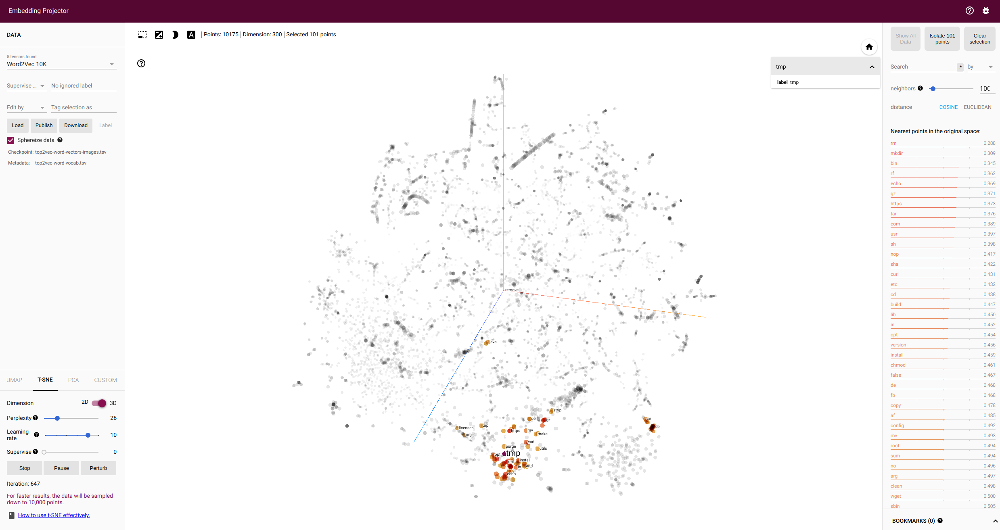

# Dockerfile

## Design

This will be a really interesting study. I want to look at:

 - Across a set of ML orgs and research software containers, get a list of unique containers. For each:
   - Assess current total size and size of layers (an average? distribution?) Try to describe distribution?
   - Look at containers over time (represented by sorted version tags, I have a library that does this) and look at how the size / layer metrics change.
   
What we want to know from the above is, what does the "average" container look like in terms of size, both total and in layers, and then how has it changed over time. As a sub-analysis we can say something about the percentage of research software projects (from the RSEPedia) that provide containers, period.

Given the above, we can then create an experiment that properly measures just outside of the range of what people are actually building, min and max wise. Questions we want to answer:

1. What is the tradeoff between container size (total vs. layers)?
2. It it better to have fewer large layers or more smaller layers?
3. Can we determine redundandy of layers across containers (arguably that is a good thing)
4. Given the needs of storage and time to pull, what are strategies around that?

For the third point, it would be really useful to see some kind of overlap _between_ layers of containers. For example, if I'm running a bunch of ML containers on a cluster, it obviously would be better for storage to have many containers share the same layers. But what does it mean, design wise, to do that? For the fourth point, I'd like to investigate and test some of the caching or optimization strategies so, for example, we don't spend a ton of money on pulling containers alone.

## Parsing

Instead of trying to sample across all Dockerfile, let's sample those we find in GitHub organizations that we know do a lot of machine learning, etc. We will take two approaches:

**GitHub orgs**

- start with a list of GitHub orgs (e.g., nvidia, Hugging Face) and list repos
- clone all repos and find all Dockerfile
- get FROM name in Dockerfile
  - for each unique FROM, get the container tags, and sort across time
  - determine how size has changed over time (getting larger)?
  - create a distribution of sizes

```bash
export GITHUB_TOKEN=xxxxxxxxx
python scripts/parse_repos.py
```

**Software Databases**

We can do the same procedure, but just searching repositories in the [Research Software encyclopedia](https://rseng.github.io/software) to get a sampling of projects in the more rse (or closer to hpc maybe?) ecosystem. If bioconda containers also has a sampling of a different community, I have almost 10k known container URIs in shpc-registry.

```bash
git clone https://github.com/rseng/software /tmp/software
python scripts/parse_rse_repos.py --settings-file /tmp/software/rse.ini
python scripts/summarize_dockerfile.py
```

Stats:

- Total Dockerfile across project: 77449
- 694/4621 RSEng repositories have at least one Dockerfile

Dragonfly?

## Analysis

```bash
python scripts/plot-layers.py
```

This script parses the manifests and generates a local csv and sqlite database file.
How many unique GitHub repositories that we cloned?
- 444

How many tags per manifest?

```console
# This is the image URI with max tags
In [17]: manifest_df.groupby(['uri'])['tag'].count().max()
Out[17]: 47428

# mean tags
In [18]: manifest_df.groupby(['uri'])['tag'].count().mean()
Out[18]: 1882.3892176199868

# standard deviation.
In [19]: manifest_df.groupby(['uri'])['tag'].count().std()
Out[19]: 2787.4401444580467

# min tags
In [14]: manifest_df.groupby(['uri'])['tag'].count().min()
Out[14]: 1
```


```console
# Metrics for the base image from Dockerfile:
# manifest_df.uri.unique().shape
# 1. 1521 docker hub repositories (not accounting for tags)

# manifest_df.full_uri.unique().shape
# 2. including tags (multiple across repositories)
# (256970,)

# 3 Unique layers as represented by digest
# manifest_df.digest.unique().shape
# Out[5]: (528449,)
```

Here are outputs from the script, first, the averages for layers and images:

```console
Mean by image: 18349246051.69792
Std by image: 79008670679.2305
Min by image: 1376848
Max by image: 2077795078486

Mean by image: 17.09 GB
Std by image: 73.58 GB
Min by image: 1.31 MB
Max by image: 1.89 TB    
```

And now breakdown by year:

```console
=== YEAR 2014
Mean by image: 191.8 MB
Std by image: 236.28 MB
Min by image: 24.73 MB
Max by image: 358.88 MB

=== YEAR 2015
Mean by image: 289.79 MB
Std by image: 202.29 MB
Min by image: 50.93 MB
Max by image: 664.97 MB

=== YEAR 2016
Mean by image: 3.14 GB
Std by image: 8.81 GB
Min by image: 2.54 MB
Max by image: 65.28 GB

=== YEAR 2017
Mean by image: 6.74 GB
Std by image: 44.69 GB
Min by image: 1.31 MB
Max by image: 798.86 GB

=== YEAR 2018
Mean by image: 8.63 GB
Std by image: 54.12 GB
Min by image: 1.97 MB
Max by image: 1.08 TB

=== YEAR 2019
Mean by image: 16.84 GB
Std by image: 50.08 GB
Min by image: 5.48 MB
Max by image: 769.4 GB

=== YEAR 2020
Mean by image: 19.15 GB
Std by image: 64.94 GB
Min by image: 4.07 MB
Max by image: 1.13 TB

=== YEAR 2021
Mean by image: 18.55 GB
Std by image: 52.28 GB
Min by image: 3.7 MB
Max by image: 546.94 GB

=== YEAR 2022
Mean by image: 25.65 GB
Std by image: 102.51 GB
Min by image: 9.23 MB
Max by image: 1.44 TB

=== YEAR 2023
Mean by image: 23.26 GB
Std by image: 100.67 GB
Min by image: 5.45 MB
Max by image: 1.73 TB

=== YEAR 2024
Mean by image: 16.91 GB
Std by image: 87.57 GB
Min by image: 1.84 MB
Max by image: 1.89 TB
```

### How are image sizes changing over time?

> They are getting larger!

Here are some interesting plots that show the pattern - these take the bytes and convert to log scale for easier reading.


### How are number of layers changing?

> They seem to be relatively the same, but trending slightly upward

We can also look at number of layers by year:


Next:

 - Do we want to derive reasonable ranges / sizes from this to test pulling scenarios for?
 - How do we want to use config data (that has per layer instructions that can be tokenized)
   - We also have all the Dockerfile directives - ENV, WORKDIR, etc.
 - Should we focus on specific containers and look at some change over time?

### How often are layers repeated?

This shows layers used >

- How many are unique (1 image): 312,095
- How many >1: 216,354
- How many layers > 2: 136,054
- How many > 50?: 9255
- How many > 100? 3333

There is one HUGE outlier (I'm guessing this is ubuntu, but TBA confirmation) that is repeated 67897 times! `sha256:4f4fb700ef54461cfa02571ae0db9a0dc1e0cdb5577484a6d75e68dc38e8acc1` The next highest is `sha256:0eeab5c200691bd777e227c6eea27f7ca3c8232b67118a76edac2dcde3186aa1`  4124. This plot shows layers that appear > 100 times, and with this one outlier removed (otherwise we cannot see the plot):


## Top2Vec

We do custom tokenization, but I'm wondering if we need to disable [this](https://github.com/ddangelov/Top2Vec/blob/7403993804e241b3dc30bf489165dd4910689e55/top2vec/Top2Vec.py#L366-L370).

```bash
python scripts/run_top2vec.py
```

The related terms look very good! Here are some examples of similar terms:





And you can see the topics in [wordcloud](data/dockerfile/wordcloud) for the above images, and [wordcloud-tokens](data/dockerfile/wordcloud-tokens) for a derivative with commits and shasum digests removed. 

### How similar are scientific images based on layers?

We have largely been using the corpus of base images to say something about the ecosystem, but not the Dockerfile themselves.
Instead, let's tokenize and build a model for those Dockerfile.

```bash
python scripts/parse_dockerfile.py
```

And then generate the model.

```bash
python scripts/run_top2vec.py --input ./data/dockerfile/scientific-dockerfile-image-corpus.txt --model-name scientific-dockerfile-learn.model
```

And the similarity matrix:

```bash
python scripts/image_similarity --model ./data/dockerfile/scientific-dockerfile-learn.model
```

Note we have one "document" per Dockerfile:

```
model.document_vectors.shape
Out[3]: (77449, 300)
```


And then word2vec to generate embeddings we can play with:

```bash
python scripts/word2vec.py --input ./data/dockerfile/scientific-dockerfile-image-corpus.txt
```

(I directed to a different output directory to sav them).


### How similar are base images based on layers?

We might assume that a grouping of layers that encompasses a Dockerfile (and image) is akin to paragraphs or sentences that make up a chapter. We can assess image similarity based on comparing these.

We can:

- Derive word2vec embeddings for each Dockerfile, where all the layers are preprocessed and represented as one document as one Dockerfile.
- Do pairwise similarity (cosine) on all the vectors (length=300, images N=309317), resulting in a similarity matrix.
- Filter the similarity matrix by ranges to create buckets of similarity. 
- Plot!

And we can see most are not very similar.


### How similar are layers?

```bash
python scripts/layer_similarity.py
```

We have a total 6,535,425 of (non-unique) layers across our images. I first built this model, and quickly relaized generating the cosine matrix would be impossible. My strategy was to then remove the exact duplicates, which are typically just the same layers between different tags of the same image. The goal wouldn't be to say something globally about the ecosystem, but say something about similarity of layers that aren't _exactly_ the same.  When we tokenize and process and filter down to unique, ensuring that layers from images from the same tag are removed, we have 597,591 layers. When we calculate similarity scores across these layers (cosine similarity) we see the following distribution:


We can say that based on these word2vec vectors, most layers are not very similar. If we compare based on shared digests between unique URIs (using the latest or first of the set), and comparing with a Jacaard similarity, we see even lower (less similar) scores.

```bash
python scripts/layer_digest_similarity.py
```
```console
Mean Jacaard score for digests is 0.002594605637405388 with std 0.03948005058610241

Layers Mean and std: 68698855.34306818, 349361930.3518502
Layers Percentile 25: 5335883.0
Layers Percentile 50: 27171074.0
Layers Percentile 75: 49933463.0
Layers Percentile 100: 4778095495.0
Layers Median: 27171074.0
Layers Median +1 quartile: 32506957.0
Layers Median -1 quartile: 21835191.0

Images Mean and std: 360563843.49506855, 1041344588.6730094
Images Percentile 25: 50241574.0
Images Percentile 50: 119557810.0
Images Percentile 75: 249281565.5
Images Percentile 100: 33964375310.0
Images Median: 119557810.0
Images Median +1 quartile: 169799384.0
Images Median -1 quartile: 69316236.0

Number of Layers Mean and std: 11.14754823759563, 8.251712939776606
Number of Layers Percentile 25: 7.0
Number of Layers Percentile 50: 11.0
Number of Layers Percentile 75: 13.0
Number of Layers Percentile 100: 189.0
Number of Layers Median: 11.0
Number of Layers Median +1 quartile: 18.0
Number of Layers Median -1 quartile: 4.0
```


### What bases are likely used?

We can extract a manifest using [guts](https://github.com/singularityhub/guts/blob/main/action/manifest/action.yaml) and then compare against [shpc-guts](https://github.com/singularityhub/shpc-guts).

Clone the guts repository (base images) and install guts:

```bash
git clone https://github.com/singularityhub/shpc-guts /tmp/guts
pip install container-guts
```

```bash
# Assumes guts cloned to /tmp/guts
python scripts/find_base_images.py
```

For this approach, we choose one image from each URI (e.g., a URI might have many tags), first selecting for "latest" and then the first tag that has the newest created date for a layer. We have to be selective because our approach for assessing similarity means pulling all the layers, extracting to a root location, and then doing a diff of the container against a set of previously extracted container bases for [45 images](https://github.com/singularityhub/shpc-guts/blob/main/.github/workflows/generate.yaml) across 7 families (ubuntu, debian, centos, rockylinux, fedora, alpina, and busybox). This means that, given a contender image A that needs classification and a set of base images B:

1. Generate a set (union) of paths across B
2. Subtract this set of paths from A. This gives us paths unique to A.
3. Subtract unique paths from A, call this "A shared"
4. Compare the similarity of A shared between every set of paths in B (intersection(A,B)/len(A))

The percentage calculated above represents the percentage of paths in A that are also present in B, after removing unique paths to A (which likely are added software installs). The maximum score would be 1, and the minimum score 0, and the maximum score is the winner. Here is how we classify our images (removing the version of the image, since we are biased to select for newer images):


And this plot shows that the scores are generally high, indicative of shared paths.


The minimum score in the above is 0.59, and the max is 1. We see that debian is by far the most frequently used, at least for this sample of images we are looking at.

```console
              count       image
generic_base                   
debian          393      debian
alpine           95      alpine
ubuntu           74      ubuntu
centos           64      centos
fedora           15      fedora
rockylinux       11  rockylinux
busybox           4     busybox
```

## Best Practices - Look at embeddings?

While there are many best / good practices for building, only a subset we can derive from tokens.

### Alpine is not always the best choice

We can see this is followed - it's the second choice, led by ubuntu.

### Limit layers amount

There isn't a good guideline for this. What is limit? We can see the number of layers is relatively consistent over time.

### use apt get with apt install in same line

See [here](https://docs.docker.com/build/building/best-practices/#apt-get).

```
import re
apt_get_count = 0
apt_get_with_install = 0
with open("dockerfile-corpus.txt", 'r') as fd:
    for i, line in enumerate(fd.readlines()):
       print(f"{i} of 6535425", end="\r")
       if "apt" in line and "get" in line:
           apt_get_count += 1
           if "install" in line:
               apt_get_with_install += 1

print(f"{apt_get_with_install/apt_get_count} of layers do apt get with install")
# 0.9429716660593467 of layers do apt get with install
```

That's really high!

### apt get with a clean / autoremove

We can look first at associated words and scores. I see both autoremove and clean, so we know it is happening!
For this I am using a model that is built on all the 6 million + layers (with duplicates)

```
In [19]: model.similar_words(['apt'], num_words=50)
Out[19]: 
(array(['get', 'autoremove', 'deb', 'dpkg', 'var', 'lists', 'no', 'conf',
        'systemd', 'acquire', 'update', 'suggests', 'languages',
        'archives', 'order', 'gzipindexes', 'recommends', 'srcpkgcache',
        'none', 'indexes', 'post', 'partial', 'invoke', 'pkgcache', 'cfg',
        'rc', 'initctl', 'speedup', 'lib', 'etc', 'clean', 'ubuntu',
        'rename', 'divert', 'unsafe', 'utils', 'policy', 'cache',
        'sources', 'make', 'debian', 'indextargets', 'run',
        'noninteractive', 'frontend', 'dev', 'echo', 'container', 'list',
        'rm'], dtype='<U14'),
 array([0.80508672, 0.76560722, 0.75240791, 0.73301251, 0.70643496,
        0.6795709 , 0.67667215, 0.67509216, 0.64805467, 0.6469739 ,
        0.64462704, 0.6277982 , 0.61877087, 0.60906698, 0.60297381,
        0.60258747, 0.59585987, 0.58531517, 0.5818818 , 0.57635006,
        0.56903515, 0.56498944, 0.56353153, 0.56145824, 0.54944087,
        0.54354866, 0.52989003, 0.52806055, 0.52542804, 0.51773187,
        0.51522571, 0.5131858 , 0.51028917, 0.50384598, 0.50310548,
        0.49735075, 0.49147437, 0.49097526, 0.48345878, 0.48300334,
        0.48079965, 0.47638827, 0.46989843, 0.46617988, 0.46011491,
        0.44758008, 0.44640614, 0.44364051, 0.44194418, 0.43892334]))
```

I can then count the percentage of layers that have apt AND a clean and rm in them. Autoremove doesn't clean the sources,
but we will count it too.

```python
import re

apt_count = 0
apt_cleaned = 0
apt_autoremove = 0
apt_cleaned_and_autoremoved = 0
with open("dockerfile-corpus.txt", 'r') as fd:
    for i, line in enumerate(fd.readlines()):
       print(f"{i} of 6535425", end="\r")
       if "apt" in line:
           apt_count += 1
           if re.search("(rm|clean)", line) and "autoremove" in line:
               apt_cleaned_and_autoremoved += 1
           elif re.search("(rm|clean)", line):
               apt_cleaned +=1
           elif "autoremove" in line:
               apt_autoremove += 1 


print(apt_count)
# 605432

print(apt_cleaned)
# 410664

print(apt_autoremove)
# 295

print(apt_cleaned_and_autoremoved)
# 67752

print(f"Percentage of layers that reference apt {apt_count/6535425}")
print(f"{apt_cleaned/apt_count} of layers do a clean (clean or rm)")
print(f"{apt_autoremove/apt_count} of layers do an autoremove")
print(f"{apt_cleaned_and_autoremoved/apt_count} of layers do both")

# Percentage of layers that reference apt 0.09263850476441854
# 0.6782991318595647 of layers do a clean (clean or rm)
# 0.00048725538128146514 of layers do an autoremove
# 0.11190686980536212 of layers do both
```
