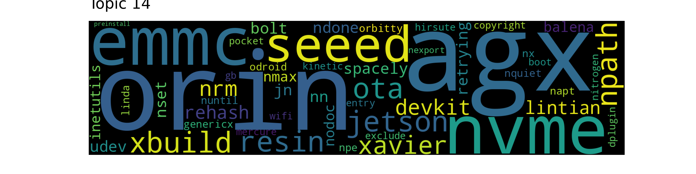
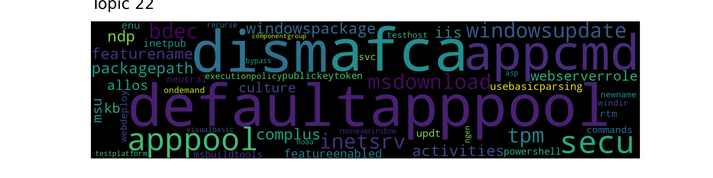
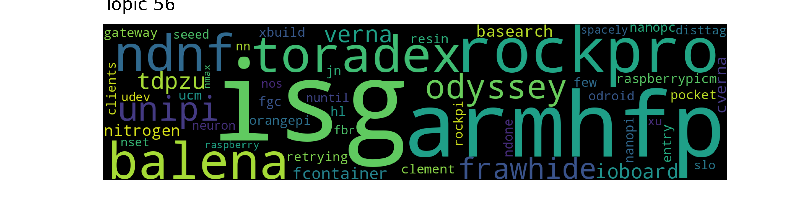
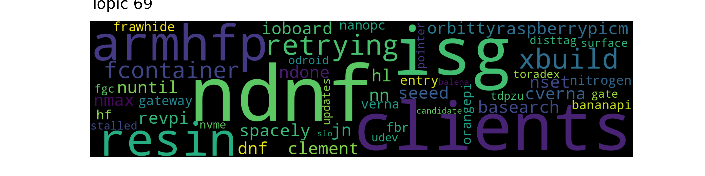

# Topic Wordclouds
> Top 100

## Topic 0

```console
xbuild nitrogen resin jn odroid genericx xu isg orangepi pocket raspberrypicm entry npe gateway orbitty bananapi balena nanopc ndone retrying ioboard spacely dbus nuntil smarc surface nn nmax nset udev npath px slo tdpzu asus orange assets nodoc qemux nbusybox lintian ahf photon tinker ndnf seeed linda nquiet hf etcher
```


## Topic 1

```console
nitrogen jn isg resin xbuild raspberrypicm tdpzu nanopc spacely smarc gateway ioboard pocket entry balena px odroid retrying etcher npe orangepi ndone nuntil orbitty xu nset nmax nn ahf bananapi assets slo rockpi asus genericx tinker revpi udev rockpro photon dbus orange surface few rehash hf unipi odyssey ndnf nbusybox
```


## Topic 2

```console
xbuild resin nitrogen fcontainer retrying balena ndnf nn isg ndone armhfp nset nmax nuntil jn genericx spacely frawhide raspberrypicm orbitty orangepi entry udev odyssey cverna verna slo odroid hl clement surface candidate ioboard agx nvme basearch clients nanopc rockpro air seeed asus bananapi fgc xu disttag toradex hf few npe
```


## Topic 3

```console
balena xbuild resin raspberrypicm isg nitrogen rockpro jn ioboard odyssey entry orangepi udev spacely retrying few fcontainer ndone unipi nanopc narchitecture visit nset nn ahf orbitty slo surface air nuntil genericx nos odroid nmax ndnf ndefault rockpi smarc nvariant bananapi frawhide way nextra npe tdpzu toradex ccimx asus cross etcher
```


## Topic 4

```console
desc miniserve armhfv gnatsd petstore temprepo terraform mdsip realm lane walsh kamil cnb schottdorf mbentley slw neomantra andras dumb kwiek sagedir november calibre envsyms sparklyballs racktear syncthing evan fileinfo defaultapppool mitzki nodotsage qemu sidekiq psfc gallium december fls procps vmware blanchard archlinux useradd hydrogen kind resolv groupmod verified stephen tzdata
```


## Topic 5

```console
orbitty genericx rehash npath resin npe xbuild raspberrypicm ndone nset lintian napt buildconfig retrying nanopc jn surface linda nuntil nmax odroid nquiet bananapi nodoc nn rpi entry seeed ioboard balena smarc nrm copyright spacely nitrogen udev gateway isg inetutils exclude etcher orin gate pocket orangepi xu ucm nx iot asus
```


## Topic 6

```console
jn nitrogen xbuild isg resin raspberrypicm odroid entry ioboard spacely gateway tdpzu pocket dbus xu balena ndone nanopc retrying orangepi nuntil smarc npe nn nset px nmax etcher orbitty genericx udev slo assets ahf bananapi ul nbusybox qemux orange surface cross seeed hf revpi npath air rockpi lintian eq asus
```


## Topic 7

```console
orbitty nanopc npath npe bananapi lintian pocket copyright rehash linda smarc nodoc genericx napt exclude nquiet orange resin inetutils px ucm buildconfig rcn xbuild agx nexport retrying nn nmax ndone raspbian nset ust nuntil nitrogen cnx seeed asus nrm liblttng tinker dotnetcli dotnet surface jn black air nvme free present
```


## Topic 8

```console
agx orin nvme genericx orbitty resin seeed xbuild devkit emmc odroid npath npe nx kinetic jetson cnx nn retrying xavier ota ndone spacely surface nset rehash nmax nuntil lintian orangepi exclude udev bananapi gb copyright rosdistro wifi linda distros cross asus nodoc entry robot lunar xu boot smarc foxy vcstool
```


## Topic 9

```console
genericx xbuild npe resin npath pocket nanopc orbitty rehash nodoc smarc nitrogen lintian copyright linda bananapi asus nquiet napt entry surface px exclude nuntil tinker retrying ndone nrm kinetic nn balena inetutils ccimx gateway buildconfig odyssey nmax orangepi rcn orange jn nset slo rockpro udev cnx agx air sbc ucm
```


## Topic 10

```console
genericx resin npe xbuild orbitty nmax rehash nuntil nset ndone retrying nn bananapi inetutils udev npath nanopc dotnetcli qemux nrm dotnet copyright ust entry balena smarc surface ucm lintian orangepi nexport jade cnx nvme linda rcn ioboard asus pocket raspberrypicm px nodoc tx solaris exclude liblttng tinker iproute air rosinstall
```


## Topic 11

```console
buildslave bazel bsmi interpreters pkginstall libquadmath gbsn libdbd libgfortran bkai devel recommends libraw checkinstall podlators tools essential libasan libarchive libfile vso ssdv groups clara libdc lists hires random libsqlite uming gkai tiny macros mplayer libusb http mtime ansicolor lowercase libnotify perldoc lib libcurl nose yarncachefolder liblzma escapes interpreter libproxy gmxapi
```


## Topic 12

```console
ndnf resin xbuild clients fcontainer retrying armhfp ndone balena clement isg odyssey nset nn nuntil raspberrypicm cverna verna nitrogen udev nmax glib basearch entry candidate ioboard fgc toradex rockpro frawhide dnf hl fbr seeed spacely disttag nanopi orangepi nvme jn odroid cross slo ucm board genericx few rockpi hf asus
```


## Topic 13

```console
orbitty npath genericx resin xbuild rehash nanopc nitrogen raspberrypicm npe lintian bananapi surface odroid jn buildconfig ndone nodoc retrying pocket napt spacely linda nset smarc qemux gateway etcher nmax copyright nuntil ioboard nquiet entry xu nn orange rpi balena isg exclude seeed ucm inetutils photon px xavier som gate orangepi
```


## Topic 14

```console
orin agx nvme emmc seeed jetson ota resin xbuild npath xavier devkit nrm lintian rehash spacely udev bolt jn retrying nn ndone nset balena nmax nodoc inetutils genericx nx nuntil odroid npe orbitty linda nquiet napt copyright hirsute wifi mercure boot entry exclude pocket gb kinetic dplugin nitrogen nexport preinstall
```


## Topic 15

```console
orbitty genericx bananapi npe resin xbuild surface nmax smarc nset retrying pocket nuntil npath seeed rehash nn cnx jn ndone nanopc orin ucm px wifi balena udev orange agx orangepi raspberrypicm nvme som nrm assets lintian nx beaglebone entry spacely odroid gate rcn green linda inetutils copyright nodoc dart buildconfig
```


## Topic 16

```console
genericx odroid orangepi surface resin xu xbuild raspberrypicm jn npe spacely balena rehash orbitty ioboard entry gate air nitrogen ndone nuntil smarc retrying qemux pocket assets npath udev slo nrm isg ucm nodoc wifi nmax nn nset ccimx gateway som nvme nanopi asus etcher revpi ahf px agx bananapi few
```


## Topic 17

```console
orbitty genericx nanopc npath bananapi npe lintian resin copyright linda smarc xbuild rehash nodoc ucm rcn exclude pocket surface napt orange agx nquiet buildconfig px cnx ust inetutils nvme retrying nmax nexport nrm ndone nuntil nset dotnetcli nn air seeed liblttng asus sbc tinker dotnet ccimx orin black entry odroid
```


## Topic 18

```console
aml exclusion installpython exclusions fasterxml nonroot standardizer eiffel geocoder tiger localrepo xnoloa ise artifactid sqlalchemy endpoint introduce mysqlsh webview taskmanager aarm flow defaultcell modelversion promptflow certutil adacf integrated defaultnode gap score tess getsentry phive appsrv infinity afca exists tinkerpop dio iana cabc excited panel wsadmin bbcdda azureml libkrad transferlog hotfixes
```


## Topic 19

```console
genericx orangepi surface resin odroid npe xbuild orbitty qemux rehash pocket smarc bananapi npath raspberrypicm wifi px xu agx nuntil balena cnx nmax nset spacely ndone entry nn gateway retrying ucm lintian nodoc nvme udev ioboard linda napt nitrogen nanopc orin nrm som buildconfig ahf copyright isg nquiet orange asus
```


## Topic 20

```console
rockpro odyssey nitrogen isg xbuild resin raspberrypicm balena unipi smarc ioboard entry nanopc retrying bananapi pocket fcontainer ndone jn ndnf orbitty px spacely rockpi orange ccimx emmc npe few toradex udev nuntil ahf nn basearch nset tdpzu armhfp asus ucm orangepi slo cross visit nanopi nmax etcher narchitecture som clients
```


## Topic 21

```console
blankenship hvr william rehash wblankenship specific iproute orbitty shaun nset determine dpgswdist inetutils gijsmolenaar deu jackman nstandardoutput resin giard sqlservr gawk ischroot nstandarderror nexecstart libopenal xbuild ndone udev nmax sjackman guniguntala multiverse jfrog nrestart wcslib swig universe sysv updating previous restricted nx nn libdpkg som nttypath nanopc ita gmsh xserver
```


## Topic 22

```console
afca defaultapppool dism appcmd apppool secu windowsupdate inetsrv bdec tpm msdownload windowspackage activities ndp packagepath iis featurename complus webserverrole kb msu culture allos featureenabled usebasicparsing enu updt inetpub publickeytoken neutral rtm svc powershell commands msbuildtools webdeploy executionpolicy testhost windir newname nonewwindow ondemand testplatform visualbasic recurse asp noaa bypass ngen componentgroup
```


## Topic 23

```console
spacely npath nanopc jn npe pocket lintian smarc ccimx orbitty isg nitrogen linda rockpi napt nrm nquiet entry xbuild resin tdpzu nodoc asus sbc odyssey nanopi balena orangepi px copyright rockpro odroid genericx surface wifi tinker bananapi few exclude udev agx buildconfig ucm xu gateway messages etcher nvariant raspbian narchitecture
```


## Topic 24

```console
agx orin nvme seeed devkit npath kinetic genericx resin xbuild ota orbitty jetson emmc xavier lintian gb nx odroid npe nn nmax copyright linda exclude rehash nset zshrc nodoc orangepi nuntil wifi rosdistro udev hirsute dplugin retrying spacely bananapi boot distros ndone napt surface cnx nquiet rosinstall air inetutils lunar
```


## Topic 25

```console
genericx jn nitrogen xbuild resin raspberrypicm isg surface orangepi bananapi ndone gateway nanopc spacely ioboard orbitty npe retrying dbus nmax balena nset nuntil pocket smarc tdpzu odroid nn ndnf entry px qemux xu orange fcontainer udev hf asus slo ul npath seeed tinker dart photon nodoc ahf rehash hl armhfp
```


## Topic 26

```console
xbuild balena resin few udev candidate genericx odyssey cjson nrm nuc agx nbalena qemux tokudb nextra toradex nvariant nbusybox jetson surface retrying nn visit cross ndefault ndnf narchitecture nos spacely way ndone nx getifaddrs xavier nmax ncp messages keep nanopi minsizerel eoan slo bool fcontainer dbus idling fops hang anywhere
```


## Topic 27

```console
rootpath dyninst plat prepend auditwheel cpan besser manylinux toolset rh libxcrypt devtoolset swap fixup rootfs dockbuild internal yasm cpython aclocal ius pp mpip nixos tfapi abi rhscl dgl valgrind centos finalize patchelf keycloak iolib transfer sparc scl intel modulus pkgconfig matt bdist clockdiff encrypt muslabi reproducible include tracepath jboss tritonclient
```


## Topic 28

```console
agx orin nvme resin xbuild udev ota odroid devkit xavier seeed jetson nn nrm emmc gb retrying surface genericx kinetic nset nmax ndone nuntil rehash balena spacely npath bolt nx boot lintian xu cross nanopi orangepi orbitty streams foxy libjfx rosdistro dplugin qemux inetutils npe lunar locator paranamer cudalegacy entry
```


## Topic 29

```console
liberica rtag variant bell vm str bellsoft info cds man rsuffix lite hflt to jvm avalable sl invalid or dp dprotobuf example vfp cfg defined excludes pv value country ctf prestashop pgpass javafx parameter tibco autoclean can unknows zouycf bfcfajdyzp hsedwwo unpacked xshare npsicdwetf jlink mnipl lname cft nzl zenithar
```


## Topic 30

```console
trimmomatic kmc pilon skesa lighter velvet megahit shovill andras mitzki seqtk spades laszlo bwa efebad bddb refresh hotspot numprocs handler oehms etcdctl ddcbdda wildfly tseemann pref ibm corretto mule pak testapps libretls rfv ncbi jsa sury jdk morphology adminserver ring fops javaws james ecdf arthurdm afdfe xnoloa esum rmid nuxeo
```


## Topic 31

```console
cgo goamd softfloat gohostos goproxy rice bp goreleaser goos goarch cfssl tibcosoftware gotoolchain tibco goarm gohostarch markbates plug grift iana buildnumber cfi packr pop rfv gocache dasel goroot gmap alter exclusions mk hive gometalinter muslsf dwithout miniserve goenv pruning flogo salmon setarch continue alecthomas boringcrypto setup catalogs themes modcache pgdg
```


## Topic 32

```console
reproducible close awscliv has awslabs lambda groupinstall awscli yum runtime configparser nrn unzip broadwell write libneurosim chaco task nest casacore rsync venv call lang django exe speech casa dicts sandybridge cracklib scidb msifile symvers debugging rebuilddb match lxml symboliclink hk zip slepc cli liblog or opensource tbl specific np pypi
```


## Topic 33

```console
isolated zre functions contentroot webjobs bbfc msft aabe functionscdn dll extensionbundle cedd webhost cade sphere dialog ptvsd gconf eeac aspnetcore bfed watcher azureedge eiffel dotnet ise cbcfbf cordova aml zxf cea ccc linuxsdk ddb dcbf fdd eef polling fea ffd warmup ebf abe cddc xnoloa getvsdbgsh ssleay bdec debhelper ionic
```


## Topic 34

```console
orbitty npath bananapi genericx npe smarc lintian nanopc pocket cnx rehash linda resin rcn exclude nmax nset nodoc copyright px nuntil xbuild napt wifi retrying nn agx surface seeed ucm buildconfig beaglebone orange nquiet ndone nrm dotnetcli raspbian orangepi inetutils rpi free entry dotnet hf nexport udev orin nvme balena
```


## Topic 35

```console
resin odroid xbuild genericx xu ndone rehash retrying surface jn raspberrypicm nset isg balena spacely nmax agx nn orangepi entry nvme udev nitrogen ioboard nuntil asus nrm smarc nanopi npath tinker ucm som napt lintian ahf nquiet nodoc ccimx linda orin air slo eq orbitty inetutils rockpro buildconfig qemux copyright
```


## Topic 36

```console
shaun jackman sjackman oehms tomas fsfe rueth jacik rocmdeb bartolome martinez cnb ruth gijsmolenaar eabi spiped luis luism libopenal pycurl kubelet giddyup iojs lri configurable gmail readkmsg tobias gnueabi bitrise daemontools emanuel xargo softmmu solaris inetutils elf erbium johannes gliderlabs borsboom libsystemd futures guniguntala ebtables hugepages universe kernsuite cockroach matplotlib
```


## Topic 37

```console
postgres postgresql pg icu libbuiltins rakudo lz uuid includes keyfp pgsocket world zoneinfo pgvecto libexecinfo next replaced desc allows vc divide ansicolor pgport star fs returns gssapi chaco gitweb datetimes vptr zstd priv bound bounds keyutils proftpd attribute osversionid rabbitmqadmin nonnull flex reg ogr enforce unreachable salmon semi vla integer
```


## Topic 38

```console
npath rehash lintian nodoc linda genericx copyright jn napt nquiet exclude aspnetcore nanopc inetutils orbitty resin xbuild dotnetcli raspbian bananapi dotnet buildconfig rcn nn npe nmax ndone retrying windows free nuntil nexport nset agx ust firmware liblttng nrm ucm libgssapi edfc promtool pocket rockpro air entry smarc groff tinker beaglebone
```


## Topic 39

```console
jn npath spacely lintian nodoc orbitty nanopc linda rehash napt nquiet pocket nitrogen xbuild copyright rockpi resin buildconfig npe tdpzu bananapi exclude inetutils wifi aspnetcore ahf entry odroid xu asus retrying air genericx rockpro assets smarc tinker surface gateway kinetic balena ndone etcher nanopi nmax nrm nn ccimx nexport orangepi
```


## Topic 40

```console
bdec visualbasic afca testhost testplatform pscore defaultapppool windowspackage appcmd apppool isolated newname culture tpm stoptime activities publickeytoken dll downloadstring inetsrv neutral nanoserver vs cool pkgdef directoryname usebasicparsing windowsupdate aspnet diasymreader sac executionpolicy secu nopath nonewwindow ndp ridk refreshenv complus vsweblauncher sphere webjobs noupdate fffe dotnetcoresdk featureenabled allos installdir zre nxi
```


## Topic 41

```console
orbitty genericx bananapi surface resin xbuild npe seeed npath pocket raspberrypicm smarc nn ucm retrying qemux nset jn nmax ndone nanopc rehash orin orange cnx nuntil px ioboard gate wifi nvme som isg spacely rcn odroid agx lintian udev beaglebone copyright entry nitrogen linda nx xu orangepi dart hf nodoc
```


## Topic 42

```console
isolated bbfc cade cedd aabe azureedge dcbf gconf zre dotnet eeac aspnetcore cadc bfed bdec clnt aspnet dotnetcli pkinit multidev cea libkrad liblttng edfc libgssrpc webjobs contentroot def caad libkdb ust functionscdn libexif warmup functions libgssapi ebf kpropd angelopoulos dotnetcoresdk janwielemaker bacba nicos ecdf sphere efab msft fffe fdeb allos
```


## Topic 43

```console
gijsmolenaar william blankenship ischroot wblankenship aztk resilio shaun kernsuite kern jackman collate futures dpgswdist bartolome webdevops luism martinez luis sjackman cleanmask apt dockerproject archives restricted universe squid multiverse digits bray julian volumes pangyp lri mattinen bjorn bjoern iojs pidproxy gruning libopenal seen sqlservr invoke bhugo initscripts gamma ben gruening ruth
```


## Topic 44

```console
tipy clx gpuci rapidsai rockylinux nbcontrib widgets rapids vincent blazingsql rocky ugo xgboost condaretry openpyxl nvdashboard dill codecov ipywidgets patsy mirrorlist aptver numexpr pyver factory pyqt nvtab realpath pair skipping sqlalchemy hpccm tf chromeoptions cloudpickle cudatoolkit xlrd pytables permissions sparse goog merlin nchannels malware nomkl yasm statsmodels blazingdb gdf cupy
```


## Topic 45

```console
rakudo keyfp idle lto uvicorn fastapi listchanges xnoloa cells sparsecheckout loadable libbluetooth sq appserver ensurepip sparse show tests cattery sherlockpipe showformat poetryvenv binascii uv pyo cask lofarbeam pyc owlcat addin prosqlite optimizations libgdbm tagomoris xl cell svt corepack futures gnucxx satoshi buildflags tagomori cleanmask xdoctest jasongin raku advice tkinter wininst
```


## Topic 46

```console
edfb cfcbc confluent xtrue unsigned installing kafka bdadcb west jms sink dfafdd bbbc fcdd platform connectors number eaeb controlcenter extends id dwant commit connect interceptors unauthenticated znc scala center abff partner rrequirements staging qq confluentinc component appuser allow packages bc advertised transport cmakeflags amazonaws jars cub azulsystems project ecdhe jinja
```


## Topic 47

```console
launchpad realm gpl yegor systemtap infrastructure forums biodocker eswrapper svscan titan portainer relational ring quadrortx titanrtx carbon erbium etcdctl tapset quadro tagomori title kwiek geforcertx indextargets suite amazonlinux gzipindexes psmdb policy wrx kamil speedup partial documentation geforce gplv srcpkgcache acquire marek petstore languages language nvidiartx pkgcache satoshi tagomoris initctl javaprefs
```


## Topic 48

```console
balena ndnf toradex xbuild resin rockpro odyssey few udev nos entry jn nvariant messages retrying visit narchitecture ndone ndefault nitrogen isg unipi odroid way armhfp nn nextra anywhere orangepi cross are nset assets nbusybox here cverna idling details basearch dnf nuntil tdpzu spacely fcontainer nmax nanopc bananapi keep verna variable
```


## Topic 49

```console
fcontainer xbuild resin udev balena xio odyssey agx assist few minsizerel uil cverna nvariant nbalena gsi harness dplugin orin cross armhfp board backtrace nos nx cjson nanopi ndnf globus clement nbusybox bool candidate getifaddrs fgc nn ndefault frawhide verna entry denable nuc libglobus nextra way messages gmap visit sysconfig callout
```


## Topic 50

```console
genericx resin surface qemux orangepi xbuild rehash odroid orbitty pocket wifi npath xu bananapi lintian nn nmax spacely retrying nuntil entry npe nset inetutils balena nrm slo ndone copyright px smarc nodoc udev raspberrypicm gateway nvme agx orin linda ioboard buildconfig rcn exclude nitrogen napt kinetic cnx ucm assets pick
```


## Topic 51

```console
fastapi uvicorn dthread gdbm bluez xjc libtirpc ffi loadable idle tkinter geo xp ucs develop eggheads exclusions exclusion xzhf ensurepip isnan libnsl func isinf introduce expat artifactid excited optimizations tcl tk lto regrtest unneeded spack diagnose uv enonic pyo poptorch pax tess network cv worse desc equals fasterxml wininst integrity
```


## Topic 52

```console
genericx npe resin xbuild pocket smarc tinker asus surface rehash ucm air copyright orangepi nuntil npath ccimx odroid px rockpro orbitty cnx ndone sbc ioboard qemux orange raspberrypicm nodoc balena bananapi nmax lintian entry nanopc wifi retrying nrm linda nitrogen agx kinetic xu ust nn nset nuc rcn dotnet odyssey
```


## Topic 53

```console
getcli conan jfrog certificate xlocale dh libmpfr bt eiffel gui squashfs bintray pypoetry ise bartolome chpasswd libmpc luis autoreconf martinez pyenv gap nasm ssleay cxx shims neural compressor buildpack engineering luism changelogs llvm nbextensions oneccl liblzma herokuish gmake solutions cmake fire multilib libbz notebooks hive essential minor bhugo konstantin oob
```


## Topic 54

```console
setuid circleci geckodriver retry nxvfb circle respectively mplayer libgconf effective extracting actual fail fy nexec preserve cil chrome libdbus delay xvfb chromedriver spa interpreters location deu pixbuf libxss xvjf direct libgtk mozilla fra libasound bsmi nosuchkey phantomjs orm select bkai cypress silent libnotify sandbox firefox browser instead libgdk lha bfcfajdyzp
```


## Topic 55

```console
ndnf balena rockpro odroid udev resin xbuild cverna armhfp clients nanopi retrying odyssey dnf verna jn clement toradex nbusybox few ndone fgc entry device basearch ccimx fbr unipi nos orangepi narchitecture visit ahf tdpzu xu spacely nset hf fcontainer nn ndefault nvariant disttag raspberrypicm nmax ioboard anywhere nextra here sbc
```


## Topic 56

```console
isg armhfp rockpro toradex balena ndnf odyssey unipi frawhide tdpzu verna ioboard nitrogen fcontainer basearch cverna raspberrypicm entry odroid resin xbuild hl clement jn ndone retrying ucm fgc gateway pocket nanopc orangepi clients nanopi rockpi few disttag nset neuron udev nuntil fbr nn nos seeed slo xu spacely raspberry nmax
```


## Topic 57

```console
gorelarch gorelsha markbates bp grift unimplemented packr rfv gometalinter goreleaser cfssl goproxy exclusions rice apiapp gobuffalo dockerhost pop exclusion alecthomas corresponding filetest pruning golint fasterxml artifactid mgechev buffalo boringcrypto goth tinkerpop deplist todo iana generators jackson filetests gotools honnef revive schedulers modcache lint admins ouch nested thumbor goenv jessie abcbc
```


## Topic 58

```console
genericx resin xbuild rehash odroid ndone nset retrying raspberrypicm jn balena nn surface nmax spacely xu orangepi nuntil nrm udev entry nanopi orin agx qemux npath nitrogen inetutils air ioboard orbitty ucm napt linda nodoc asus nquiet copyright isg ndnf nvme frawhide slo lintian ahf gate rockpi hf fcontainer tinker
```


## Topic 59

```console
rehash npe dotnetcli npath genericx jade dotnet windows ust nuntil nodoc resin copyright xbuild inetutils nmax linda retrying lintian nn libgssapi ndone nquiet eeuxo nset liblttng exclude rocmdeb napt abff entry bananapi mattinen buildconfig caad edfc gamma aspnetcore markus vcstools nexport orbitty ddbfd libsdl libopenal defb sle control envs upgraded
```


## Topic 60

```console
targeting dotnet hostfxr bbfc cea azureedge efab dcac ebf aabe ecdf aspnetcore binarch dbe def edff fda cedd dotnetcli cbb eeac bfb dcaef oxzf acd ddcbdda pwshtool isolated cbf adbd abe cdd ozxf dotnetcoresdk bdec bfed ace cedb fcc fff dfd eedbb ebaab cadc warmup bacba dde ccc cade functionscdn
```


## Topic 61

```console
raspbian npath exclude lintian nanopc linda copyright napt nquiet nsystemd rpi smarc inetutils rehash technology nodoc nexport retrying buildconfig free bananapi sysv launch firmware therefore nuntil ust nset remount deprecation ndone pi cbcfbf resin nn xbuild entry onedrive logind npe groff liblttng libgssapi orbitty getty rcn initsystem orange present px
```


## Topic 62

```console
jn xbuild resin isg genericx raspberrypicm nitrogen gateway spacely tdpzu ioboard dbus ndone retrying entry ul nn pocket nset nuntil slo qemux surface nmax balena xu assets odroid orangepi nanopc udev orbitty rpi seeed bananapi fcontainer rehash pi toradex hf values ql npath revpi lintian vmware nbusybox eq nodoc raspberry
```


## Topic 63

```console
showformat yjit rubygems ruby productversion productid gemrc rakudo lafiles satoshi background cool tagomoris silence bundler telnet seclevel al tagomori libgdbm keyfp couchperuser func buildlabel productname schedulers isnan tdsodbc dno rails solargraph pd warning swipl swi sunteya libossp fusioninspector extdir halt bedwell gem extends tkinter jruby resolv precision pipversion mcs appserver
```


## Topic 64

```console
odyssey ndnf rockpro isg resin xbuild unipi nitrogen retrying fcontainer raspberrypicm balena jn nanopc armhfp ndone ioboard nset toradex nn nuntil clients entry smarc basearch spacely udev asus cverna emmc frawhide seeed nmax ucm few clement slo rockpi verna nanopi tinker cross dnf hf agx tdpzu hl nbusybox fgc orbitty
```


## Topic 65

```console
mfpu sqsf gnuabi sparc rust rustarch rustupurl softmmu dropbear gnueabi elf linker rustupsha musl muslsf prologue notownedfile nlinker sqlo knizpqcjt rustup solaris nzvo cargo zulufx dazzle muslabi xargo eabi marks quota unwind yrtssc star yjit toolchains show csweichel apkarch vsls rustflags prereq adhnw router oofq libexecinfo libgeoip musleabi musleabihf component
```


## Topic 66

```console
raspbian free npath firmware linda lintian napt exclude nodoc copyright contrib nquiet wifi rcn rpi dotnetcli nexport rehash smarc buildconfig nrm fddd udev inetutils resin entry pi mediamtx px pocket xbuild windows aspnetcore groff raspberry distros nset edfc dotnet foxy east hirsute eeac agx nanopc nuntil nn bp initsystem robot
```


## Topic 67

```console
pixbuf libgdk libxshmfence libnspr libxcomposite libxi gconf libxdamage libcups libatk isolated randr libxcursor cedd bsmi gbsn functions libxfixes xcb libpango libxrandr libxtst libxinerama getvsdbgsh contentroot libgconf libdbus bkai libpangocairo libappindicator webjobs insiders mplayer nend libgbm xfixes libasound gkai microhei vsdbg render blue ssleay bedtools libxss signedheaders fish zre prereq normal
```


## Topic 68

```console
fcontainer few balena nvariant visit ndefault way rockpro odyssey nos narchitecture details nbusybox are nextra nitrogen entry here anywhere idling ahf xbuild variable messages graphdef udev resin unipi toradex frawhide isg candidate raspberrypicm rockpi keep armhfp cross please basearch cverna verna nbalena device issues ioboard easy feature parallel smarc converters
```


## Topic 69

```console
ndnf clients isg armhfp resin retrying xbuild fcontainer raspberrypicm clement nset revpi jn nmax hl cverna spacely nn dnf seeed basearch ndone ioboard nuntil orbitty nitrogen verna hf orangepi entry gateway frawhide nanopc fbr bananapi disttag tdpzu gate udev fgc stalled updates pointer odroid toradex nvme surface candidate balena slo
```


## Topic 70

```console
rockpro ndnf odyssey xbuild resin balena unipi som isg clients toradex armhfp ccimx tdpzu ucm raspberrypicm cverna entry nanopi ioboard jn dnf few emmc sbc spacely cross preinstall verna ahf lcbzu basearch clement orangepi surface odroid narchitecture nbusybox udev fcontainer way bananapi visit nos pocket retrying orbitty nanopc ndefault owa
```


## Topic 71

```console
xu odroid xbuild genericx isg raspberrypicm resin ioboard dbus ndone efab orangepi jn npe surface orbitty retrying nmax bananapi nn ul dotnet heap nuntil addlib nset sq dcaef balena latomic qemux hybrid proofer entry rust smp and tsdb nbusybox consoles revpi lftp clock toradex sass som npath connectors udev connect
```


## Topic 72

```console
npath orbitty lintian bananapi rehash genericx copyright exclude npe nanopc linda pocket nodoc inetutils resin rcn smarc napt agx xbuild buildconfig nrm px nquiet wifi nset nmax nn raspbian nvme surface ndone nexport retrying orin orange nuntil beaglebone seeed free odroid qemux ust cnx entry dotnetcli ucm liblttng black xu
```


## Topic 73

```console
gnatsd andras mitzki kamil xeserv kwiek temprepo laszlo mbentley localaddress statics cabal qqy pcl outdir localdomain rancher httpredir ensuring gallium puppeteer klee fuller gpuci inetd mdsip hydrogen redis released engineering catalogs rapid board property etcdctl defaultapppool gcloud libgcrypt parent bentley swift cattle shields verified schottdorf dockercompose rockylinux sagedir installations tcpping
```


## Topic 74

```console
suite debootstrap nitrogen promtool pylintpath artful board influxd modern ats influx pylintenabled bigsearcher nrm narchitecture rootfs reverse resin fcontainer ioboard black gems visit eoan nixos pycodestyle pocket googlegroups telegraf consoles few ggr pydocstylepath jn entry redisearch xbuild influxdb nextra ftpmirror subsystem astro kernels containous fluentd dumbinit developers ndevice entrypoint gateway
```


## Topic 75

```console
dfafdd edfb eaeb confluent cfcbc fcdd appuser abff extends kafka fcfe dwant jms number project id adea appuserdir connectors confluentinc fcae sink bbbc commit znc connect bc cmakeflags krb packages nbaseurl nname installing ngpgkey workstation npriority west srpms ngpgcheck yum rrequirements its component hostname nenabled partner rpm artifact advertised nrepo
```


## Topic 76

```console
genericx xu odroid dbus xbuild orangepi ndone resin ioboard ndnf raspberrypicm nuntil biweekly qemux releasedate started acpttag jpeg criu finished heap see smp retrying nmax isg balena nn benv surface glib nbusybox nset jn jobs npe devops hashicorp dockage hybrid udev lftp groovyc yumdb builddate clock when swg perldoc lts
```


## Topic 77

```console
raspbian free contrib firmware lintian npath opasswd syncookies linda fddd copyright napt utmp pi lastlog exclude raspberry nodoc nquiet rpi nexport rcn forward mediamtx sysctl rcolorbrewer srcs initsystem tsne nanopc eeac nrm ust inetutils emulator resin liblttng dockerproject smarc technology therefore buildconfig aminev xbuild entry udev nwwidaqab nsystemd netns bp
```


## Topic 78

```console
udev nset resin xbuild nn balena nmax prep eoan nrm iproute retrying nuntil ndone orbitty hf spacely gijsmolenaar jn blankenship fcontainer slo sqlservr william ndnf ahf nx wblankenship determine software shaun dpgswdist specific libgsl frawhide few jetson scipy brotli qemux libgeos glib sherlockpipe som swig cross nox bitrise verna libopenal
```


## Topic 79

```console
hbase hotspot adoptium temurin binaries mgoldman marek openjdk slim esum jakarta wasdev ccfb efebad adoptopenjdk jdk befeadc bddb distrib lfsso langpacks dcca dkafka download url awt centos bellsoft goldmann dhe openj notices chris liberica ebaab rockylinux alfresco phoenix eec bell cds ecdf gplv jre ebfb rtag dcaa gm dcad djava
```


## Topic 80

```console
jn isg resin xbuild nitrogen spacely raspberrypicm balena ndone ioboard tdpzu nset retrying surface hf rockpro genericx etcher fcontainer udev odroid nn entry ahf nuntil smarc px ndnf orangepi nmax qemux odyssey dbus nbusybox frawhide basearch rockpi slo nanopc gateway photon armhfp clients tinker unipi few nanopi cross verna revpi
```


## Topic 81

```console
msgpuck mraa tferma what libxsmm dcmake hdt fiat cmake dijitso dolfin vc iot ctrl ufl relwithdebinfo dprotobuf foptflags denable orange independent commit bitbucket omit rserve tempdb position dwerror cxxoptflags immediate changing tables janwielemaker coptflags swi sequence swig egs dswipl clone introspector cnx ncdu cmakeflags thibault normand doxygen off getcontext dbuild
```


## Topic 82

```console
shaun jackman tomas sshd spiped babim sjackman loginuid jacik giddyup libopenal shanghai embedded asia david localconnector appsecurity localaddress ldapregistry sessioncache pycurl sessiondatabase webcache requesttiming restconnector william openerp webprofile optional microprofile motd johannes cnb squid tegner quota configurable storm blankenship erbium confnew dockercompose tobias samba solaris gmail daemontools libseccomp moigagoo libsdl
```


## Topic 83

```console
mfpu sqsf notownedfile muslabi rustarch rustupsha musl nlinker toolchains gnuabi rustflags fuzz rust rustupurl sqlo muslsf zulufx rustup honggfuzz precompile ranlib cargo encrypt lets musleabihf getcontext richfelker bdwgc unwind musleabi docbook sparc gnueabihf stamblerre quota consularch libgssrpc router sysroot gomod androideabi dno detection analysis cfi libprotoc ifs pidproxy yjit elf
```


## Topic 84

```console
pattern ebaab lo oss phoenix hbase dash centos llc bien xdev gpl logstash fedoraproject gplv cdfc fbadea localhost initnuxeo libfabric forums libnvmalloc patterns infrastructure format honggfuzz title jdist miller average langpacks galaxy beats gkq cufftmp marek andras recursive libacccuda gssntlmssp libnvompstub which mgoldman adc psk dcac adns skiaparser yasm programming
```


## Topic 85

```console
live guilherme changelogs tamasfe bonicontro thomazi konstantin minikube buildpack molchanov visualization xcaddy moigagoo securityopt luadir me pocket even binarch ptrace seccomp dominik capadd visualizations average kubectl unconfined lsp mutantdino authors gnuabi tables markupsafe httplib gline serayuzgur picheta bjorn hyc vadimcn gkq guac eeac shopify nbrsessionproxy solaris devcontainers fillstruct artembo phoenix
```


## Topic 86

```console
nounset errexit assistive groovysh fakeapp importing groovy postinst downloading deststorepass phonegap noprompt browse ionic sbt ons listed nuxeo nmu installation apis skiaparser symlinking typesafe changeit cnxns play activator grape jira snapretaincount purgeinterval initnuxeo readlink selections adminserver zoocfgdir datalog grapes advice bdadcb myapp mysolrhome zkserver showauto applying levels adding jasongin martijn
```


## Topic 87

```console
vmware nvtabular vnightly rec nvtab odoo merlin hdf bdec sparse biojs tsne nomkl dockbuild manylinux pygit sheds makeflags tibcosoftware websockets msgpuck range photon adacf darrow gap integrated panel installdeps testhost smarc sparsecheckout gnueabi diverse flogo fecd pyqt psk kevinrue andras pastix openblas rtsne libocct pkgver dwant ml webserverrole nbcontrib dbuser
```


## Topic 88

```console
armhfp isg ndnf hl cverna clement fcontainer basearch verna frawhide disttag dnf xbuild fgc entry resin nitrogen toradex tdpzu retrying gateway fbr clients balena nset raspberrypicm hf udev vars assets ndone nn revpi ioboard nuntil nmax slo uiterwijk jn pi raspberry maxamillion few seeed gate nanopc patrick miller odyssey visit
```


## Topic 89

```console
buildslave prompts bazelbuild buildifier bazel buildkit devel buildozer bashrc clara pipwhl cuda setup nvidia aptver compute core google buildtools dt pygit library libnvvp gcloud bats libctc atex dl bazelisk bazelrc netsupport kitpicks configured testlist run rapid abseil cudart sparse msdp toolkit targetarch dnn sudo nvvp cloudsdk pypoetry nvbazelcache expunge sdk
```


## Topic 90

```console
block amazonlinux lowercase forums dots swift libbsd programming powertools infrastructure dno getcontext webroot cjson citation vi targeting telepresence galaxyproject gmxapi signing fops galaxy citations libstdc edff bjoern cabc getifaddrs testapps gpgcheck srpms central epel libwebpdemux epl nodeps libaec libwebpdecoder cfitsio enablerepo openexr engineering enterpriselinux branch joblib npriority gruening bien fdea
```


## Topic 91

```console
plat rootpath auditwheel mgoldman marek goldmann dyninst prepend swap yasm ius aclocal mgrondona business centos sparc dumper fixup amazonlinux fastestmirror uclibc hbase tryton sysvinit vmware getopt block valgrind klee pref wildfly internal tom jboss smb fedoraproject rh tok pydot commandargs rhscl dgl mean noaa errno scl laszlo devtoolset scogland gu
```


## Topic 92

```console
orbitty rehash anil nset inetutils resin shaun nmax libdpkg raspberrypicm sjackman jackman nx px orin nuntil qemux bananapi ioboard rpi xbuild inotify spacely nn wifi npath nanopc jade hvr ita smarc jn sidekiq disco seeed cleaned ros ocaml specific mattinen eoan retrying ndone aspnetcore eng pocket rosinstall raspbian debhelper tomas
```


## Topic 93

```console
suid autoprefixer rst destination postcss hugo babel extended coderay klee uclibc target rejson chocolatey rouge gitpod asciidoctor nopath autoload goroot october fish installdir tryton awscollector modules bash redistimeseries choco analysis tuse rls rebar redisgraph production mpiexec aptlist aoc redisjson noupdate completion november msys setuptools html csweichel workspace busybox loadmodule company
```


## Topic 94

```console
resin xbuild squashfs rehash orbitty libgdiplus nset ndone shaun lzma nn jfrog libmemcached targetgo william libopenal sdispater retrying nmax cv dthread previous libsdl nitrogen pipversion webdevops iproute nstandardoutput nosuchkey instead moreutils nanopc peter jackman nexecstart nrestart spacely func nuntil hvr nttypath inetutils readiness zak nstandarderror lcov xlocale sjackman udev blankenship
```


## Topic 95

```console
fls graal endpoint azul fuller xed curlrc cee project mkfifo cad nzvo james kjkuu ring xb aed decd dcad confluent df confluentinc browse cefaa cri dcb corretto agea zst amiibcgkcaqeapz topics advertised wi dde eggdrop fadec abe ntoqkzf cnb afea libs import listeners create upgrade blanchard dab pyplot codeberg rsa
```


## Topic 96

```console
resin nset xbuild jn udev nmax balena nn rehash retrying iproute nrm ndone orbitty spacely swig nuntil qemux inetutils blankenship shaun nx specific genericx eoan orin raspberrypicm william libgdiplus wblankenship board ucm jetson nanopi glib air surface nanopc moreutils serial dpgswdist seeed sqlservr jackman determine giard hvr few prep anil
```


## Topic 97

```console
symvers openai tok clip debugging vit standardizer dgl tritonclient average fcflags exists mpich geocoder coreos optflags suite mipsel xpu tiger tibcosoftware dprotobuf rfv gkq downloadmd androideabi modulus debootstrap gloo pgpass swg emerge diffutils gremlin richfelker indices hyc negative sym cni devops tinkerpop slepc sysroot cover bounds ssldirs trace grift psql
```


## Topic 98

```console
ilib metacpan pevans fwrapv miyagawa pe ccflags skaji cpan seclevel dusethreads scrapyd duse scrapy mi archbits harness xaf bitall archflag cpanminus martini exclusion bedtools des exclusions bitint duseshrplib fasterxml petercmartini prokka darchname blitz tbl ncbi portablexdr libwebpdecoder shovill libwebpdemux tseemann artifactid bwa salmon pwdb libturbojpeg carp pathtools cfitsio ansicolor enableextstore
```


## Topic 99

```console
bitrise envman doe steplib stepman devcenter babim tool zulufx packagecloud jz rtag hsniugrfvgt benlubar stamblerre jellyfish prokka credentials your prep mgechev bower machines bedtools keyscan keychain payara expect dijitso gomod statsd bins webide readiness prerelease email cvmfs shanghai serveradmin systemd tbl archives giard dolfin xpu revive ufl star daemontools goreleaser
```


## Topic 100

```console
nitrogen jn isg orbitty npe pocket nanopc genericx gateway raspberrypicm smarc px bananapi tdpzu odroid spacely xbuild resin xu ioboard orange ndone orangepi retrying ahf etcher surface nuntil balena nmax entry nset ul rockpi nn hf som assets tinker seeed wifi asus revpi rockpro gate dbus udev slo ucm photon
```

