# Topic Wordclouds
> Top 100

## Topic 0

```console
nn code retrying ndone nset nmax nuntil resin udev xbuild dbab slo balena gnuabi gt iproute genericx phoenix cross hf c_rehash df_ai_version entry inetutils max muslsf vmware npe edl es_download_url simdem_cli benlubar elastic_version initnuxeo rserve_client isolated epl weblegends centurylink surface keycloak_dist eq cdbdcae findutils bfedac expected_sha pwshtool tryton bzr nuxeo_dist_url
```
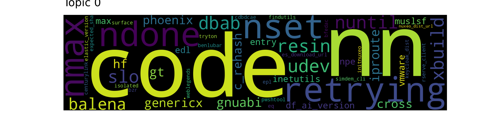

## Topic 1

```console
adadbc eddcc cddff balena udev xbuild resin entry ul cross jn ddba cbdfe dbus nitrogen slo few orange xu cacfab orangepi odroid visit dbab narchitecture bananapi feab isg are tm retrying npe nos assets nbusybox ndone cbdc nvariant variant messages raspberrypicm variables nextra ndefault code ioboard caeeab nanopc here cbec
```
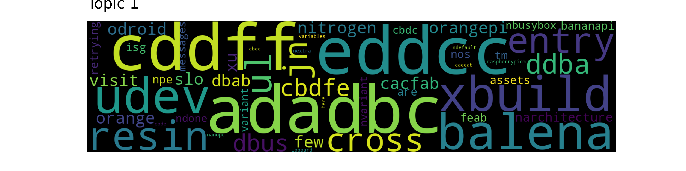

## Topic 2

```console
aoc awscollector promptflow guru gorename acroca mdempsky symbols galaxy_log_dir cxxopt davidrjenni reftools golint fillstruct buildslave bazel playbook ci_build configured dst_root_ca_x mamba_exe galaxy_venv_dir xtrue xallow_unsigned joblib repkv bash_prompt env_name interpreters nuxeo_dist_url models nuxeo_md ci_build_python goimports webcache bdadcb abseil vmagent crt cover enable_runfiles sessiondatabase raku simdem_cli resampy godoctor packages tf_need_cuda godef fccc
```
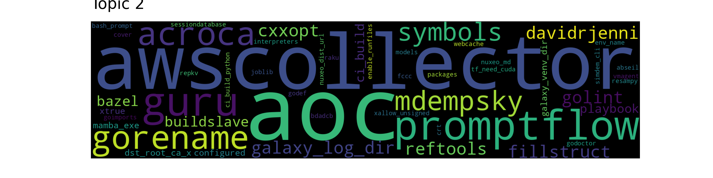

## Topic 3

```console
resin xbuild udev balena afeffd dbab slo entry cross accd ecdf nitrogen adadbc ndone dbus retrying ahf code jn odroid xu eddcc isg nbusybox bada nn nuntil nset assets nmax etcher few raspberrypicm surface ul aabaa mediamtx dacee ioboard orangepi pi visit tdpzu dfba raspberry variant tm mediamtx_v are revpi
```
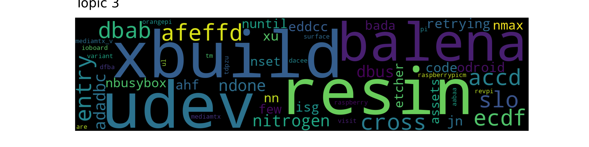

## Topic 4

```console
set_user nginx_conf_file catroot unable able localrepo ffbdeccef gfx found_python eceade mytemplate ouch voila eefaec apiapp experience user_uid eddabaf eula_file orange unreachable rpms_path goth excited introduce dbddd nsystemd cni_base_url paths bound divide array init_userconf gomod cni_tarball sysroot cni_url admin_user_name downloadsha bounds mongod vla ecdsa wsadmin dockerstage poetryvenv therefore phonegap skaji wno
```
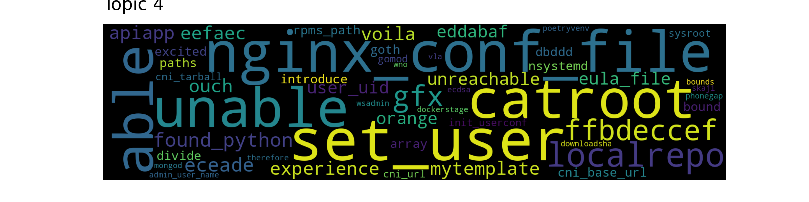

## Topic 5

```console
webserverrole iis featurename tpm windowspackage win_x sac sdk_tools vsextui defaultapppool activities ndp rtm newname item updt dockerassets commands event msi apppool req kb package_dir culture netfx publickeytoken dism neutral appcmd nonewwindow allos enu aspnet level_zero_ver windowsupdate apply catalogs usebasicparsing inetsrv dotnetbinaries icd_ver packagepath testhost launcher msu secu user_name visualbasic msdownload
```
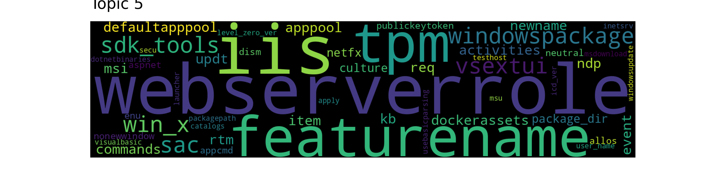

## Topic 6

```console
build_scripts prepend_path dyninst keycloak_dist manylinux all_cpython rh libxcrypt fdbba auditwheel_plat pp git_branch ebedc aeadb devtoolset besser finalize rootfs wildfly_version libxcrypt_hash perl_root cpan goldmann dockcross autoconf_root wildfly_sha marek auditwheel_arch fafbec patchelf_hash automake_root build_utils wildfly kc git_repo bcdadb jboss_home autoconf_hash toolset libtool_root libtool_hash manylinux_ matt perl_hash pkg_config_path keycloak automake_hash mccormick vmware dockbuild
```
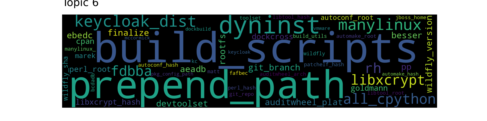

## Topic 7

```console
adadbc eddcc udev xbuild entry resin cross balena dbab slo ddba nbusybox retrying dbus ndone dacee code assets isg odroid tinker asus xu feab jn nn genericx raspberrypicm qemux spacely surface nmax ioboard deaeb few nuntil visit eab os nitrogen nset mdsip_port apalis orangepi afeffd narchitecture eda nos nrm messages
```
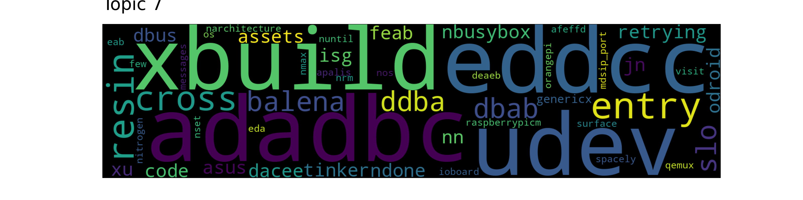

## Topic 8

```console
zulu_repo_sha zulu_repo_ver xb initnuxeo npin fcfbdb codeberg p_hi ghc_release_sha filename_ext empty nuxeo_version local_policy ghc_release_key llvm_key zulu daemontools leiningen lein_version nuxeo_md nuxeo_dist_url aecbc bacbbe dwarves nuxeo_user no_proxy technomancy install_android prefectextras azul slepc jre_s bananapi phoenix edl sslo srcs repo_ petsc_dir hbase keychain bay tryton janeczku sonarsource sq_data_dir haskell abdbc galaxy_home apt_pref
```
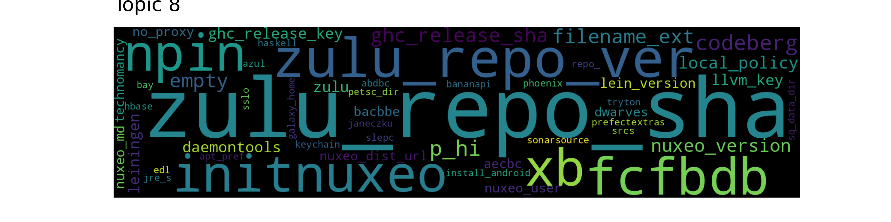

## Topic 9

```console
dcbccb goarm edaece cafcce goos goarch gohostarch gohostos cgo_cflags goamd golang_src_sha golang_src_url softfloat gotoolchain likely cfafe gnuabi cccdeef fcbea xcaddy_version alpine_version muslsf continue facba unimplemented goproxy befeb cfssl early_access apiapp tibco rice tibcosoftware gorelarch webpack pruning bp grift gorelsha boringcrypto quota compatible markbates flogo binarch riscv modprobe gocache rfv blanchard
```
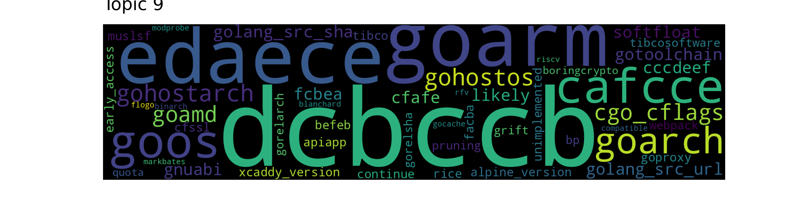

## Topic 10

```console
afeffd balena udev xbuild resin ecdf accd cross entry fdcaa dbab nitrogen slo jn adadbc dbus ul code ndone retrying eddcc nset nn nuntil nmax isg bananapi orangepi hf cbadb xu bada few nbusybox aabaa nrm mediamtx odroid gateway etcher dfba assets raspberry visit device variant pi adfcbd are narchitecture
```
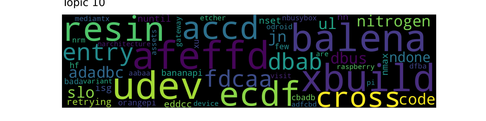

## Topic 11

```console
agx emmc orin xavier npath lintian napt slo udev copyright resin linda dbab xbuild nx balena npe jetson surface nquiet ccimx bada ota entry nvme exclude aabaa seeed rockpro here code asus few orange nrm retrying ndone sbc devkit genericx nanopc dfba ahf visit jn odroid cnx caac tinker nuntil
```
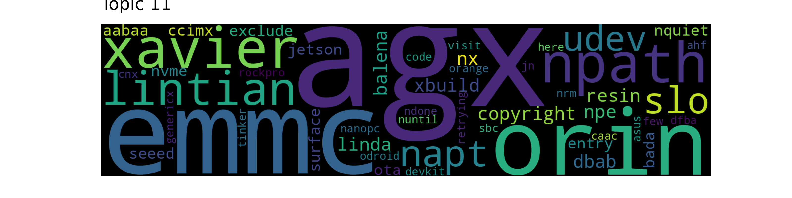

## Topic 12

```console
bdfbfec libopenal nuntil nset nn code retrying iproute xbuild resin iojs udev ndone nmax dbab slo inetutils npe cafada libsdl fbaddf bitrise_io shaun universe rocmdeb jackman df_version ruth deeebb kern odyssey gijsmolenaar kernsuite nrm gt nanopc orbitty julian hf iojs_ babim entry c_rehash astropy fpcomplete pocket pycurl balena eq lcbzu
```
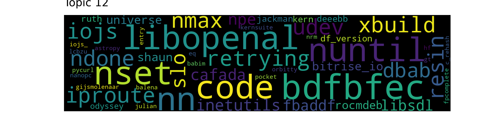

## Topic 13

```console
rockylinux linux_ver cedbdf tipy ffabb gdf cuda_ver rapidsai arch_type gpuci_retry blazingdb xgboost_version clx rapids_ver hash_join build_branch realpath dffcd sklearn_version ebaed fcdab dask_version parallel_level cxx_version numba_version rapids miniforge_url fefeced rapids_dir scipy_version cc_version pandas_version xdff supportfiles cython_version conda_ver blazingsql full_cuda_ver ipython_version tini_ver mytemplate nbcontrib widgets dask_cuda nvdashboard cffi_version utils_dir activate_rapids condaretry orgg
```
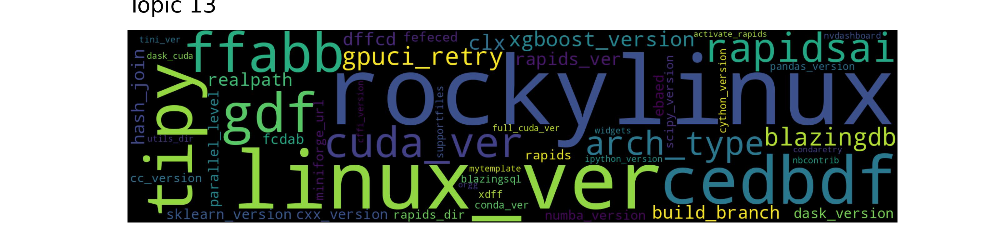

## Topic 14

```console
dbab slo entry xbuild udev resin rockpro balena retrying ndone code nn nuntil odyssey few cross cdee nitrogen variant nmax bada visit nset ndnf cafa narchitecture nvariant unipi nrm ahf are aabaa variables clients ucm nos device nextra easy orbitty messages way raspberrypicm usbutils rockpi glib assets spacely lcbzu ndefault
```
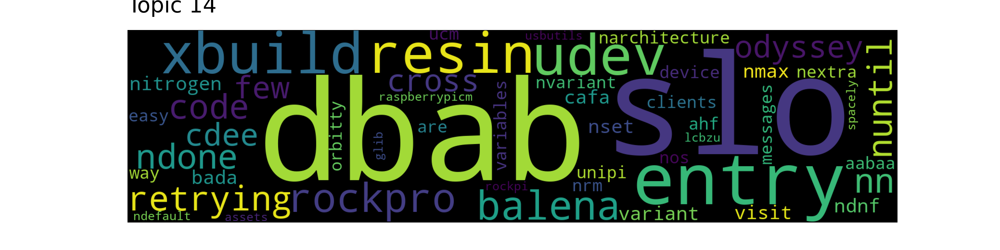

## Topic 15

```console
fbdccfdd cdcfbbe nmu baedf noprompt eeeedef bdfafa deststorepass eaeda readlink changeit errexit postinst martijn fbcde koster groovysh srcstorepass groovy_version javac browse jks greenhills fffad nounset sbt_version bpo importkeystore jira deststoretype srckeystore dirname aaafba sbt destkeystore java_base_url cbaadc cromwell groovy_home selections cceecacdd jruby_sha early_access downloading svt jruby_version workaround activator play typesafe
```
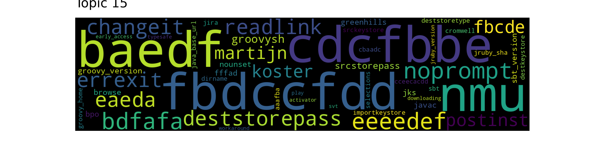

## Topic 16

```console
xbuild resin slo dbab host_version entry retrying ndone beaafb code aspnetcore_urls nset dotnetcli nn ust dotnet liblttng dotnet_version nmax nuntil zre npath isolated libgssapi udev balena npe surface genericx gconf gnuabi lintian dafcca jdk_name rserve_client aspnetcore dotnet_sha muslsf aspnetcore_sha azureedge rcu inetutils caaae mongod lttng faccbfb cross pwshtool functions hdt
```
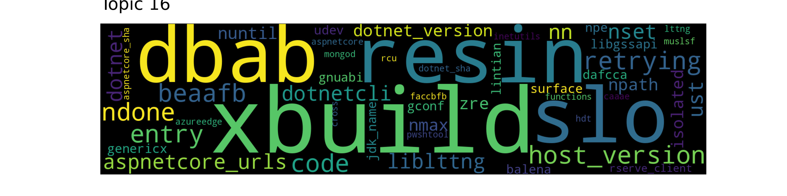

## Topic 17

```console
nn nmax retrying code ndone nset bsi oxzf nuntil artifact xcaddy_ vmware pwshtool bddcc packs node_exporter centurylink xbuild dbab alpine_mirror resin udev alpine_rel jacoco df_ai_version simdem_cli cb_package_name dotnetsdk edebc promtool isolated download_sha edace azureedge slo git_lfs_version nvcc_gencode nicos remove_source dotnet_nologo goth solr_group rserve_client nuxeo_dist_url initnuxeo mysolrhome solr_gid poptorch edl em_config
```
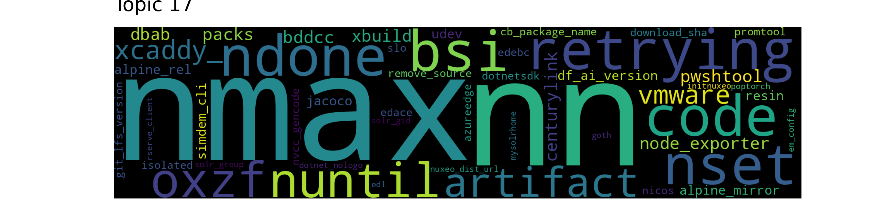

## Topic 18

```console
dafcca fccfce bcbbde rustupurl rustarch abbbae efede rustup_home dcdede rustupsha bffcf debccd cacdd rustup rust_version rust mfpu cflags_armv modify cargo cdbfdcd cargo_home gnuabi gnueabihf imagemagick eggdrop target_cxx adfec slo musl cdcae c_include_path retrying target_cc qemu_ld_prefix rustc toolchains mercurial code nmax nn nset nuntil muslsf ndone unknown target_ar sqsf profile_orig adadf
```
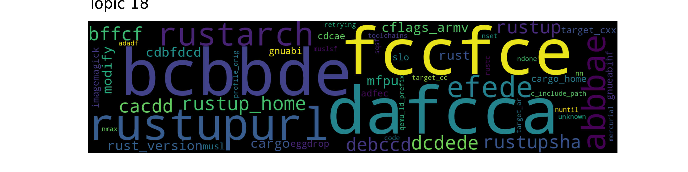

## Topic 19

```console
dbedc fdddccef febaa bfaae bdadec dpgswdist fcabd ztat decfd fbafb deeebb cccaedd bdfbfec zalando cddefb bbfcc feaea dacab aadbb gijsmolenaar effbb cdbfd accdfb cleanmask sqlservr fbaddf libopenal libsdl eaefefdbafa bitrise_tmp_dir cafada bhugo termini bcfcc webdevops prep locale_collate ben tobias ccdcad hvr fire ischroot luis shaun tool_ver_go resin xbuild bitrise_io instructure
```
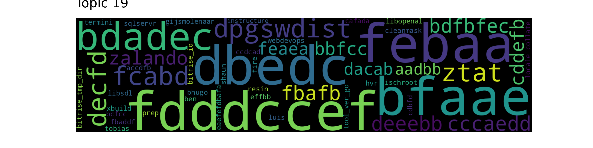

## Topic 20

```console
commit_id xallow_unsigned xtrue bceecd confluent installing bdadcb monitoring controlcenter allow_unsigned interceptors kafka cfcbc west partner repo_ rrequirements shttps jms connectors center sink jdbc build_number cub dirs edfb adding workstation qq hdfs transport project_version amazonaws connect avro secrets artifact_id jars cub_classpath component azulsystems staging git_commit unknown dfafdd confluentinc dub number scala_version
```
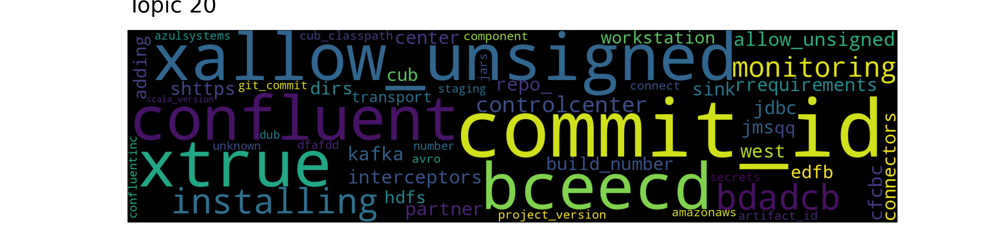

## Topic 21

```console
cacba udev balena xbuild resin entry slo bffbc afeffd dbab ecdf cross accd dbus odroid code ndone retrying xu afeb ffbce nitrogen bada nn aabaa jn few nset nuntil revpi isg nmax ul adadbc dfba device gnuabi nrm visit narchitecture assets raspberrypi pi are ahf nbusybox nvariant gateway hf adfcbd
```
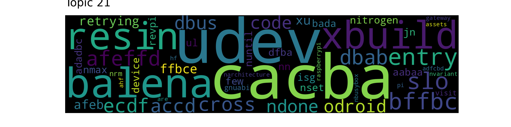

## Topic 22

```console
nitrogen npe xbuild entry surface dacee resin jn slo genericx nanopc udev balena odyssey dbab orange asus bananapi isg tdpzu ccfdcf cross tinker odroid xu dbus air spacely nbusybox orangepi raspberrypicm afeffd cnx pocket ul ahf photon code orin assets adadbc orbitty eddcc ndone rockpi accd revpi retrying visit rockpro
```
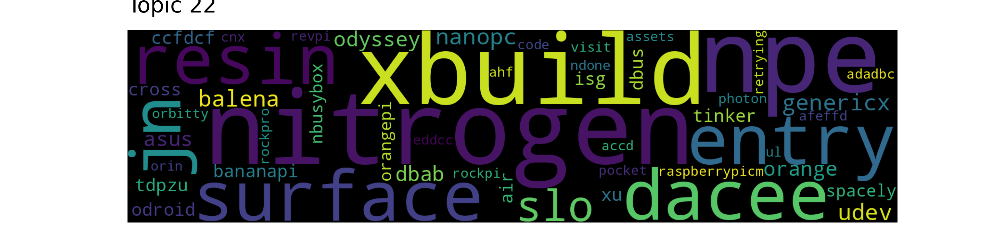

## Topic 23

```console
febcda cadae bluez poetryvenv libtirpc eggheads ffi eggdrop all_modules nspkg libnsl bdeeeb loadable xjc uv cli_version command_modules tmp_pkg_dir trim_sdk bash_version ebbdb cddac az_installer embeddingstore dst bbcfed cdbebe privates fastapi gdbm locust cffeca whlazure findutils pyc pyo material install_full bebeba uvicorn ensurepip deced gpg_key idle_test ebaacf aws_lb_version ft_app_env pydoc pax promptflow_sdk
```
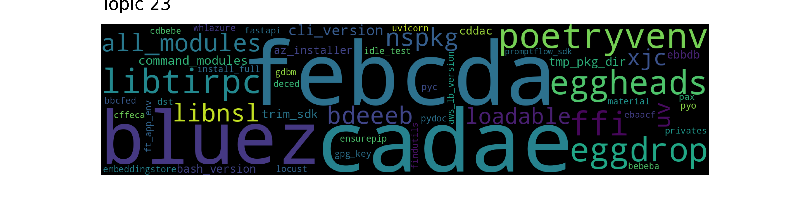

## Topic 24

```console
getcli xlocale jfrog conan_version certificate conan libmpfr dh nest autoreconf multilib nasm serverall pyenv martinez intelpython liblzma vim luis maarten bartolome rope sudo stillwater ninja pypoetry level_zero_ver alternatives idp libmpc torch_version docutils libncursesw oneccl_version cxx mkl_ver fonville icd_ver bintray essential chpasswd cookiecutter autoclean cmake sudoers libreadline pyenv_root gmake dpcpp_ver ccl_ver
```
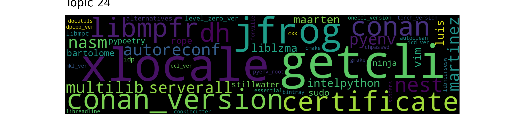

## Topic 25

```console
latest_release circleci circle setuid url_effective shere sandboxg direct firefox_url phantomjs_url actual_url chrome respectively libgconf openssl_conf geckodriver mplayer extracting location fail cil debian_version chrome_version libdbus nxvfb firefox chromedriver retry ctf_values cft_channel libasound libgtk lib_pypy phantomjs ecfef browser_name xvfb fy bcde build_ firefox_version preserve sandbox libgbm product playwright libxss vpypy_version jq_url delay
```
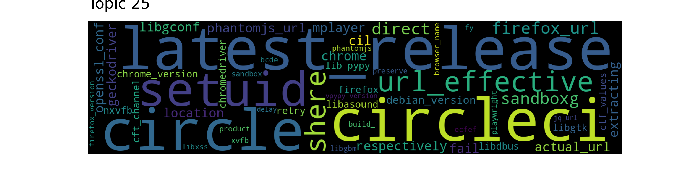

## Topic 26

```console
sac win_x package_dir vsextui pscore rtm stoptime msiexec sdk_tools testhost containeruser msi testplatform downloadfile powershell_msi featurename windowspackage activities iis webserverrole nonewwindow setx allos dism apply nanoserver ndp weblegends enu ltsc tpm windowsupdate culture transcript directoryname neutral qn newname netfx cool df_ai_version msu symboliclink msdownload kb bdx uw benlubar usebasicparsing updt
```
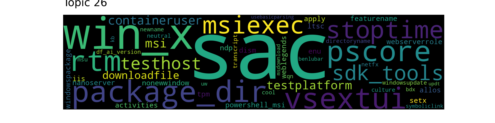

## Topic 27

```console
liberica_vm liberica_root bellsoft bell liberica_build lite rtag sl info vm dist_url unpacked_root pv cfg liberica_arch liberica rsuffix jlink pkg_url vfp standard hflt compress aliased_to sw unknows man jsa opt_pkgs jdk jmods sha_url jvm known classes pgpass invalid sstartgroovy does pages example workarea editing smartfolders jmod argument header maxdepth amp avalable
```
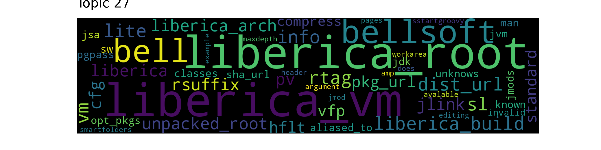

## Topic 28

```console
ruby_major bundler_version showformat ruby yjit exitgem sitemap createenv gemrc libgdbm resolv creategem coffeescript mentions proofer gem_bin event bundle_path webrick paginate minima bundle_home bigdecimal jekyll_bin cdbfdcd chicago drafts jekyll_var_dir ruby_version sg lftp jordon su_exec_version redcloth jemoji force_polling kramdown yaml jekyll_data_dir rdoc gemfile libffi tagomori bundler define bedwell gem bundle_bin document jekyll_env
```
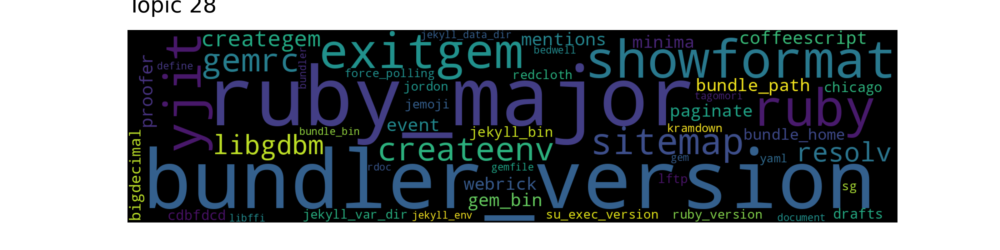

## Topic 29

```console
reproducible lambda aws_cli_arch awscliv task ddcbc groupinstall lang awslabs image_arch aws_lb_version sam_cli_version builders binutils unzip aws cli goth amazonaws libmpc file awscli yum_conf exe curl grift env zip libgmp rsync samcli liblzma rm simdem_cli bin sam apiapp dir install has_section abbbae add_section cmakeflags writef var usr in yum workdir bcbbde
```
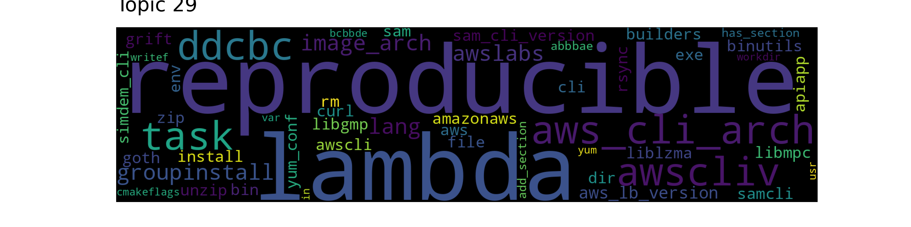

## Topic 30

```console
slo balena entry dbab bada udev xbuild resin cdee cafa aabaa dfba odyssey assets visit cross air few ucm nos nitrogen retrying messages nvariant ndone narchitecture variant code nextra npe genericx here spacely ahf ndefault rockpro nn way details tinker idling easy variables nanopc ndnf cedead are surface asus nbusybox
```
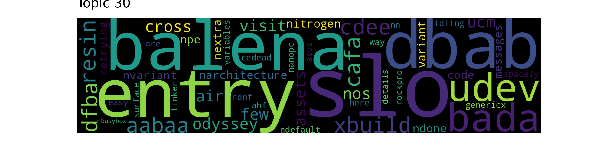

## Topic 31

```console
udev entry xbuild cross resin balena feab eddcc dbab adadbc dacee slo ddba aaccd nbusybox assets jn retrying dbus surface ndone odroid xu are few visit afeffd nrm spacely nitrogen isg orangepi asus fcdfc narchitecture code eebeb nvariant messages ul nuntil nquiet deaeb eda nn nos dbedd idle cdbecb npath
```
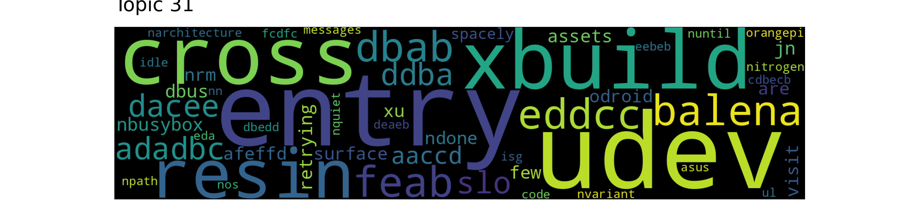

## Topic 32

```console
cddcd libxi host_version libappindicator pixbuf libatk libxshmfence caaae libxdamage libgdk libxcursor libcups libxcomposite gconf libxtst mplayer libgbm randr xcb xdg libxss shape libpango functions beaafb xfixes jdk_name dialog libpangocairo bridge azcli debian_version libdbus libxfixes glx libxrandr libxinerama libnspr msft bbfbd cfbf microhei getvsdbgsh vsdbg uming isolated acad libhunspell zre libmagick
```
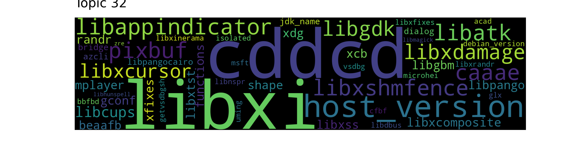

## Topic 33

```console
gorelarch gorelsha unimplemented corresponding bp edaece todo have cafcce acdae goth pruning does markbates gometalinter rice rfv golang bdbfb facba alecthomas grift warning pwshtool cfafe gobuffalo buffalo apiapp dirarch cfssl aeffe dcbccb tararch packr likely pop gotoolchain oxzf goenv fcbea deplist pypyarch after backports bdef boringcrypto packs filetest race rn
```
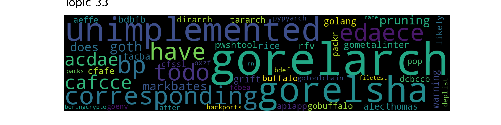

## Topic 34

```console
afeffd xbuild balena accd udev resin entry slo nbusybox ecdf dbab dbus ahf surface cross bada nitrogen adadbc npe eddcc genericx assets dfba jn aabaa odroid code xu orange ndone visit retrying air dacee few nanopc nn isg spacely mediamtx_v raspberrypicm nos raspberrypi nset nuntil orangepi tdpzu ccfdcf bcaaffefea narchitecture
```
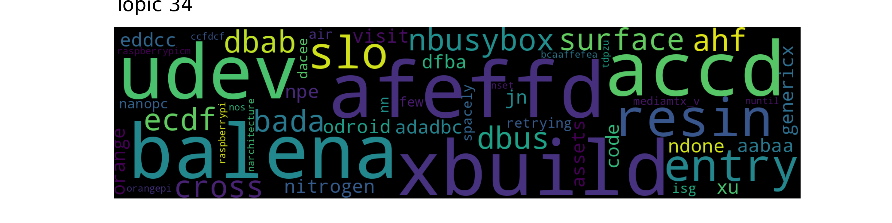

## Topic 35

```console
rpc proto_path eldev webinstall grpc_tools python_out model keg third_party cask ssdv build_with_ipex dockerd ipex_url grpc_python_out buildkit sac resampy inference serve protoc ipex_version gitpod joblib ddbdf requirements protoc_zip kserve_wrapper properties models store entrypoint upgrade pkginstall mosquitto_ctrl protoc_version vmagent branch_name nuxeo_md pygit abseil deadsnakes trigger_rebuild protocolbuffers apiapp stow user_name aoc goth broadwell
```
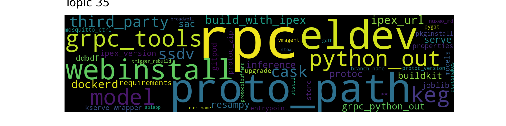

## Topic 36

```console
abbbcb motd pam_loginuid optional bdfbfec cafada udev max sage_src_target bdadec rocmdeb pam embedded nset nn tcp_syncookies sshd nuntil code retrying nmax systemctl fbaddf opasswd febaa iproute cleanmask node_polling ruth libopenal resin screen_width permitrootlogin hsetroot ndone node_port slo borsboom wifi cubical inetutils permissions nodejs_version babim julian bray erik screen_depth board futures
```
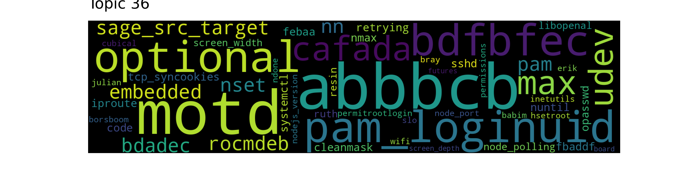

## Topic 37

```console
buildslave bazelbuild broadwell bazel atex enable_runfiles bats build_pip_pkg applewebkit ci_build_python cxxopt configured ci_build safari branch cuda clone khtml sandybridge cudahostcxx expunge setup tf_need_cuda meqtrees tigger gecko tensorboard dt prompts purr tf_cuda_version buildifier buildkit ocpkg_url xpu sa honggfuzz kittens core_plugin cliffwoolley promptflow ptxjitcompiler bazel_version patched_file cuda_version owlcat pyxis max_idle_secs devel ocpkg
```
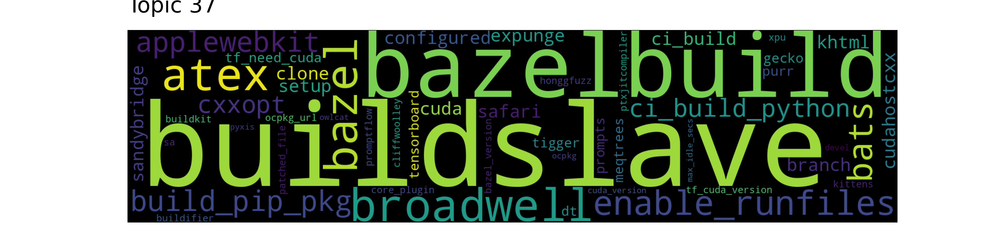

## Topic 38

```console
pip_no_binary sdispater frontend gdal virtualenvs pyproject ebbc xp_uid xp_user libmemcached xp_root psycopg xp_home poetry_version unwind xp enonic emsdk_portable nodejsgrep libproj cddac cordova_version fdcc rethinkdb tika_jar_name tests qiime webide libbluetooth build_proj test_class nikolai oh resty_apt_repo regress abbbcb test_codecs runtestflags nodesourcecut storm kristiansen poetry srcs versiongrep node_ coding projsync uv libgdbm debconf
```
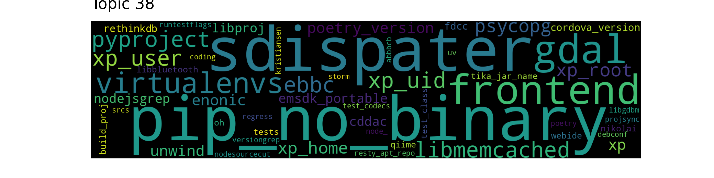

## Topic 39

```console
adadbc eddcc udev dbedd xbuild xu odroid resin entry balena ddba dbab cross slo nbusybox dacee bbfe retrying assets ndone code genericx surface dbus baceafcfb orangepi feab deaeb inetutils mdsip_port nn visit qemux nuntil nmax spacely few asus orbitty jn tinker nrm koch nitrogen nset afeffd ptxjitcompiler narchitecture variant messages
```
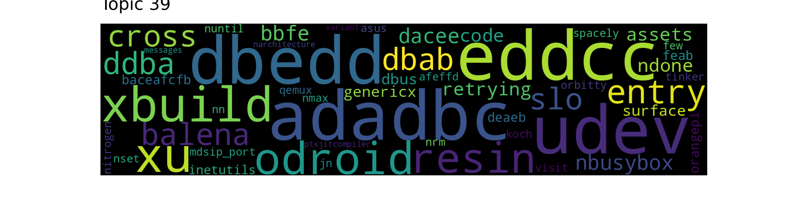

## Topic 40

```console
molchanov konstantin guilherme thomazi dominik bonicontro xj nim_version picheta nigredo authors tori nodesource koch setup_ nim websocket c_code markprocess libdeflate qo edaf sums_linux_amd startd pwd bdfafa ats jstl start_modules build_projgrids product_version dll chrome_bin enmod cacba cacab addbca sigfault bin_name classpath prereqs gobin cdbdcae nodejsgrep filetests libwebpdemux rdf cfedf activation tryton
```
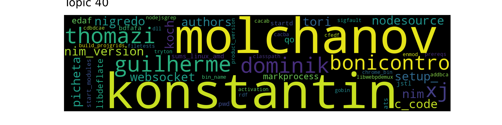

## Topic 41

```console
mraa_commit upm_commit swig mraa_version libpcre npath copyright exclude getcli mraa librocksdb libdeflate linda cplus dwerror release_version lintian upm_version jfrog clone libfyba nquiet cmake libkmldom libkmlengine swi git_version libkmlbase fallow checkout napt fcflags bullseye builddeps silva mismatch libbrotli libserd uninstall libraptor libspatialindex eduardo libfreexl liblog libossp aed fflags mpich_version gui vcmake_version
```
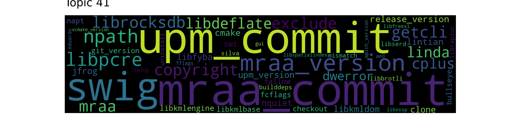

## Topic 42

```console
postgres icu nss_wrapper world postgresql divide pg_sha libbuiltins integer vptr blob_plain vla includes bound unreachable attribute vpg_version nonnull search_path lksctp gssapi returns pgport array replaced gitweb datetimes uuid dddec safety overflow zoneinfo postgreshome fs pgdata savannah ecdbd pg_version bounds hb plain tap denable_dist mpl bebeba gen_opt_flgs guess seclevel pg_major head
```
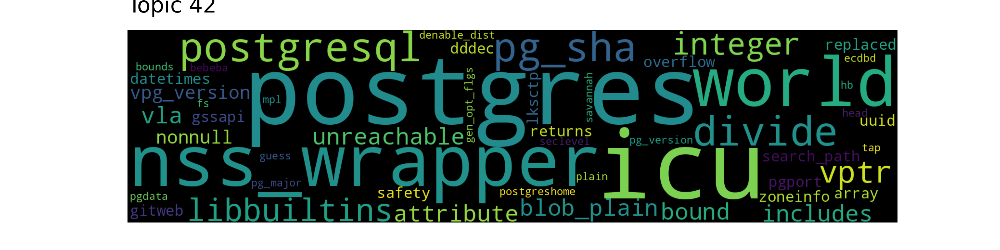

## Topic 43

```console
es_download_url elastic_version badfd faecce acfca expected_sha logstash cbfb ddcd centurylink snapshot pipeline remove_source star_version ccb keycloak_dist trimmomatic proteinsolver xdev yml afb wildfly_sha eec esdirs fusioninspector oss goldmann awscollector marek lso wildfly_version bolt jboss_home phoenix lo feacc fdab pipelines bddcc how build_proj git_branch efbe mercure license_base nvcc_gencode caddyserver repl node_exporter aaca
```
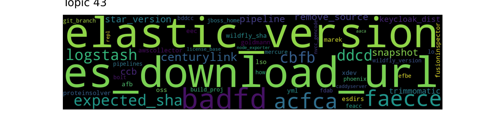

## Topic 44

```console
hugo_env hugo_edition suid hugo_version version_arg hugo_bind hugo_cachedir autoprefixer coderay rouge rst postcss node_path extended hugo target adcf babel maxdepth mindepth miniserve completion fdaf gitignore standard asciidoctor bash node_modules goroot npm do setuptools acb production busybox gitpod slingshot map lc_measurement adbbab ca npm_version lc_time fccacc ecbf muslsf buildkit git mfpu trigger_rebuild
```
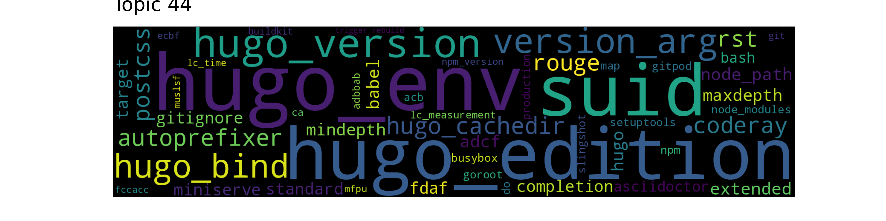

## Topic 45

```console
vmware genericx dbab npe with_srv xbuild resin with_tls_psk with_websockets orange mosquitto_pub orbitty retrying plug nn with_strip code workstation udev dfhack ndone with_docs package_dir auditwheel_plat git_branch mosquitto_sub surface auditwheel_arch personality balena jn renode es_download_url mosquitto_rr benlubar with_adns stonesense fdcdb epl klee mongod aflplusplus df_ai_version fafbec nset smartfolders nmax odyssey wildfly_version entry
```
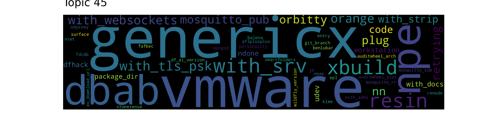

## Topic 46

```console
entry slo balena xbuild udev resin cfcdd few cross narchitecture dbab visit are nvariant basearch nos nextra retrying easy ndone variables way odroid jn seeed armhfp xu ndnf messages ndefault anywhere variant odyssey isg assets unipi clients raspberrypicm device idling aecbc nitrogen rockpro nuntil here code nn dnf keep ddba
```
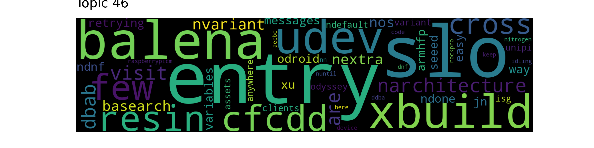

## Topic 47

```console
afeffd accd ecdf udev xbuild balena resin cross dbab dbus entry slo adadbc eddcc bada nbusybox aabaa dfba fdcaa ndone retrying genericx code adfcbd gnuabi assets mediamtx_v jn odroid surface xu nitrogen gorelsha feab mediamtx few libmosquitto nrm faeae gorelarch visit ul pi mosquitto_rr nset mosquitto_ctrl nmax server_v nn orange
```
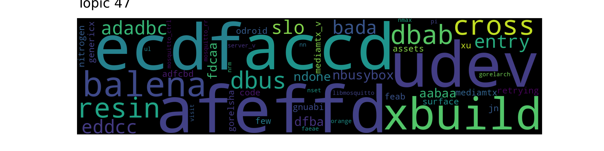

## Topic 48

```console
eddabaf ilib fwrapv skaji ccflags archbits archflag miyagawa pe duse xaf bitall metacpan bitint pevans dusethreads darchname mi martini zak test_harness test_jobs duseshrplib cpan peter cefdf elep cpanminus cdbdcae savedpackages dvendorprefix cpm gettextize des bwa cccad jnproc cpanm salmon bfabf trimmomatic raku fusioninspector skesa libgdbm memcached_url star_version rakudo_version keyfp pilon
```
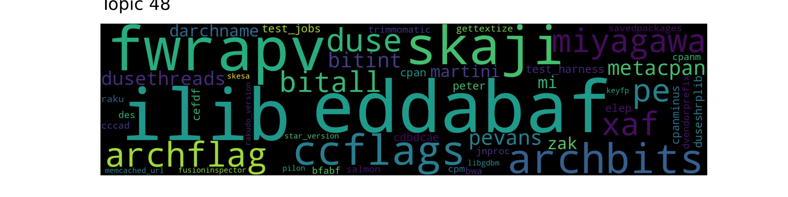

## Topic 49

```console
nginx_conf_file rv localrepo goth rpms_path apiapp ouch dockerstage pmc workers installnginx oc pip_index_url rzw cdwlszc msazure experience close writef pv filetests mimetypes filetest ys introduce port_ipv rpms_to_install add_section excited local_repo_path installnodejs embedding able nsystemd paths catroot gfx groupinstall sysroot cors python_deps rpm_file jmods have nasys fetch_head httr_localhost eula_file buffalo unreachable
```
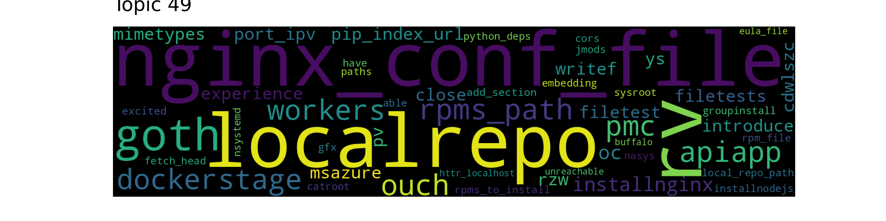

## Topic 50

```console
kc git_branch ngx_cache_purge sysusers liberica_root keycloak_dist gorelarch unsuported gorelsha goth goldmann install_scripts marek unknows yum_conf pkg_link xcaddy_ close git_repo nodotsage tz gometalinter writef chaco release_keys task opt_pkgs bdbfb initnuxeo glibc_prefix golint hypre acdae jmods business mytemplate does ubuntu_suite ext_zlib_url caddyfile add_section liberica_vm docker_bucket correto_temp fafbec alecthomas metis aliased_to divide honnef
```
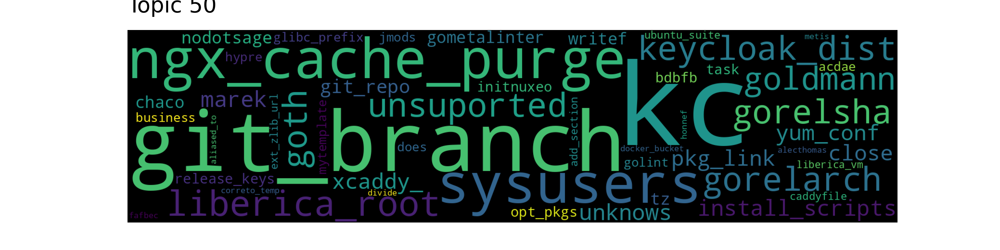

## Topic 51

```console
baceafcfb slo aecbc dbab udev cbab eccfd candidate ddba xbuild resin entry nrm bcea caeb eoan afeee cross ecdabe balena odyssey ndone fcontainer retrying rockpro orange nuntil nn few bafcf messages nvariant nanopc visit variables idling rockpi board nmax updates variant way narchitecture nos code unipi ndnf nextra real are
```
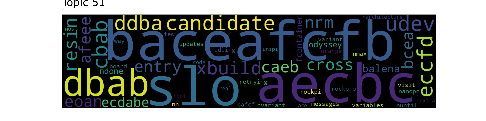

## Topic 52

```console
adoptium temurin binary_url eaefefdbafa linux_hotspot_ jdk_ppc armhfarmv armhfarm bdeffcd esum libretls elpowerpc jdk_s jdk_aarch jre_ppc libffi_sum libffi_url jdk_x phoenix xs jre_s binaries cfebe x_linux_ abdbc initnuxeo codeberg jre_x lfsso le_linux_openj jre_aarch fenics expected_sha slim le_linux_ dedcd nuxeo_version hbase nuxeo_user bacdd x_linux_openj ibmruntimes nuxeo_md bolt nuxeo_dist_url s_tools_version resty_apt_pgp tryton node_exporter xcaddy_
```
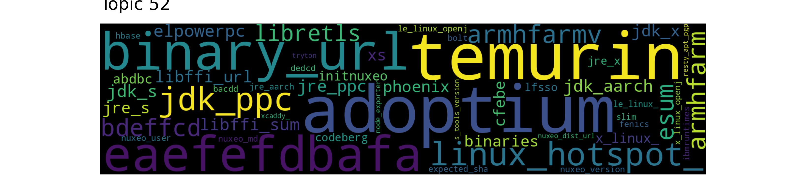

## Topic 53

```console
ring abcfe cacb getsentry xss nop cassandra_conf trusted cassandra sentry_version bin sh cassandra_home sapmachine sentry_plugins fe in solr_url affebf ccbe arg gpg env oblique welcome cbaadc print gpgv disparate pytorch_type cf github dsvm bacdd get aeaecc libaccnotify sc eedbcb nashorn fdd seluser solr_dist_url df resty_apt_repo usr dc caff version solr_port
```
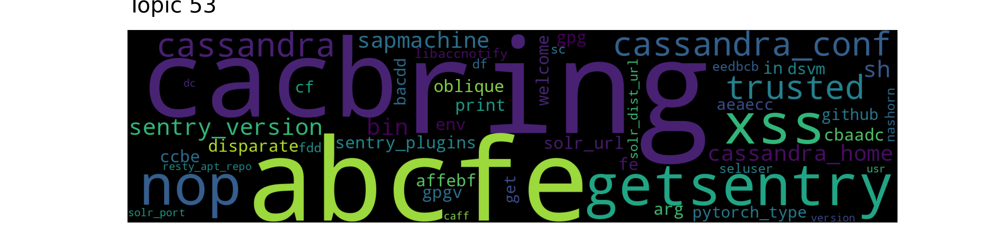

## Topic 54

```console
swoole_async dbbae swoole_version orm_version async_version swoole accce php_ini_dir dev_mode fceceee sfl rootfilesystem getcomposer winch mysqlnd_azure dbabcc loach efcaad sodium php decimal composer date_timezone php_ldflags ext delay php_log_dir php_cppflags corrupt cdaa max oryx php_timezone php_run_dir defcda php_eol embed php_cflags transferlog cfbd rob mysqlnd eabcdf limit unlink libargon hash_equals images_dir integrity bcfc
```
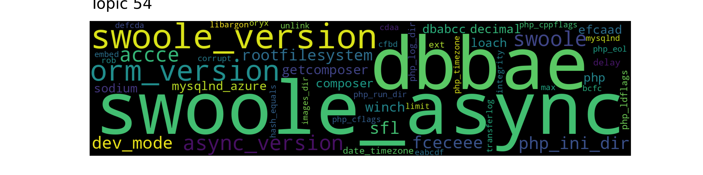

## Topic 55

```console
amazonlinux swift_url bbbfbb swift_branch swift_platform ec cced programming infrastructure swift_version os_arch_suffix swift ae swift_webroot swift_webdir arch_name cc powertools perlmodules osxcross rtag libbsd psmdb_version rocky swift_snapshot star_version ecdfa rethinkdb amzn triple libatomic https innovation ceb sfsl xcaddy_ db star lf keyfp tmp fdd be swift_bin_url tr bacdd resty_rpm_dist centosofficial resty_yum_repo orgbaseurl
```
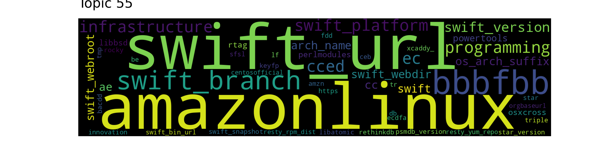

## Topic 56

```console
pwsh psgallery temprepo stoptime az powershell mariner blob_url uw mcr gbubfi installmodule psversiontable powershell_msi nologo noprofile rrygkozj azpspackage requiredversion cmdlets currently waiting drw transcript seconds umiubd fqyzd aka dnobaww bu debugpreference ps_package_url dockerimage bnd psdocker sourceversion jbptc psrepository azpsdocker bdx ey image_name dih outfile yjzcezhlym webrequest fileinfomsifile operatingsystem spr srt
```
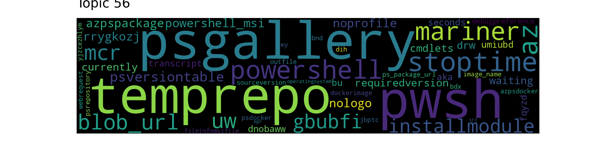

## Topic 57

```console
balena afffa entry udev xbuild dbab resin slo cross ndone ndnf retrying cdee nn cbadb code nuntil cafa dnf bada nmax few armhfp clients nset device aabaa narchitecture nrm basearch nitrogen messages visit nvariant cfcdd nos variant jn nextra variables isg are dfba assets fedora ndefault raspberry easy hf anywhere
```
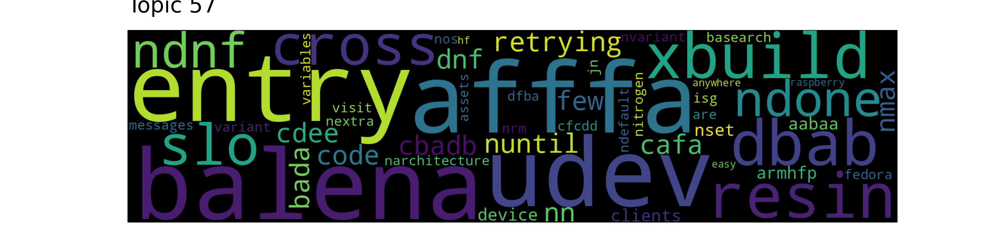

## Topic 58

```console
febcda cadae ft_app_env ebbdb libbluetooth locust bbcfed eggdrop cffeca cdbebe loadable bdeeeb poetryvenv gpg_key pyc xp_uid deced lib_pypy xp_user idle_test dst xp_root aws_lb_version cddac xjc enonic pyo ensurepip airflow_gid savedaptmark yjit bfacff aeca cv eggheads ecdef xp svt all_modules git_sha builders prefect_version ftuser tests rserve_client codeberg lto uv ffi ebcb
```
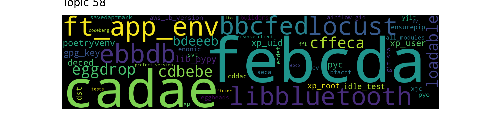

## Topic 59

```console
vcpkg_root watcherexclude better crates serayuzgur devcontainers mutantdino vscode shopify checkonsave cpptools resourcemonitor tamasfe lsp vcpkg_downloads analyzer even cppcheck dotnettools containerenv caaae devcontainer vadimcn lldb timestamp vscjava toolsmanagement checkforupdates capadd remoteuser gmt pylance sys_ptrace msopenjdk devcontainerid hugo_ securityopt csharp builtin ghcr rust_ nvs_dir oct perlmodules hugo_dir seccomp metadata customizations jan mypyenabled
```
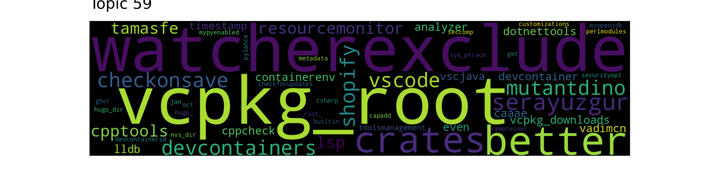

## Topic 60

```console
hooks extract_threads nb_gid dafdddf permissions ddbdde initial nbclassic snakepit nb_user nb_uid jovyan singleuser jupyterhub altair g_slice pinned conda_dir httpgen_cert notebookapp jupyter_core serverapp nbrsessionproxy aarm gtar xetex tries bottleneck cookiecutter super plyr conda_mirror configurable condarc datauri rodbc cromshell jupyter_port crayon caret mamba xclip cloudpickle dvipng firecloud pycurl dask_config fabfc venv_dir pangeo
```
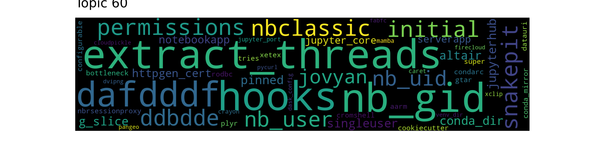

## Topic 61

```console
searchd nodetach mysql_history pygit daemon_url manticore morphology server_ wordbreaker pak columnar manticoresearch lib_ ru spelldump replication redis_args mcl_url mcl core_ mysqld_innodb extra_url cxxopt clip binlog_format nuxeo_md astools gnatsd openai buildkit nuxeo_version ea initnuxeo placeholder pip_package step aql copy uris innodb_ vit cpu tryton backup_ nuxeo_dist_url configured download com london redisgraph_args
```
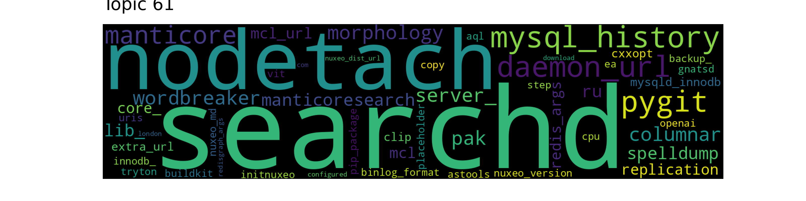

## Topic 62

```console
dotnet aspnetcore_urls dotnetcli libgssapi aspnetcore cbcfbf ust liblttng preview dotnet_sha windows aspnetcore_sha dotnet_version dcaef ddfefa functionscdn zxf ddbfd libicu bacba blob was raspbian azureedge stretch rcn npath host_version nginx_gpgkey skip found could perl_root copyright merged guide ozxf dotnetsdk free fbdea pwshtool fdbba installscripts dotnet_nologo extensionbundle oxzf ababf oryxsdk besser functions
```
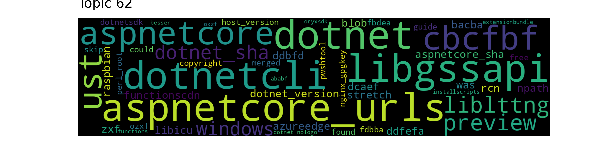

## Topic 63

```console
usebasicparsing testhost testplatform vsextui visualbasic msbuild nonewwindow installpath webdeploy windowspackage sdk_tools clickonce visual dd_setup_ programfilesx visualstudio msbuildtools vs_buildtools componentgroup programfiles throw norestart netfx studio ngen nocache secannotate dotnetbinaries workload netcore windir newname nxi argumentlist nuget_version tpm pkgdef ndp dockerassets vswhere winmdexp symboliclink vs_testagent recurse defaultapppool csi webrequest culture diasymreader allos
```
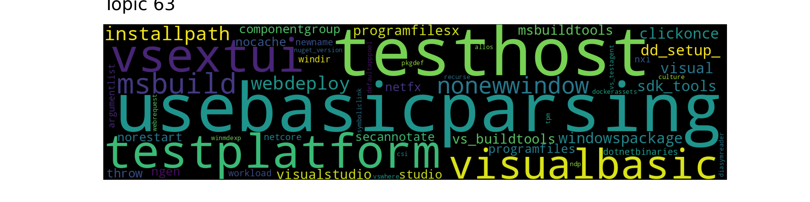

## Topic 64

```console
bitrise digit ninstalling envman upgraded tool_ver_docker keyscan bdfbfec shaun distrib_id steplib distrib_release jackman ci_xbuild known_hosts libflac eeuxo runner_user fafa cleaned mash nodesourcecut mlst goog libopenal prologue tuse_pty nodesource hostedtoolcache inst fasta setup_ doe export_dir se_relax_checks image_os cni_base_url gov imageos distrib_idecho adff run_tool_cache credentials galaxy_user cni_tarball ncbi qiime stepman gotool_ver_go typescript
```
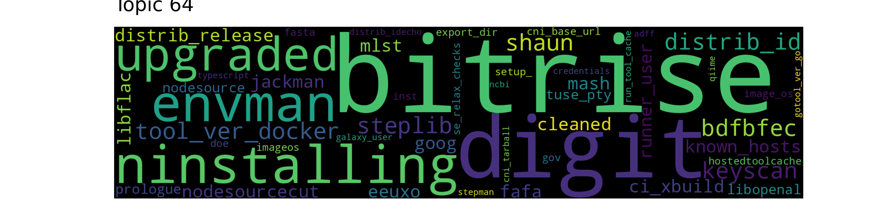

## Topic 65

```console
resin xbuild udev balena entry dbab afeffd cross adadbc slo nitrogen isg dacee eddcc ecdf jn accd xu dbus odroid ahf ul tdpzu etcher ndone bada retrying assets code surface tm raspberrypicm bcaaffefea nbusybox spacely mediamtx bananapi orangepi ioboard raspberry pi revpi mediamtx_v nanopc nset nn nmax nuntil few aabaa
```
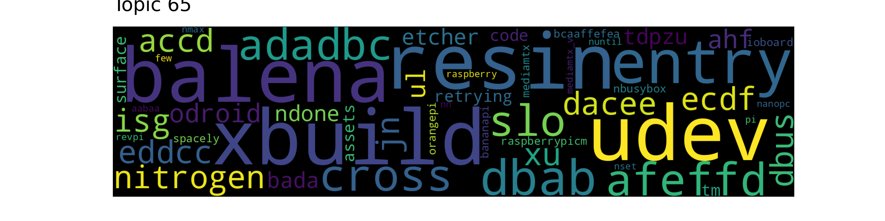

## Topic 66

```console
es_download_url elastic_version expected_sha faecce xdev esdirs dashboards auditwheel_plat product_version bwa es_java_opts bin_name shipper solr_closer_url badfd lso bacdd dfadc normand license_terms raschke solr_keys marek goldmann metricbeat mercure bcfd beats build_proj solr_group solr_gid thelamer acceptlicense ingest leptonica lightweight jitesoft elastic wendy zoo_tick_time solr_dist solr_dist_url fca centurylink proteinsolver thibault auditwheel_arch javaee zoo_data_dir vmware
```
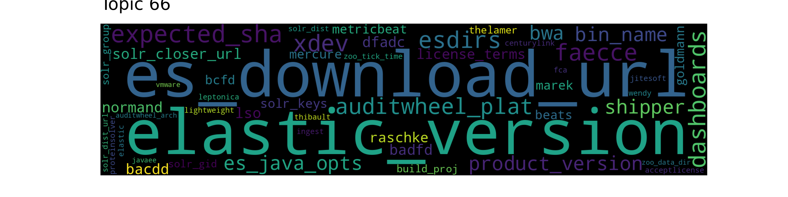

## Topic 67

```console
azureedge dotnetcli dotnet ozxf dotnet_sha oxzf aspnetcore_urls dotnetsdk dotnet_version aspnetcore pwshtool isolated aspnetcore_sha packs dotnetcoresdk dotnet_nologo host_version targeting beaafb azurefd xbuild resin slo gnuabi entry npe retrying code balena ndone nn libgssapi genericx hostfxr nset dbab nmax surface functions nuntil aspnet_version muslsf locals powershell_sha udev simdem_cli ust tryton manifests inetutils
```
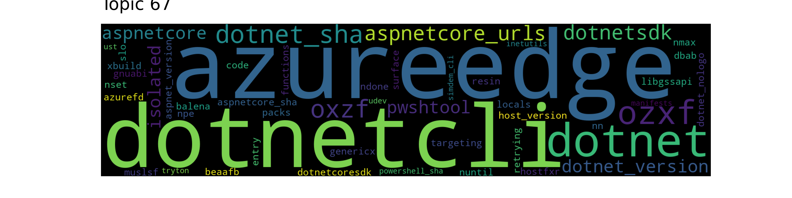

## Topic 68

```console
ebaab obs golang techpreview llc suse opensuse race kiwi sle cfefa image apiapp bci supportlevel label distribution oldstable disturl url golang_version goth sp umoci cdeb dbd www ctl cr fcbf opencontainers iana go guacgui dca de eula ouch cde title adc enterprise zypper io source cfe lifecycle lastlog dcac boringcrypto
```
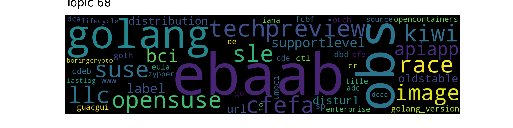

## Topic 69

```console
prefect_version prefecthq prefect_extras fcfbdb git_sha prefect cddac cdbebe febcda cadae egg catalogs prefectextras getsentry qiime sentry_plugins libbluetooth sentry_version pyo storm locust idle_test dfaa depth poptorch pyc rethinkdb fdec xjc kristiansen solr_keys poplar popart rserve_client nikolai xp_uid default_utils solr_gid xp_user ebbdb bdbaf gpg_key solr_sha lib_pypy sentry mlst tests solr_group solr_closer_url rl
```
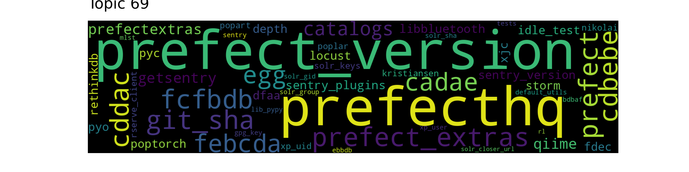

## Topic 70

```console
balena udev afeffd xbuild nitrogen entry resin dbus dbab slo accd ecdf ul ahf cross jn etcher nbusybox isg code px ndone smarc adadbc retrying nanopc raspberrypicm eddcc mediamtx few orange ioboard npe nn bananapi nuntil orangepi tm nset gateway visit aabaa pocket bada spacely nmax mediamtx_v variant tdpzu raspberrypi
```
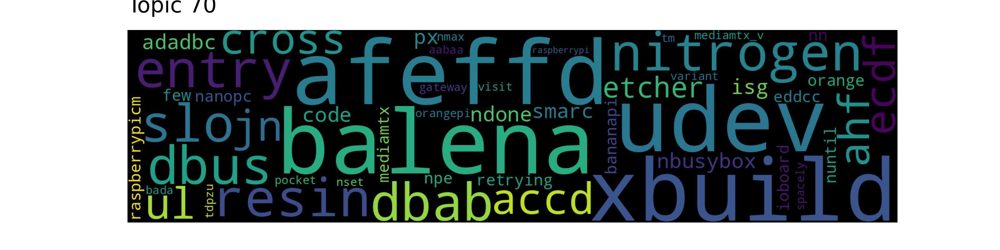

## Topic 71

```console
astronomer_user snowflake airflow astronomer airflow_home constraints in_container astronomer_uid astrogroup groups keycloak_dist dags febcda qiime gosuers cadae compileall entrypoint_prod astronomer_dags pylib default_airflow keycloak auth_backend git_branch kc astro airflow_uid poptorch airflow_gid azure scheduler run_as_user openlineage bdeeeb rootdir gh distro_libffi prefect_extras zeromq autorestart libmariadb iperf ngrep constraint git_repo git_sha bfacff prefect_version prefecthq pyc
```
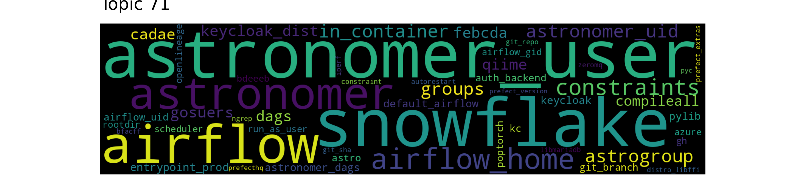

## Topic 72

```console
openj nulnae aztnxdejyaxfpu bgpltjzrnu odywnjixmjy cmvmdgtuojaxoje java ibmruntimes semeru xshareclasses tomcat_checksum scc cachedir lfsso binary_url x_linux_ openjdk esum dry_run_scc nonfatal criu_url name acada bbdabf ibm bootclassesonly dda createlayer bdeffcd true de readonly eq swg le_linux_ wendy devops ecbcad scc_size length elppc bce raschke unset broz opt xscmxscc_size db substr michal
```
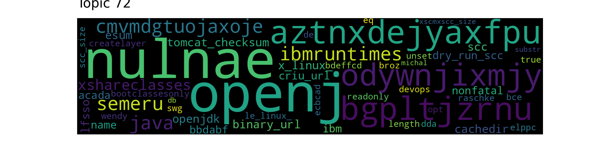

## Topic 73

```console
afffa mic entry spacely armhfp ndnf ccimx xbuild raspberrypicm resin beaglebone emmc dnf dbab basearch hl ioboard isg rockpro orangepi jn few wifi narchitecture odyssey xu variables sbc udev nitrogen cross odroid visit variant ndone etcher uiterwijk cfbaf black ul slo seeed nvariant cfcdd ndefault easy device functionality balena nos
```
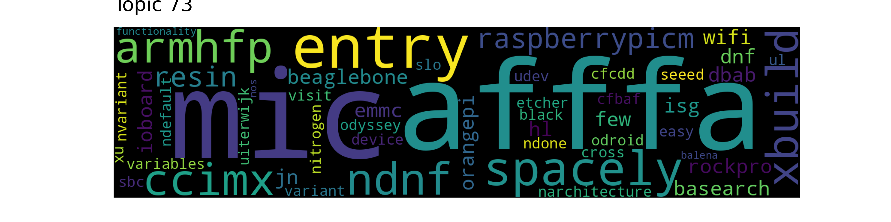

## Topic 74

```console
azurefd checkonsave packs vscode watcherexclude crates lsp locals oxzf serayuzgur manifests pwshtool targeting powershell_sha shopify better mutantdino dotnetsdk resourcemonitor nupkg devcontainers dotnet_nologo azureedge tamasfe acdae psdocker tue gmt analyzer even devcontainer timestamp nvs_dir deb_amd vadimcn dotnetcli containerenv sep vscjava conda_env gnuabi dotnet builtin aspnet_version dcab nov oct ecdhe heads git_
```
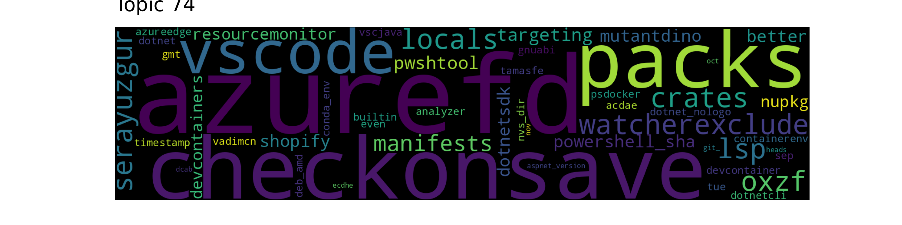

## Topic 75

```console
watcherexclude containerenv pylance shopify mypyenabled lsp poptorch checkonsave vscode crates devcontainers yapf ghcr serayuzgur pycodestylepath pydocstylepath mutantdino ft_app_env pycodestyle banditpath popart remoteuser better customizations poplar autopep yapfpath pylint pylintenabled blackpath resourcemonitor formatting request bdeeeb default_utils tamasfe febcda pydocstyle ubuntu_ lldb mypy flake mypypath vscjava bandit cupy dotnettools bfacc pylintpath ecdsa
```
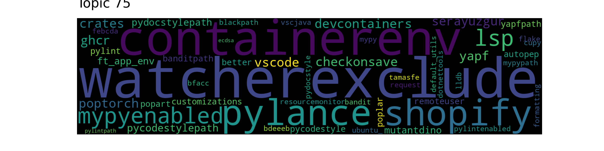

## Topic 76

```console
afeffd npe nbusybox accd balena slo entry xbuild pocket aabaa nitrogen ecdf udev dfba genericx resin dbus bada ahf visit tinker asus cross dbab nanopc surface few nvariant nos assets messages odyssey nextra orbitty busybox narchitecture impish kinetic anywhere here bananapi ndefault cnx orange raspberrypicm px hirsute easy air variant
```
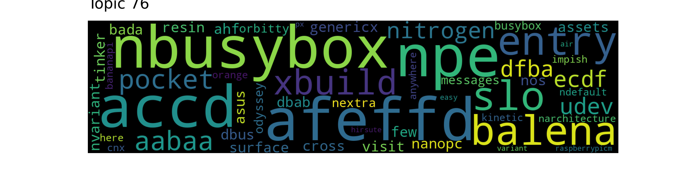

## Topic 77

```console
version_tags makeomatic sfsl npm_version node gold chrome_bin git_ssh_command ci_build_id config_flags ci_build_ref cfffe flavordeps compressed del_pkgs ipv ci_build_time sfslo appbase rm_dirs ng_cli_version vnode_version shasums sslo aminev tapset ny efefe fsslo dfd systemtap decrypt npm nodejs sums_url mksnapshot buildtype cmakeflags amiibcgkcaqea file net lockfile add chromium do bdbe angular vips uv cairosvg
```
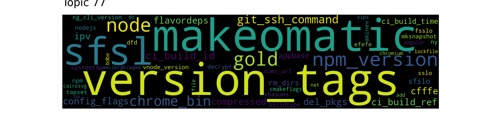

## Topic 78

```console
dwant_python kiwi mosq goth dwant_perl rocm_path gromacs apiapp dwant_cyrus sentry_conf trojan libopenmpi wall klee nccl_home ebcac with_adns znc_version cassandra_sha rn mpi_home psdocker mosquitto_sub umoci herbein sentry grondona hydrogen mosquitto_ctrl sentry_plugins metalayer boost mosquitto_pub graph cmakeflags nopush validator vadios setupvars cupy build_branch cuda_ver bcpushmode cub tactac with_docs commit_branch singularity dadios fbdda
```
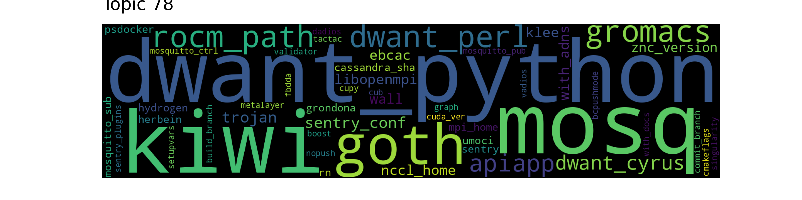

## Topic 79

```console
faecce es_download_url expected_sha xdev elastic_version iter bacdd exit_code swoole_async aaca elastic goldmann skip_gpg_check bolt marek attempts jboss_home dbbae esdirs es_java_opts eswrapper wildfly_sha aada abda pkgarch mercure dfafdd nc ecdsa cefcc usage orm_version tsflags serveradmin personality distrib_major setopt solr_closer_url ecdhe liberty adapter git_branch klee schema max_redirects nuxeo_dist_url dfec dbuild_testing auditwheel_plat solr_dist_url
```
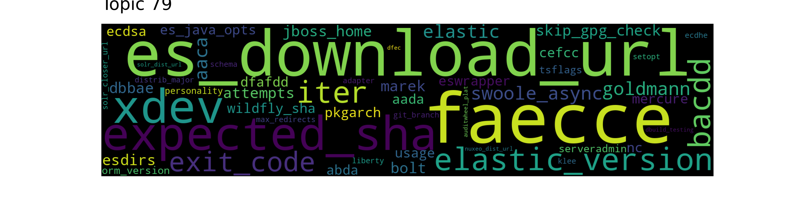

## Topic 80

```console
anaconda sudo msrestazure whl ray links mgmt wheel_path find_links_path nvidia conda identity compute numpy torchvision boto cuda merlin autoscaler buildkit azure flatbuffers inc_version psutil manylinux hosttype gpu firecloud pth six tornado xpu cudnn cromshell core cookiecutter ci_build ipex configured broadwell cryptography expunge targetarch miniconda ipex_version oauth oneccl_version tensorflow devel transformers
```
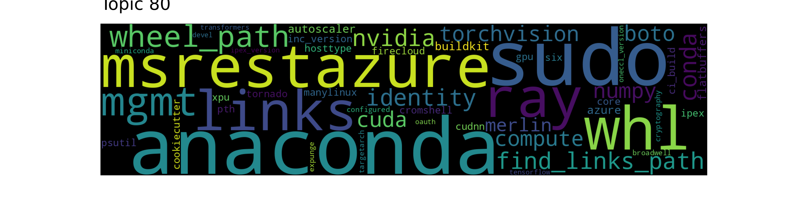

## Topic 81

```console
afeffd accd xbuild ecdf resin udev balena dbus adadbc dbab slo nbusybox entry eddcc cross dacee bada genericx assets surface xu aabaa npe odroid jn ahf dfba orangepi nitrogen ndone ccfdcf raspberrypicm visit feab retrying code few bcaaffefea orange ioboard isg busybox tdpzu muslsf air tinker eebeb cfedf asus spacely
```
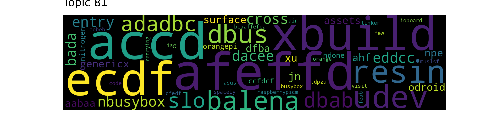

## Topic 82

```console
daffa sudo gitpod trigger_rebuild completion debrepo packages nft securepath completions mpich_dir rootless bkp env_prompt stow zsh_prompt bfbbb nixpkgs webinstall bashrc jre_version workspace curl bash flakes lc eldev tuse_pty default extract_threads grpc_version sel_passwd nbconfig ripgrep direnv ipex_whl_url ia buildkit pg_ctl sel_user mkl_ver dpcpp_ver webide slirp fssl ccl_ver fingerprint buildx git vstack
```
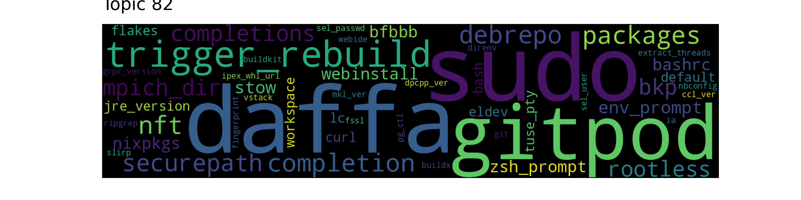

## Topic 83

```console
search_path pgvecto postgres pg_major accc createcluster pg_version enforce pgdg sigint rethinkdb root_password postgresql repokey afcaa gosu_ver postgis_major ecdbd initdb alter pgdata trusted scanpackages sv lafh vmod aptrepo innovation dockerhost tempdir nss_wrapper aacff forego resty_apt_pgp dep adbeac nginxpackages nocheck sc mysqlsh xtrabackup ose resty_apt_repo skesa bwa ri tseemann backuppackage frm njs_release
```
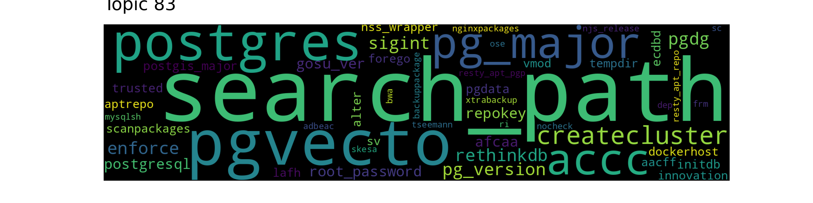

## Topic 84

```console
ddbdebaabbcb uv poetryvenv febcda tests poptorch vl dabbfe sebastian ft_app_env uwsgi_cheaper bfacff uwsgi_ini static_url ping gdb cadae faef fastapi gunicorn_conf listen_port ebfaad static_path abseil ramirez tcpflow nvcc_gencode flask static_index pythonpath dst ebbdb corepack iperf ngrep lto bbcfed bdeeeb poplar iftop uwsgi_processes pn poetry_home tracepath idle astronomer_uid pyo deced popart gen_opt_flgs
```
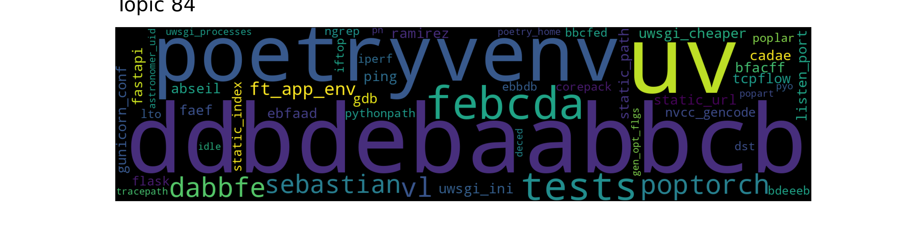

## Topic 85

```console
confluent appuser artifact_id project_version dfafdd appuserdir confluentinc build_number git_commit krb kafka dcc zulu_openjdk yum netcat_version iputils_version new amazonaws bceecd base tar_version adding wget_version git partner component releasever procps_version workstation chown cub_classpath controlcenter nconfluent dirs cp west fdf monitoring appusermulti jars rpm xz_libs_version io fcfed nname in el connect nbaseurl bc
```
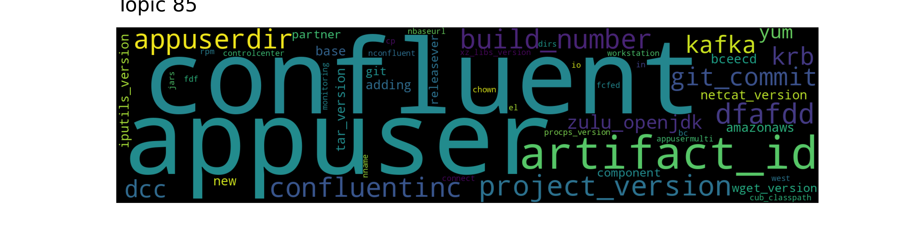

## Topic 86

```console
xbuild resin code slo dbab nset ndone nn nmax nuntil retrying udev balena entry gnuabi schottdorf cross hf genericx install_scripts npe inetutils centurylink fafbec c_rehash node_exporter surface miniserve oauth_app_name muslsf gt nodotsage oauth_realm beaafb dotnet dropbear qemu_ld_prefix adbeac localdomain abebc faaba softmmu catalogs cockroach oauth_client_id iproute localaddress sagedir dfadbeb mercure
```
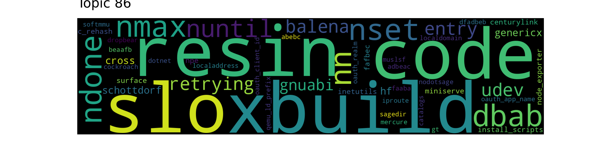

## Topic 87

```console
njs_release nginxpackages ababf maint nginx_gpgkey njs_version abbcbf pkg_release comment nonexistent docker_host rnjs_release dhparam xslt nginx_version forego maintainers ecafb gecos gpg_couch_key njs stretch fetching scanpackages bbedaeaa cddcf nocheck eggdrop mainline jason faaba tempdir cfeeb alerting dfffd pass proxy_temp_path embedding eebdb dockerproject dockerhost eggheads createcluster xp_user xp_root sage_root sagemath mkfifo nicolas ecdef
```
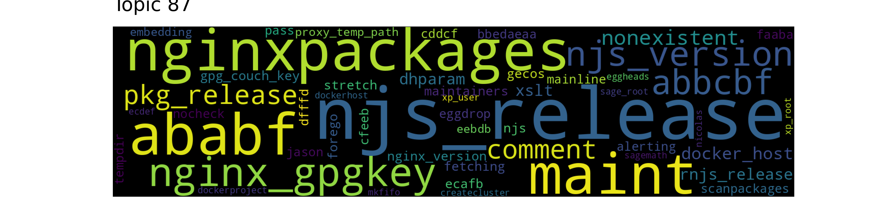

## Topic 88

```console
bcaaa rnjs_release embedding smartbear fbadea gorej faabc nginxpackages vladimir port_ipv verification apkindex dfbfbec cors envsh succeeded nginx_signing ecada resolvers tune processes docker_host pkg_release tempdir njs_release abbcbf nginx_version ecafb dhparam hg pkgosschecksum configurator abuild tarball cfeeb cddcf eggdrop rpkg_release xslt bbedaeaa key_sha njs proxy_temp_path api_key swagger fbdcc forego vegrep ccbbc eedda
```
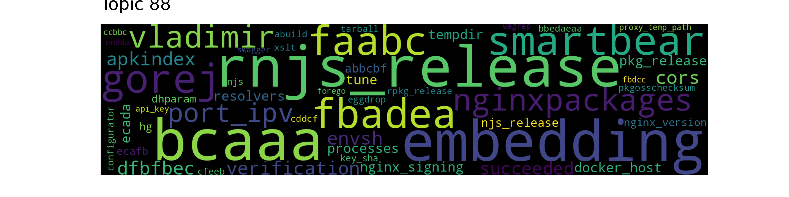

## Topic 89

```console
centurylink portainer mdsip_port awscollector initnuxeo aoc qemu_ld_prefix phoenix tpl crt feafe bolt mercure thumbor tryton gnuabi webide muslsf fafbec baaede nuxeo_user renode mamba_user nuxeo_dist_url keycloak_dist schottdorf dropbear tobias git_lfs_version etcdctl travis_branch fcafc resouce_version nuxeo_version muslabi srcs coding nuxeo git_branch env_name janeczku nuxeo_md mamba_user_id nuxeo_home cockroach cromwell_args curlrc oh system_libs adapter
```
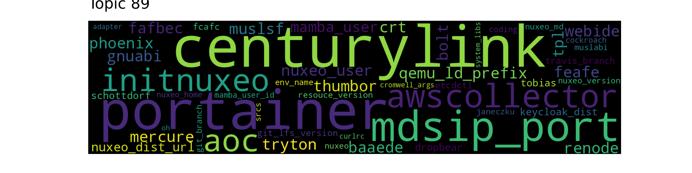

## Topic 90

```console
ipex_version build_with_ipex branch_name ipex_url ipex machine_type torch_version xpu ipex_whl_url torch_whl_url gpu use_cuda serve cpu pygit ts_scripts oneccl_version ccl_ver libiomp dpcpp_ver mkl_ver configured distutils whl pytorch ci_build level_zero_ver eldev model icd_ver inc_version base_image cuda_version cxxopt pip_package idp webinstall torchvision ocpkg_url github_name libomp tensorflow checkout oneapi keg ci_build_python cask software torchaudio inc_ver
```
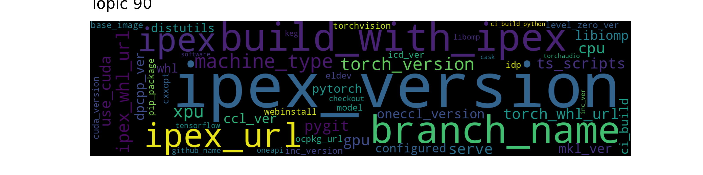

## Topic 91

```console
xbuild resin udev balena dbab entry slo surface code genericx jn ndone nitrogen cross retrying afeffd nn ahf adadbc nuntil eddcc npe nset nanopc odroid nmax xu orangepi orange isg bananapi dbus accd bada ecdf eq ul tdpzu few nbusybox assets mediamtx_v visit spacely mediamtx revpi etcher dfba raspberrypicm aabaa
```
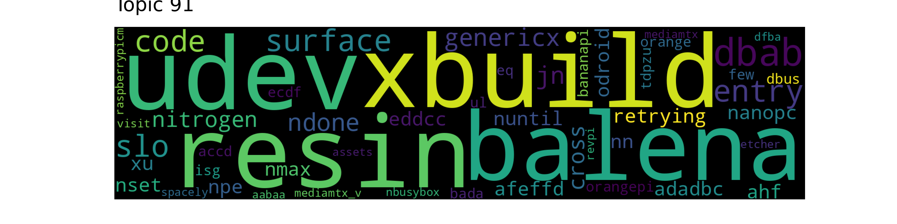

## Topic 92

```console
udev balena entry cross xbuild feab resin dbab slo ddba jn adadbc eddcc ul few are dbus odroid visit xu nbusybox nitrogen narchitecture retrying isg nvariant orangepi ndone nrm assets nos nextra messages device ndefault variables way afeffd bffbc code easy spacely tm dacee nquiet idling variant surface npath napt
```
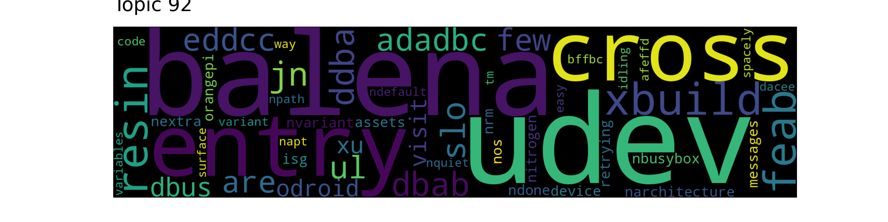

## Topic 93

```console
beaafb azureedge functionscdn functions host_version aspnetcore aspnetcore_sha cddcd zre bbfbd aspnetcore_urls isolated dotnet dotnetcli webjobs eacca acbfdb msft ci_build_time extensionbundle demo_scripts caaae dialog ozxf webhost ci_build_ref ys gconf vsextui liblttng ci_build_id libgssapi cfbf df_ai_version workers ust jdk_name simdem_cli simdem dotnet_version signedheaders squashfs dbab ng_cli_version dcaef odoo_sha caca amz oxzf slo
```
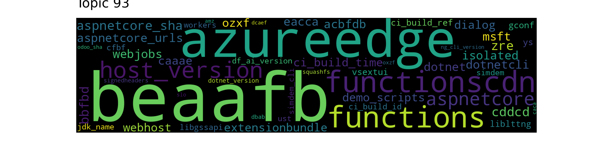

## Topic 94

```console
zulu_key_sha public_keys signing cfbc ceadd zulu_repo_sha aaafba esum azul cdn kafkacat workaround faed surface alpine_version applying bay cdac longer zulu_repo_ver cbdb elastic_version dwarves fceef es_download_url binaries tf_major freefont fffad abdbc zsi dinakar expected_sha fvvu accepted tf_minor msttcorefonts fasterxml dockeruserfile cordova_version ujmdiifywbrw nuxeo_version hbase binary_url jdk_ppc qk annotations publishes glibc_repo qtr
```
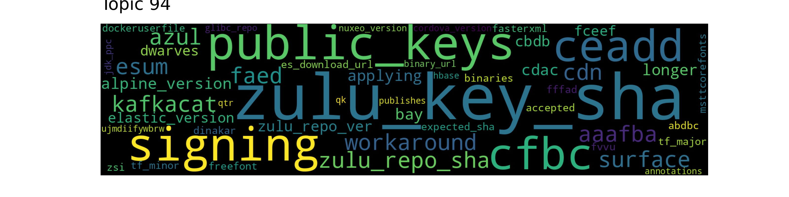

## Topic 95

```console
fileinfo linuxserver baseimage cdffae aptalca xmlwriter simplexml script_filename january label sparklyballs fastcgi_param fastcgi_params daily nop periodic logrotate image opencontainers november december build codiad_commit version baccc fb authors libressl build_version php october in dir sh io eeeb af thelamer abcac echo bin created org packages cabec maintainer apk dffba ed guacgui
```
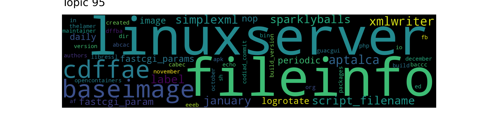

## Topic 96

```console
npe slo npath lintian xbuild resin dbab entry genericx napt nanopc cnx retrying ndone udev bananapi balena surface linda code nn nuntil copyright nmax nquiet orbitty pocket nset exclude orange odyssey nx lcbzu cross asus smarc tinker here ucm eda c_rehash rockpro xavier nrm odroid agx details rockpi bfedac emmc
```
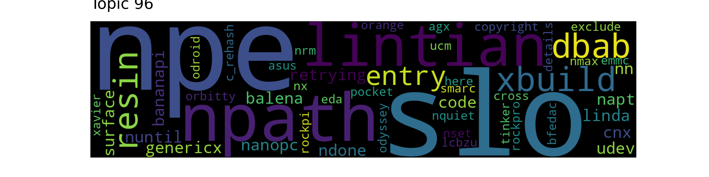

## Topic 97

```console
openjpeg lcms configparser vnstat notify unrar httpsclient lxml paramiko cheetah eefdca ndg tiff abcac dependencies fcbdc cdffae packages bacede buildout groupmod dir apk build fdcedc freetype bbaece del linuxserver abc turbo add thelamer users ams folders aptalca build_version build_proj install no virtual pyopenssl bacc urllib aacdc cadbe cleanup lsio msazure
```
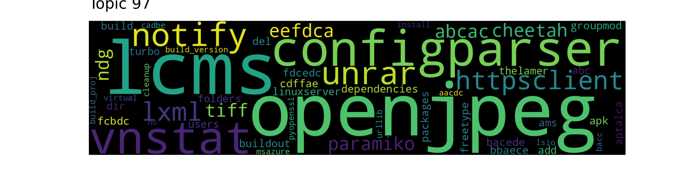

## Topic 98

```console
beaafb cddcd host_version zre isolated msft jdk_name functions webjobs acbfdb caaae aspnetcore_urls pmc dffca ys msazure nmax webhost cdwlszc nn nset dotnet rzw nuntil retrying cfbf code abbbcb slo gconf dafcca oc dbab workers bcbbde dotnet_version ndone zak resin dialog iproute inetutils xbuild dotnetcli eaffe elep tryton martini bfedac bddcc
```
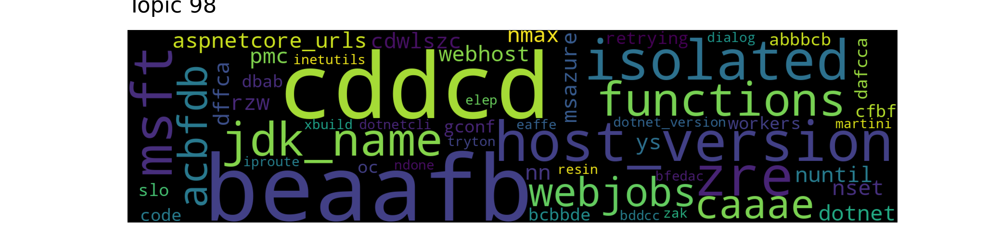

## Topic 99

```console
sfsl gyp_defines slo buildtype ci_build_id stillwater node mksnapshot archs vnode_version uv npm_version ci_build_ref cfffe shasums config_flags compressed do decrypt same owner ex sslo ci_build_time systemtap ng_cli_version xzf tapset del_pkgs efefe appbase builddeps corepack rm_dirs configdb sfslo abbbcb mongod batch done nodejs fsslo sums_url paxctl ipv gnupg_home gosu_key sks solr_sha cmake_dir
```
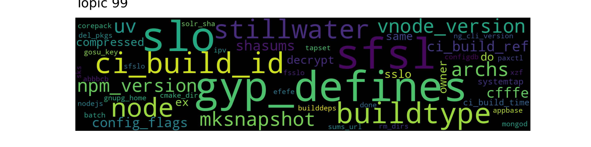

## Topic 100

```console
cafa slo cdee balena dbab udev xbuild entry resin cross bada ndone bcdca retrying messages few code visit nrm dfba edcdb ndnf nvariant variant nos aabaa assets narchitecture nn nextra nuntil idling ucm way ndefault variables odyssey eda nitrogen easy anywhere nmax are hirsute running air orin details here nset
```
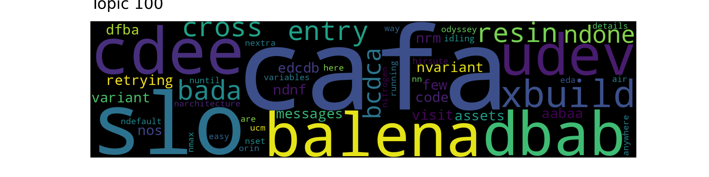
