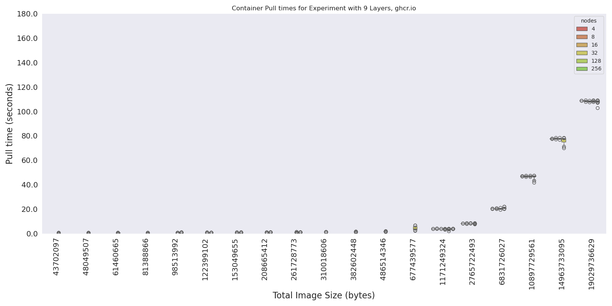

# Pulling Experiments

> AWS edition!

We will be using a matrix of containers to test pulling across a number of total image sizes and layer counts. For this test, we are only interested in the scaling aspect, namely if the pull times increase with the cluster size (by default) and not going to look at different SSDs or snapshotters. We are going to use `C5a.4xlarge` which should be an equivalent (mostly) to n1-standard-16.

## Design

```console
For each cluster size:
  Create the cluster
  Start monitoring service (see below) for pulls
  Deploy service that clears cache every 1800 seconds so we don't run out of room
  For each container in the set:
    Create a job that does nothing, this will record container pulling events
    Wait for job to complete and go away, continue
```

## Experiments

Prepare event exporter

```
git clone https://github.com/resmoio/kubernetes-event-exporter /tmp/kubernetes-event-exporter
```

### run1

> test pulling containers on c5a.4xlarge sizes 4-256

```console
for NODES in 4 8 16 32 64 128 256
  do
  time eksctl create cluster --config-file ./eks-config-${NODES}.yaml
  aws eks update-kubeconfig --region us-east-2 --name pulling-study

  cd /tmp/kubernetes-event-exporter
  kubectl create namespace monitoring
  kubectl apply -f deploy
  cd -

  mkdir -p metadata/run1/$NODES
  kubectl get nodes -o json > metadata/run1/$NODES/nodes-$NODES-$(date +%s).json

  # In another terminal
  # NODES=4
  # kubectl logs -n monitoring ${pod} -f |& tee ./metadata/run1/$NODES/events-size-$NODES-$(date +%s).json

  python run-experiment.py --nodes $NODES --study ./studies/run1.json
  time eksctl delete cluster --config-file ./eks-config-${NODES}.yaml --wait
done
```

#### Analysis

Here is how to run scripts to generate plots, etc.

```bash
# Raw times raw-times.json
python analysis/1-prepare-data.py --root ./metadata/run1 --out ./analysis/data/run1

# Get docker manifests (only need to do this once when containers are new)
# python analysis/2-docker-manifests.py --data ./analysis/data/run1

# This generates (or updates) plots!
python analysis/3-parse-containers.py --data ./analysis/data/run1

# And similarity
python analysis/4-similarity.py --data ./analysis/data/run1
```
```console
Stats for container set pulling
How many layers?
(2112, 8)
How many unique URIs not including tags?
1
How many unique URIs including tags?
32
How many unique layer digests?
2112
Similarity for pulling-digests
mean: 0.03125
std 0.17399263633843817
Similarity for pulling-content
mean: 0.04973742826236392
std 0.17210235537054003
```

The scripts in [analysis](analysis) provide parsing of experiment metadata. 
Here are the two plots (y scale is the same):




I see the following:

- The larger number of layers (smaller size per layer) has an overall higher median value, but much less variation. This makes sense, because maybe it could be less burden on the network, or less subject to variability of it?
- The smaller number of layers (and larger size per layer) has a lower overall mean, but much larger variation. I'd guess the longer pull makes it more subject to the network. If extraction is used in container pulling, this could also reflect the filesystem.

BUT the log makes those "differences" less pronounced.


I believe that layer extraction is done sequentially, so there are two pieces to that. More layers == more things to do, but they are smaller tasks. The flip is fewer extractions, but each one is larger. I think we need to look at the influence of network and storage. We can do that next. Specifically I want to:

- Do an experiment that uses Google's artifact registry (reduce latency to pull) run2 - NO
- Do an experiment set that uses a local SSD 
- Do an experiment that enables container streaming (this requires the previous point)
- Zstandard compressed container images

I then think it would be super cool to try profiling the container technology (during a pull to one node) to see how that time breaks down! We next want to run the same study as before, but follow [best practices](https://cloud.google.com/blog/products/containers-kubernetes/tips-and-tricks-to-reduce-cold-start-latency-on-gke) suggested by Google Cloud. The general strategy of these practices can be mapped to other clouds.
