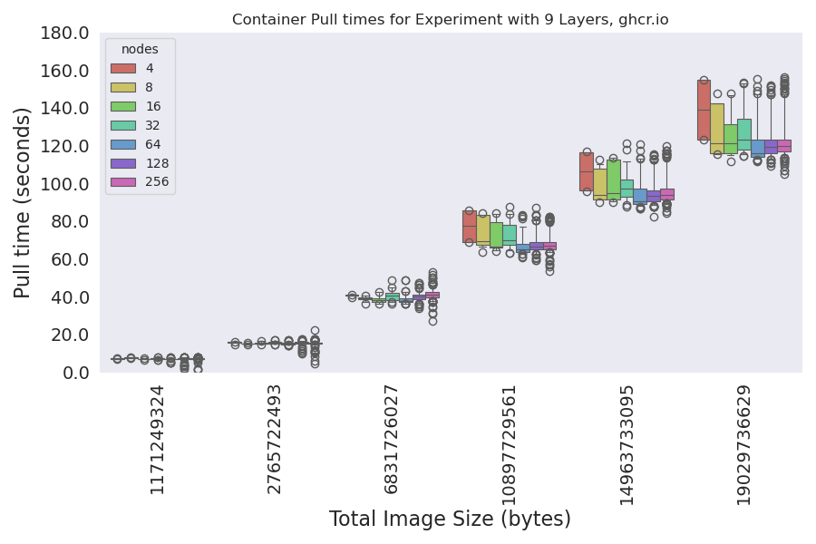
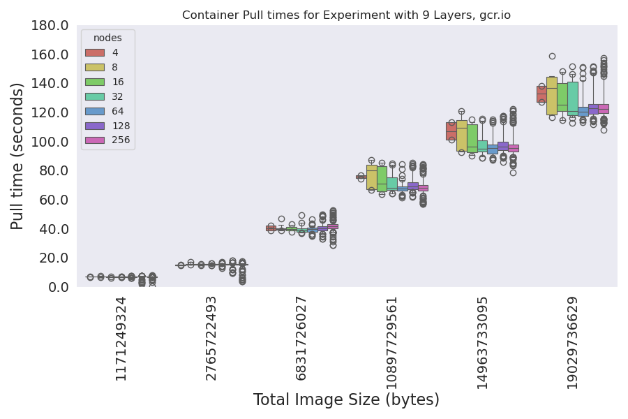
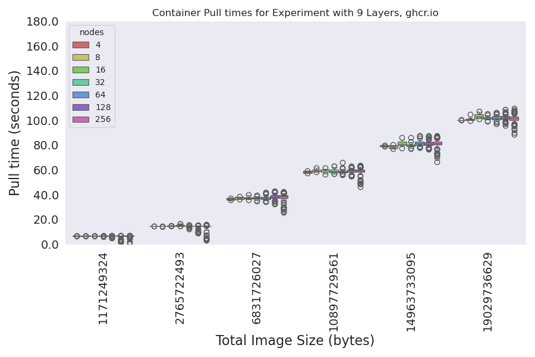

# Pulling Experiments

We will be using a matrix of containers to test pulling across a number of total image sizes and layer counts.
For each container, the layer size is determined based on the image size / number of layers. The total size has 5MB subtracted to account for the busybox base image. There are 71 images built for the study, which you can see tags for in [run-experiment.py](run-experiment.py). The tool to generate the lists of containers (and the actual containers in the registry) is [converged-computing/container-crafter](https://github.com/converged-computing/container-crafter).

## Design

```console
For each cluster size:
  Create the cluster
  Start monitoring service (see below) for pulls
  Deploy service that clears cache every 1800 seconds so we don't run out of room
  For each container in the set:
    Create a job that does nothing, this will record container pulling events
    Wait for job to complete and go away, continue
```

## Experiments

### run1

> test pulling containers on n1-standard-16 sizes 4-256

This was the first set of experiments run after testing - an attempt to reduce the number of layers to the median (9) and the max (125) layers and increase sizes. The time was much more reasonable (~11 minutes the first time). It definitely was faster! I wound up running it twice, adding more sizes the second time (and this was the final container set). For this final set of containers, the experiment was run as follows:

```console
GOOGLE_PROJECT=myproject
for NODES in 4 8 16 32 64 128 256
  do

    time gcloud container clusters create test-cluster-$NODES \
    --threads-per-core=1 \
    --num-nodes=$NODES \
    --machine-type=n1-standard-16 \
    --enable-gvnic \
    --region=us-central1-a \
    --project=${GOOGLE_PROJECT} 

    kubectl create namespace monitoring
    kubectl apply -f ./deploy

    mkdir -p metadata/run1/$NODES
    kubectl get nodes -o json > metadata/run1/$NODES/nodes-$NODES-$(date +%s).json

# In another terminal
# NODES=64
# kubectl logs -n monitoring $(kubectl get pods -o json -n monitoring | jq -r .items[0].metadata.name) -f  |& tee ./metadata/run1/$NODES/events-size-$NODES-$(date +%s).json

    time python run-experiment.py --nodes $NODES --study ./studies/run1.json
    gcloud container clusters delete test-cluster-$NODES --region=us-central1-a
done
```

#### Analysis

Here is how to run scripts to generate plots, etc.

```bash
# Raw times raw-times.json
python analysis/1-prepare-data.py --root ./metadata/run1 --out ./analysis/data/run1

# Get docker manifests (only need to do this once when containers are new)
# python analysis/2-docker-manifests.py --data ./analysis/data/run1

# This generates (or updates) plots!
python analysis/3-parse-containers.py --data ./analysis/data/run1

# And similarity
python analysis/4-similarity.py --data ./analysis/data/run1

# Further explore times
python analysis/4-explore-times.py --data ./analysis/data/run1
```

The scripts in [analysis](analysis) provide parsing of experiment metadata. Here are the plots:




### run2

> test pulling containers on n1-standard-16 with gcr.io

This will answer the question if using a registry in the same region (in the same cloud) can reduce pull times. The answer is no.

```bash
# configure registry
gcloud auth configure-docker us-central1-docker.pkg.dev

# Here is how to re-tag and push containers after creating the repository
for tag in $(oras repo tags ghcr.io/converged-computing/container-chonks-run1)
  do
   echo "Retagging and pushing $tag"
   container=us-central1-docker.pkg.dev/llnl-flux/converged-computing/container-chonks:$tag
   docker tag ghcr.io/converged-computing/container-chonks-run1:$tag $container
   docker push $container
 done
```

```console
GOOGLE_PROJECT=myproject
for NODES in 4 8 16 32 64 128 256
  do

    time gcloud container clusters create test-cluster-$NODES \
    --threads-per-core=1 \
    --num-nodes=$NODES \
    --machine-type=n1-standard-16 \
    --enable-gvnic \
    --region=us-central1-a \
    --project=${GOOGLE_PROJECT} 

    kubectl create namespace monitoring
    kubectl apply -f deploy

    mkdir -p metadata/run2/$NODES
    kubectl get nodes -o json > metadata/run2/$NODES/nodes-$NODES-$(date +%s).json

# In another terminal
# NODES=4
# kubectl logs -n monitoring $(kubectl get pods -n monitoring -o json | jq -r .items[0].metadata.name) -f  |& tee ./metadata/run2/$NODES/events-size-$NODES-$(date +%s).json

    python run-experiment.py --nodes $NODES --study ./studies/run2.json
    gcloud container clusters delete test-cluster-$NODES --region=us-central1-a
done
```

#### Analysis

Here is how to run scripts to generate plots, etc.

```bash
# Raw times raw-times.json
python analysis/1-prepare-data.py --root ./metadata/run2 --out ./analysis/data/run2

# Get docker manifests (only need to do this once when containers are new)
# python analysis/2-docker-manifests.py --data ./analysis/data/run2

# This generates (or updates) plots!
python analysis/3-parse-containers.py --data ./analysis/data/run2

python analysis/4-explore-times.py --data ./analysis/data/run2
```

These plots are almost identical to the first. There is no benefit to gcr.io, as is (without anything else) aside from needing to pay for it.




### run3

> test adding local SSD to improve filesystem latency

This will test if improving filesystem latency will speed up pulls! You can read [more about it here](https://cloud.google.com/compute/docs/disks/local-ssd). For this set of containers, since we see equivalent performance between ghcr.io and gcr.io, we can stick with our original run1. Note that we only went up to size 64 - sizes 128 and 256 went over the quota.

```console
GOOGLE_PROJECT=myproject
for NODES in 4 8 16 32 64
  do

  time gcloud container clusters create test-cluster-$NODES \
    --ephemeral-storage-local-ssd count=1 \
    --threads-per-core=1 \
    --num-nodes=$NODES \
    --machine-type=n1-standard-16 \
    --enable-gvnic \
    --region=us-central1-a \
    --project=${GOOGLE_PROJECT} 

    kubectl create namespace monitoring
    kubectl apply -f deploy

    mkdir -p metadata/run3/$NODES
    kubectl get nodes -o json > metadata/run3/$NODES/nodes-$NODES-$(date +%s).json

# In another terminal
# NODES=4
# kubectl logs -n monitoring $(kubectl get pods -n monitoring -o json | jq -r .items[0].metadata.name) -f  |& tee ./metadata/run3/$NODES/events-size-$NODES-$(date +%s).json

    time python run-experiment.py --nodes $NODES --study ./studies/run2.json
    gcloud container clusters delete test-cluster-$NODES --region=us-central1-a --quiet
done
```

#### Analysis

Here is how to run scripts to generate plots, etc.

```bash
# Raw times raw-times.json
python analysis/1-prepare-data.py --root ./metadata/run3 --out ./analysis/data/run3

# Get docker manifests (only need to do this once when containers are new)
# python analysis/2-docker-manifests.py --data ./analysis/data/run3

# This generates (or updates) plots!
python analysis/3-parse-containers.py --data ./analysis/data/run3

# Can't run similarity for google cloud - no manifests.
# but they are the same images, should be the same!

python analysis/4-explore-times.py --data ./analysis/data/run3
```

Oh wow - this is big! I could only go up to size 64 (quota for the storage for one VM family went over) but we can see that for the largest size, the variability is hugely decreased, and the pull times are 20-40 seconds faster. 




### run 4

> Using container streaming

As described [here](https://cloud.google.com/blog/products/containers-kubernetes/tips-and-tricks-to-reduce-cold-start-latency-on-gke) and [here](https://cloud.google.com/blog/products/containers-kubernetes/introducing-container-image-streaming-in-gke).

```console
GOOGLE_PROJECT=myproject
for NODES in 4 8 16 32 64 128 256
  do

    time gcloud container clusters create test-cluster-$NODES \
    --image-type="COS_CONTAINERD" \
    --enable-image-streaming \
    --threads-per-core=1 \
    --num-nodes=$NODES \
    --machine-type=n1-standard-16 \
    --enable-gvnic \
    --region=us-central1-a \
    --project=${GOOGLE_PROJECT} 

    kubectl create namespace monitoring
    kubectl apply -f deploy

    mkdir -p metadata/run4/$NODES
    kubectl get nodes -o json > metadata/run4/$NODES/nodes-$NODES-$(date +%s).json

# In another terminal
# NODES=4
# kubectl logs -n monitoring $(kubectl get pods -n monitoring -o json | jq -r .items[0].metadata.name) -f  |& tee ./metadata/run4/$NODES/events-size-$NODES-$(date +%s).json

    python run-experiment.py --nodes $NODES --study ./studies/run4.json
    gcloud container clusters delete test-cluster-$NODES --region=us-central1-a --quiet
done
```

#### Analysis

Here is how to run scripts to generate plots, etc.

```bash
# Raw times raw-times.json
python analysis/1-prepare-data.py --root ./metadata/run4 --out ./analysis/data/run4

# Get docker manifests (only need to do this once when containers are new)
# python analysis/2-docker-manifests.py --data ./analysis/data/run4

# This generates (or updates) plots!
python analysis/3-parse-containers.py --data ./analysis/data/run4
python analysis/4-explore-times.py --data ./analysis/data/run4
```


### streaming

#### without streaming

Let's run the experiment now with applications. Here we can see if the streaming approach works for single layered (the spack) images. Let's first push the images to gcr.io:

<details>

<summary>Pushing containers</summary>

```console
# Here is how to re-tag and push containers after creating the repository
# Remember they need to be in gcr to get indexed for the streamer

container=us-central1-docker.pkg.dev/llnl-flux/converged-computing/ensemble-amg2023:spack-skylake
docker pull ghcr.io/converged-computing/ensemble-amg2023:spack-skylake
docker tag ghcr.io/converged-computing/ensemble-amg2023:spack-skylake $container
docker push $container

container=us-central1-docker.pkg.dev/llnl-flux/converged-computing/ensemble-lammps:spack-skylake
docker pull ghcr.io/converged-computing/ensemble-lammps:spack-skylake
docker tag ghcr.io/converged-computing/ensemble-lammps:spack-skylake $container
docker push $container

container=us-central1-docker.pkg.dev/llnl-flux/converged-computing/ensemble-minife:spack-skylake
docker pull ghcr.io/converged-computing/ensemble-minife:spack-skylake
docker tag ghcr.io/converged-computing/ensemble-minife:spack-skylake $container
docker push $container

container=us-central1-docker.pkg.dev/llnl-flux/converged-computing/ensemble-osu:spack-skylake
docker pull ghcr.io/converged-computing/ensemble-osu:spack-skylake
docker tag ghcr.io/converged-computing/ensemble-osu:spack-skylake $container
docker push $container
```

</details>

First, here is without streaming:

```console
GOOGLE_PROJECT=myproject
for NODES in 4 8 16 32 64 128 256
  do

    time gcloud container clusters create test-cluster-${NODES} \
    --image-type="COS_CONTAINERD" \
    --threads-per-core=1 \
    --num-nodes=$NODES \
    --machine-type=n1-standard-16 \
    --enable-gvnic \
    --region=us-central1-a \
    --project=${GOOGLE_PROJECT} 

    kubectl create namespace monitoring
    kubectl apply -f deploy

    mkdir -p metadata/without-streaming/$NODES
    kubectl get nodes -o json > metadata/without-streaming/$NODES/nodes-$NODES-$(date +%s).json

# In another terminal:
# kubectl logs -n monitoring $(kubectl get pods -n monitoring -o json | jq -r .items[0].metadata.name) -f  |& tee ./metadata/without-streaming/$NODES/events-size-$NODES-$(date +%s).json

    python run-streaming-experiment.py --nodes $NODES --study ./studies/streaming.json --outdir ./metadata/without-streaming/$NODES/logs
    gcloud container clusters delete test-cluster-${NODES} --region=us-central1-a --quiet
done
```

I stopped at size 64 since it gets expensive with the network.

#### streaming

```console
GOOGLE_PROJECT=myproject
for NODES in 4 8 16 32 64 128 256
  do

    time gcloud container clusters create test-cluster-$NODES \
    --image-type="COS_CONTAINERD" \
    --enable-image-streaming \
    --threads-per-core=1 \
    --num-nodes=$NODES \
    --machine-type=n1-standard-16 \
    --enable-gvnic \
    --region=us-central1-a \
    --project=${GOOGLE_PROJECT} 

    kubectl create namespace monitoring
    kubectl apply -f deploy

    mkdir -p metadata/streaming/$NODES
    kubectl get nodes -o json > metadata/streaming/$NODES/nodes-$NODES-$(date +%s).json

# In another terminal
# NODES=4
# kubectl logs -n monitoring $(kubectl get pods -n monitoring -o json | jq -r .items[0].metadata.name) -f  |& tee ./metadata/streaming/$NODES/events-size-$NODES-$(date +%s).json

    python run-streaming-experiment.py --nodes $NODES --study ./studies/streaming.json --outdir ./metadata/streaming/$NODES/logs
    gcloud container clusters delete test-cluster-$NODES --region=us-central1-a --quiet

done
```
Parse the results, akin to before.

```bash
# Raw times raw-times.json
python analysis/1-prepare-streaming-data.py --out ./analysis/data/streaming

# This generates (or updates) plots!
python analysis/3-parse-streaming-containers.py --data ./analysis/data/streaming
```

Wow, that's a pretty substantial difference, at least in terms of pull times reported by the kubelet. This time we can be confident that the application is running, as opposed to our simulation that didn't have a real entrypoint. The reason we see the smallest size not be optimized is from [this page](https://cloud.google.com/kubernetes-engine/docs/how-to/image-streaming):

> You might not notice the benefits of Image streaming during the first pull of an eligible image. However, after Image streaming caches the image, future image pulls on any cluster benefit from Image streaming.


### The Mystery...

It was a mystery to me why pulling times didn't change but the clusters were clearly up longer. I took a closer look at the events across the first set of experiments (run1..run4) and I think we found our answer!


Here is what we are seeing!

- Larger containers have more variation in event timestamps across nodes, regardless of size
- As the number of nodes gets larger, the entire range shifts upwards! There is probably "more stuff going on" or some change in algorithm so (overall) the time between the first to start and last to finish is consistently slower.
- Pulling from a local registry (gcr.io() actually seems to bring down the overall range.

TLDR: When you increase the size of the cluster, your experiments take longer, but not because of pulling time. 

