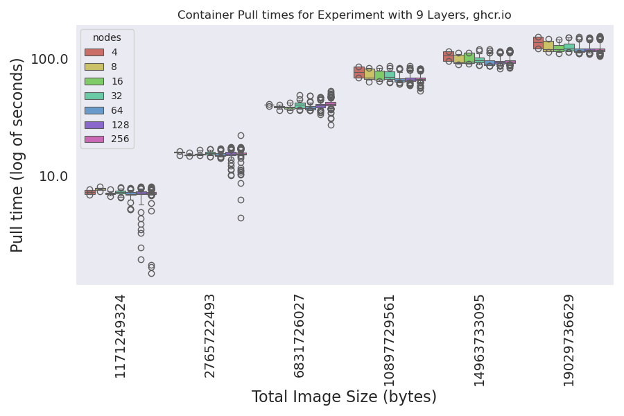
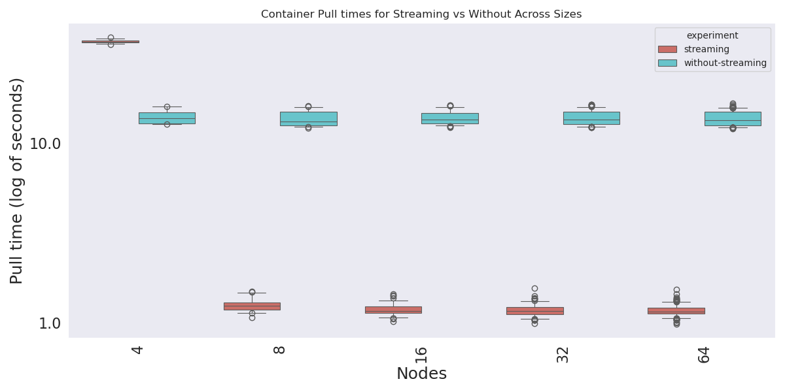

# Pulling Experiments

We will be using a matrix of containers to test pulling across a number of total image sizes and layer counts.
For each container, the layer size is determined based on the image size / number of layers. The total size has 5MB subtracted to account for the busybox base image. There are 71 images built for the study, which you can see tags for in [run-experiment.py](run-experiment.py). The tool to generate the lists of containers (and the actual containers in the registry) is [converged-computing/container-crafter](https://github.com/converged-computing/container-crafter).

## Design

```console
For each cluster size:
  Create the cluster
  Start monitoring service (see below) for pulls
  Deploy service that clears cache every 1800 seconds so we don't run out of room
  For each container in the set:
    Create a job that does nothing, this will record container pulling events
    Wait for job to complete and go away, continue
```

## Experiments

### run1

> test pulling containers on n1-standard-16 sizes 4-256

This was the first set of experiments run after testing - an attempt to reduce the number of layers to the median (9) and the max (125) layers and increase sizes. The time was much more reasonable (~11 minutes the first time). It definitely was faster! I wound up running it twice, adding more sizes the second time (and this was the final container set). For this final set of containers, the experiment was run as follows:

```console
GOOGLE_PROJECT=myproject
for NODES in 4 8 16 32 64 128 256
  do

time gcloud container clusters create test-cluster \
    --threads-per-core=1 \
    --num-nodes=$NODES \
    --machine-type=n1-standard-16 \
    --enable-gvnic \
    --region=us-central1-a \
    --project=${GOOGLE_PROJECT} 

cd /tmp/kubernetes-event-exporter
kubectl create namespace monitoring
kubectl apply -f deploy
cd -

mkdir -p metadata/run1/$NODES
kubectl get nodes -o json > metadata/run1/$NODES/nodes-$NODES-$(date +%s).json

# In another terminal
# NODES=64
# kubectl logs -n monitoring $(kubectl get pods -n monitoring | jq -r [0].metadata.name) -f  |& tee ./metadata/run1/$NODES/events-size-$NODES-$(date +%s).json

python run-experiment.py --nodes $NODES --study ./studies/run1.json
gcloud container clusters delete test-cluster --region=us-central1-a

done
```

Here is the output from the script (wrapping automation for all runs):

<details>

<summary>Wrapped time for runs</summary>

```console
# size 4 (not final study containers)
job.batch "container-pull" deleted
Experiments are done!
total time to run is 694.6678006649017 seconds

# size 4 (final study containers)
job.batch "container-pull" deleted
Experiments are done!
total time to run is 1383.645084142685 seconds

# size 8
job.batch "container-pull" deleted
Experiments are done!
total time to run is 1392.8416512012482 seconds

# size 16
kubectl delete -f /tmp/job-86ljvb30.yaml --wait=true
job.batch "container-pull" deleted
Experiments are done!
total time to run is 1408.475350856781 seconds

# size 32
kubectl delete -f /tmp/job-8x3al9cq.yaml --wait=true
job.batch "container-pull" deleted
Experiments are done!
total time to run is 1426.8381447792053 seconds

# size 64
job.batch/container-pull condition met
kubectl delete -f /tmp/job-a_75wuum.yaml --wait=true
job.batch "container-pull" deleted
Experiments are done!
total time to run is 1535.1909275054932 seconds

# size 128
kubectl delete -f /tmp/job-jd3nj2cz.yaml --wait=true
job.batch "container-pull" deleted
Experiments are done!
total time to run is 1940.994199514389 seconds

# size 256
kubectl wait --for=condition=complete job/container-pull --timeout=1200s
job.batch/container-pull condition met
kubectl delete -f /tmp/job-er3kyteb.yaml --wait=true
job.batch "container-pull" deleted
Experiments are done!
total time to run is 2884.183334827423 seconds
```

</details>

Note how the total experiment time goes up by quite a bit, but the plots don't reflect that. There is something else in here taking time - maybe just waiting for the job to complete?

#### Analysis

Here is how to run scripts to generate plots, etc.

```bash
# Raw times raw-times.json
python analysis/1-prepare-data.py --root ./metadata/run1 --out ./analysis/data/run1

# Get docker manifests (only need to do this once when containers are new)
# python analysis/2-docker-manifests.py --data ./analysis/data/run1

# This generates (or updates) plots!
python analysis/3-parse-containers.py --data ./analysis/data/run1

# And similarity
python analysis/4-similarity.py --data ./analysis/data/run1
```
The scripts in [analysis](analysis) provide parsing of experiment metadata. See [test](test.md) for preliminary testing. Here are the complete times (recorded by the script) that wrapped the experiment.

Here are the two plots (y scale is the same):


I see the following:

- The larger number of layers (smaller size per layer) has an overall higher median value, but much less variation. This makes sense, because maybe it could be less burden on the network, or less subject to variability of it?
- The smaller number of layers (and larger size per layer) has a lower overall mean, but much larger variation. I'd guess the longer pull makes it more subject to the network. If extraction is used in container pulling, this could also reflect the filesystem.

BUT the log makes those "differences" less pronounced.





I believe that layer extraction is done sequentially, so there are two pieces to that. More layers == more things to do, but they are smaller tasks. The flip is fewer extractions, but each one is larger. I think we need to look at the influence of network and storage. We can do that next. Specifically I want to:

- Do an experiment that uses Google's artifact registry (reduce latency to pull) run2 - NO
- Do an experiment set that uses a local SSD 
- Do an experiment that enables container streaming (this requires the previous point)
- Zstandard compressed container images

I then think it would be super cool to try profiling the container technology (during a pull to one node) to see how that time breaks down! We next want to run the same study as before, but follow [best practices](https://cloud.google.com/blog/products/containers-kubernetes/tips-and-tricks-to-reduce-cold-start-latency-on-gke) suggested by Google Cloud. The general strategy of these practices can be mapped to other clouds.

### run2

> test pulling containers on n1-standard-16 with gcr.io

This will answer the question if using a registry in the same region (in the same cloud) can reduce pull times. We can hypothesize that pulling from a registry located int he same region (us-central1) could reduce latency as oppose to using GitHub packages (ghcr.io). I first created the Artifact Registry "converged-computing" under my project, then I tagged and pushed the images:

The answer is no!

```bash
# configure registry
gcloud auth configure-docker us-central1-docker.pkg.dev

# Here is how to re-tag and push containers after creating the repository
for tag in $(oras repo tags ghcr.io/converged-computing/container-chonks-run1)
  do
   echo "Retagging and pushing $tag"
   container=us-central1-docker.pkg.dev/llnl-flux/converged-computing/container-chonks:$tag
   docker tag ghcr.io/converged-computing/container-chonks-run1:$tag $container
   docker push $container
 done
```

```console
GOOGLE_PROJECT=myproject
for NODES in 4 8 16 32 64 128 256
  do

time gcloud container clusters create test-cluster \
    --threads-per-core=1 \
    --num-nodes=$NODES \
    --machine-type=n1-standard-16 \
    --enable-gvnic \
    --region=us-central1-a \
    --project=${GOOGLE_PROJECT} 

cd /tmp/kubernetes-event-exporter
kubectl create namespace monitoring
kubectl apply -f deploy
cd -

mkdir -p metadata/run2/$NODES
kubectl get nodes -o json > metadata/run2/$NODES/nodes-$NODES-$(date +%s).json

# In another terminal
# NODES=4
# kubectl logs -n monitoring $(kubectl get pods -n monitoring -o json | jq -r .items[0].metadata.name) -f  |& tee ./metadata/run2/$NODES/events-size-$NODES-$(date +%s).json

python run-experiment.py --nodes $NODES --study ./studies/run2.json
gcloud container clusters delete test-cluster --region=us-central1-a

done
```

<details>

<summary>Wrapped time for runs</summary>

```console
# size 4
job.batch/container-pull condition met
kubectl delete -f /tmp/job-5ywx0uto.yaml --wait=true
job.batch "container-pull" deleted
Experiments are done!
total time to run is 1375.4710006713867 seconds

# size 8
job.batch/container-pull condition met
kubectl delete -f /tmp/job-4lsbfmns.yaml --wait=true
job.batch "container-pull" deleted
Experiments are done!
total time to run is 1381.183841228485 seconds

# size 16
job.batch/container-pull condition met
kubectl delete -f /tmp/job-x2oqqhsk.yaml --wait=true
job.batch "container-pull" deleted
Experiments are done!
total time to run is 1366.366715669632 seconds

# size 32
job.batch/container-pull condition met
kubectl delete -f /tmp/job-uv4o5wdy.yaml --wait=true
job.batch "container-pull" deleted
Experiments are done!
total time to run is 1367.845073223114 seconds

# size 64
job.batch/container-pull condition met
kubectl delete -f /tmp/job-yh43g0tr.yaml --wait=true
job.batch "container-pull" deleted
Experiments are done!
total time to run is 1465.6497366428375 seconds

# size 128
job.batch/container-pull condition met
kubectl delete -f /tmp/job-gilsnk4a.yaml --wait=true
job.batch "container-pull" deleted
Experiments are done!
total time to run is 1754.5072467327118 seconds

# size 256
kubectl wait --for=condition=complete job/container-pull --timeout=1200s
job.batch/container-pull condition met
kubectl delete -f /tmp/job-_qygl2qr.yaml --wait=true
job.batch "container-pull" deleted
Experiments are done!
total time to run is 2550.7278447151184 seconds
```

</details>

#### Analysis

Here is how to run scripts to generate plots, etc.

```bash
# Raw times raw-times.json
python analysis/1-prepare-data.py --root ./metadata/run2 --out ./analysis/data/run2

# Get docker manifests (only need to do this once when containers are new)
# python analysis/2-docker-manifests.py --data ./analysis/data/run2

# This generates (or updates) plots!
python analysis/3-parse-containers.py --data ./analysis/data/run2

# Can't run similarity for google cloud - no manifests.
# but they are the same images, should be the same!
```

These plots are almost identical to the first. There is no benefit to gcr.io, as is (without anything else) aside from needing to pay for it.


And the log images:


### run3

> test adding local SSD to improve filesystem latency

This will test if improving filesystem latency will speed up pulls! You can read [more about it here](https://cloud.google.com/compute/docs/disks/local-ssd). For this set of containers, since we see equivalent performance between ghcr.io and gcr.io, we can stick with gcr.io. Note that we only went up to size 64 - sizes 128 and 256 went over the quota.

```console
GOOGLE_PROJECT=myproject
for NODES in 4 8 16 32 64
  do

# 128 256 are not done yet, over quota

time gcloud container clusters create test-cluster \
    --ephemeral-storage-local-ssd count=1 \
    --threads-per-core=1 \
    --num-nodes=$NODES \
    --machine-type=n1-standard-16 \
    --enable-gvnic \
    --region=us-central1-a \
    --project=${GOOGLE_PROJECT} 

cd /tmp/kubernetes-event-exporter
kubectl create namespace monitoring
kubectl apply -f deploy
cd -

mkdir -p metadata/run3/$NODES
kubectl get nodes -o json > metadata/run3/$NODES/nodes-$NODES-$(date +%s).json

# In another terminal
# NODES=4
# kubectl logs -n monitoring $(kubectl get pods -n monitoring -o json | jq -r .items[0].metadata.name) -f  |& tee ./metadata/run3/$NODES/events-size-$NODES-$(date +%s).json

python run-experiment.py --nodes $NODES --study ./studies/run2.json
gcloud container clusters delete test-cluster --region=us-central1-a --quiet

done
```

<details>

<summary>Wrapped time for runs</summary>

```console
# size 4
job.batch/container-pull condition met
kubectl delete -f /tmp/job-72cdbfhz.yaml --wait=true
job.batch "container-pull" deleted
Experiments are done!
total time to run is 1018.2316541671753 seconds

# size 8
job.batch/container-pull condition met
kubectl delete -f /tmp/job-7dbo75ss.yaml --wait=true
job.batch "container-pull" deleted
Experiments are done!
total time to run is 1012.093866109848 seconds

# size 16
kubectl wait --for=condition=complete job/container-pull --timeout=1200s
job.batch/container-pull condition met
kubectl delete -f /tmp/job-7dbo75ss.yaml --wait=true
job.batch "container-pull" deleted
Experiments are done!
total time to run is 1012.093866109848 seconds

# size 32
kubectl wait --for=condition=complete job/container-pull --timeout=1200s
job.batch/container-pull condition met
kubectl delete -f /tmp/job-t117svkr.yaml --wait=true
job.batch "container-pull" deleted
Experiments are done!
total time to run is 1093.947240114212 seconds

# size 64
kubectl wait --for=condition=complete job/container-pull --timeout=1200s
job.batch/container-pull condition met
kubectl delete -f /tmp/job-v30fo2bu.yaml --wait=true
job.batch "container-pull" deleted
Experiments are done!
total time to run is 1147.4819929599762 seconds

# size 128

# size 256
```

</details>

#### Analysis

Here is how to run scripts to generate plots, etc.

```bash
# Raw times raw-times.json
python analysis/1-prepare-data.py --root ./metadata/run3 --out ./analysis/data/run3

# Get docker manifests (only need to do this once when containers are new)
# python analysis/2-docker-manifests.py --data ./analysis/data/run3

# This generates (or updates) plots!
python analysis/3-parse-containers.py --data ./analysis/data/run3

# Can't run similarity for google cloud - no manifests.
# but they are the same images, should be the same!
```

Oh wow - this is big! I could only go up to size 64 (quota for the storage for one VM family went over) but we can see that for the largest size, the variability is hugely decreased, and the pull times are 20-40 seconds faster. 


This could be significant for a GPU cluster. Local SSDs are [also very cheap](https://cloud.google.com/compute/disks-image-pricing#localssdpricing) - $0.1046 per GB per month, so (if we did the calculation for a scoped experiment) it very likely would be worth the time of having the cluster up. One question I have (that we could further investigate) is how much SSD can you add (the count variable) before you stop seeing improvements. Finally, the log images:


### run 4

> Using container streaming

As described [here](https://cloud.google.com/blog/products/containers-kubernetes/tips-and-tricks-to-reduce-cold-start-latency-on-gke) and [container streaming](https://cloud.google.com/blog/products/containers-kubernetes/introducing-container-image-streaming-in-gke) is:

> Image streaming works by mounting the container data layer in containerd using a sophisticated network mount, and backing it with multiple caching layers on the network, in-memory and on-disk. Your container transitions from the ImagePulling status to Running in a couple of seconds (regardless of container size) once we prepare the image streaming mount; this effectively parallelizes the application boot with the data transfer of required data in the container image. As a result, you can expect to see much faster container boot times and snappier autoscaling. 

It's not clear if this will be reflected in container events. If the image can go to running sooner, we might need to do another experiment that actually runs something (and then record the time it takes to do that). We will see. 

```console
GOOGLE_PROJECT=myproject
for NODES in 4 8 16 32 64 128 256
  do

time gcloud container clusters create test-cluster \
    --image-type="COS_CONTAINERD" \
    --enable-image-streaming \
    --threads-per-core=1 \
    --num-nodes=$NODES \
    --machine-type=n1-standard-16 \
    --enable-gvnic \
    --region=us-central1-a \
    --project=${GOOGLE_PROJECT} 

cd /tmp/kubernetes-event-exporter
kubectl create namespace monitoring
kubectl apply -f deploy
cd -

mkdir -p metadata/run4/$NODES
kubectl get nodes -o json > metadata/run4/$NODES/nodes-$NODES-$(date +%s).json

# In another terminal
# NODES=4
# kubectl logs -n monitoring $(kubectl get pods -n monitoring -o json | jq -r .items[0].metadata.name) -f  |& tee ./metadata/run4/$NODES/events-size-$NODES-$(date +%s).json

python run-experiment.py --nodes $NODES --study ./studies/run2.json
gcloud container clusters delete test-cluster --region=us-central1-a --quiet

done
```

<details>

<summary>Wrapped time for runs</summary>

```console
# size 4
job.batch/container-pull condition met
kubectl delete -f /tmp/job-7satz2uh.yaml --wait=true
job.batch "container-pull" deleted
Experiments are done!
total time to run is 1286.9867091178894 seconds
Deleting cluster test-cluster...done.  

# size 8
job.batch/container-pull condition met
kubectl delete -f /tmp/job-1423io2e.yaml --wait=true
job.batch "container-pull" deleted
Experiments are done!
total time to run is 1332.5545303821564 seconds

# size 16
job.batch/container-pull condition met
kubectl delete -f /tmp/job-3m7rh1zb.yaml --wait=true
job.batch "container-pull" deleted
Experiments are done!
total time to run is 1399.6686463356018 seconds

# size 32
kubectl delete -f /tmp/job-1k14vepn.yaml --wait=true
job.batch "container-pull" deleted
Experiments are done!
total time to run is 1440.1837031841278 seconds
Deleting cluster test-cluster...done.  

# size 64
kubectl delete -f /tmp/job-hw6kf_u5.yaml --wait=true
job.batch "container-pull" deleted
Experiments are done!
total time to run is 1674.736645936966 seconds
Deleting cluster test-cluster...done.  

# size 128
kubectl wait --for=condition=complete job/container-pull --timeout=1200s
job.batch/container-pull condition met
kubectl delete -f /tmp/job-0uylqxbh.yaml --wait=true
job.batch "container-pull" deleted
Experiments are done!
total time to run is 3667.703760623932 seconds

# size 256
kubectl delete -f /tmp/job-89s27zxh.yaml --wait=true
job.batch "container-pull" deleted
Experiments are done!
total time to run is 4335.0549857616425 seconds
```

For the largest size there was a problem with this container - led to "ContainerStatusUnknown"

```
Running experiment for container us-central1-docker.pkg.dev/llnl-flux/converged-computing/container-chonks:125-layers-size-14968733095-bytes, 33 of 38
kubectl apply -f /tmp/job-d1tvtlel.yaml
job.batch/container-pull created
kubectl wait --for=condition=complete job/container-pull --timeout=1200s
```

I'm also seeing a lot of this:

```
container-pull-228-55rrv   0/1     ImagePullBackOff   0          68s
container-pull-229-28npk   0/1     ErrImagePull       0          65s
container-pull-23-9z5s8    0/1     Completed          0          75s
container-pull-230-k4rpl   0/1     ImagePullBackOff   0          65s
container-pull-231-jsndm   0/1     ErrImagePull       0          66s
container-pull-232-qsd75   0/1     ErrImagePull       0          67s
```
I also saw Evicted:

```
container-pull-134-w9jjs   0/1     Evicted     0          7m9s
container-pull-136-bhqxb   0/1     Completed   0          7m8s
container-pull-15-tx576    0/1     Completed   0          7m15s
container-pull-150-58vwl   0/1     Evicted     0          7m4s
container-pull-158-4px9l   0/1     Completed   0          7m6s
container-pull-167-86tsx   0/1     Evicted     0          7m5s
container-pull-169-5mrjc   0/1     Completed   0          7m6s
container-pull-172-fsmlp   0/1     Evicted     0          7m4s
container-pull-174-l5gz4   0/1     Evicted     0          7m3s
container-pull-175-7nvpb   0/1     Evicted     0          7m4s
```
So we might have hit some kind of limit with this size.

Thinking - I think we should choose one size (since it doesn't matter that much) that is relatively larger and do this again without purging the cache. Perhaps that was causing the problem?

</details>

#### Analysis

Here is how to run scripts to generate plots, etc.

```bash
# Raw times raw-times.json
python analysis/1-prepare-data.py --root ./metadata/run4 --out ./analysis/data/run4

# Get docker manifests (only need to do this once when containers are new)
# python analysis/2-docker-manifests.py --data ./analysis/data/run4

# This generates (or updates) plots!
python analysis/3-parse-containers.py --data ./analysis/data/run4

# Can't run similarity for google cloud - no manifests.
# but they are the same images, should be the same!
```

These plots might need a redo, because I did see the errors above. I did get the sense that they are pulling more quickly, but I also saw a lot of errors. I'll wait to see the costs for running the above and craft another experiment.


### streaming

#### without streaming

Let's run the experiment now with applications. Here we can see if the streaming approach works for single layered (the spack) images. Let's first push the images to gcr.io:

<details>

<summary>Pushing containers</summary>

```console
# Here is how to re-tag and push containers after creating the repository
# Remember they need to be in gcr to get indexed for the streamer

container=us-central1-docker.pkg.dev/llnl-flux/converged-computing/ensemble-amg2023:spack-skylake
docker pull ghcr.io/converged-computing/ensemble-amg2023:spack-skylake
docker tag ghcr.io/converged-computing/ensemble-amg2023:spack-skylake $container
docker push $container

container=us-central1-docker.pkg.dev/llnl-flux/converged-computing/ensemble-lammps:spack-skylake
docker pull ghcr.io/converged-computing/ensemble-lammps:spack-skylake
docker tag ghcr.io/converged-computing/ensemble-lammps:spack-skylake $container
docker push $container

container=us-central1-docker.pkg.dev/llnl-flux/converged-computing/ensemble-minife:spack-skylake
docker pull ghcr.io/converged-computing/ensemble-minife:spack-skylake
docker tag ghcr.io/converged-computing/ensemble-minife:spack-skylake $container
docker push $container

container=us-central1-docker.pkg.dev/llnl-flux/converged-computing/ensemble-osu:spack-skylake
docker pull ghcr.io/converged-computing/ensemble-osu:spack-skylake
docker tag ghcr.io/converged-computing/ensemble-osu:spack-skylake $container
docker push $container
```

</details>

First, here is without streaming:

```console
GOOGLE_PROJECT=myproject
for NODES in 4 8 16 32 64 128 256
  do

time gcloud container clusters create test-cluster \
    --image-type="COS_CONTAINERD" \
    --threads-per-core=1 \
    --num-nodes=$NODES \
    --machine-type=n1-standard-16 \
    --enable-gvnic \
    --region=us-central1-a \
    --project=${GOOGLE_PROJECT} 

cd /tmp/kubernetes-event-exporter
kubectl create namespace monitoring
kubectl apply -f deploy
cd -

mkdir -p metadata/without-streaming/$NODES
kubectl get nodes -o json > metadata/without-streaming/$NODES/nodes-$NODES-$(date +%s).json

# In another terminal:
# kubectl logs -n monitoring $(kubectl get pods -n monitoring -o json | jq -r .items[0].metadata.name) -f  |& tee ./metadata/without-streaming/$NODES/events-size-$NODES-$(date +%s).json

python run-streaming-experiment.py --nodes $NODES --study ./studies/streaming.json --outdir ./metadata/without-streaming/$NODES/logs
gcloud container clusters delete test-cluster --region=us-central1-a --quiet

done
```

Total experiment times (without streaming)

- 4: (not recorded)
- 8: 349.02490305900574 seconds
- 16: 417.4731261730194 seconds
- 32: 487.6656312942505 seconds
- 64: 1061.1585018634796 seconds

I stopped at size 64 because it gets very expensive given the network.

#### streaming

```console
GOOGLE_PROJECT=myproject
for NODES in 4 8 16 32 64 128 256
  do

time gcloud container clusters create test-cluster \
    --image-type="COS_CONTAINERD" \
    --enable-image-streaming \
    --threads-per-core=1 \
    --num-nodes=$NODES \
    --machine-type=n1-standard-16 \
    --enable-gvnic \
    --region=us-central1-a \
    --project=${GOOGLE_PROJECT} 

cd /tmp/kubernetes-event-exporter
kubectl create namespace monitoring
kubectl apply -f deploy
cd -

mkdir -p metadata/streaming/$NODES
kubectl get nodes -o json > metadata/streaming/$NODES/nodes-$NODES-$(date +%s).json

# In another terminal
# NODES=4
# kubectl logs -n monitoring $(kubectl get pods -n monitoring -o json | jq -r .items[0].metadata.name) -f  |& tee ./metadata/streaming/$NODES/events-size-$NODES-$(date +%s).json

python run-streaming-experiment.py --nodes $NODES --study ./studies/streaming.json --outdir ./metadata/streaming/$NODES/logs
gcloud container clusters delete test-cluster --region=us-central1-a --quiet

done
```

Total experiment times (streaming)

- 4: (not recorded)
- 8: 340.0614514350891 seconds
- 16: 401.97024512290955 seconds
- 32: 550.8497557640076 seconds
- 64: 1319.139487028122 seconds

Parse the results, akin to before.

```bash
# Raw times raw-times.json
python analysis/1-prepare-streaming-data.py --out ./analysis/data/streaming

# This generates (or updates) plots!
python analysis/3-parse-streaming-containers.py --data ./analysis/data/streaming
```

Wow, that's a pretty substantial difference, at least in terms of pull times reported by the kubelet. This time we can be confident that the application is running, as opposed to our simulation that didn't have a real entrypoint. 





