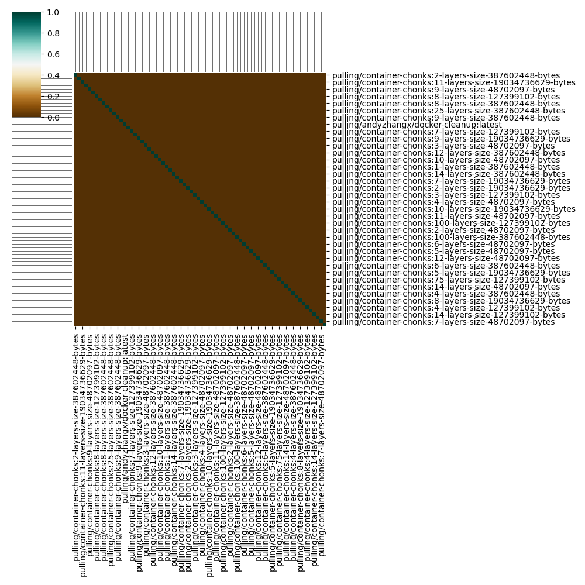

# Test

This was early testing work to get a sense of what I wanted to do. This was consolidated into the contents of the current [README](README.md).

I'm first going to test a small cluster (4 nodes) with two instance types, the purpose being to see if the instance type (and more cpu/ram) can decrease pull time. We will either run across a range (cost allowing) or if not, choose a single size. I'm going to start with n1-standard-16, which has 16vCPU and 60GB RAM. Each instance is ~0.76 an hour, and I'm hoping we can try scaling up to 256 nodes. I'll test on something small like 4 nodes. I am then going to test on n1-standard-64 ($3.03, 64 vCPU and 240GB memory). We are going to use an indexed job for both.


### 1. Setup

Bring up the cluster (with 4, 8, 16, 32, 64, 128, and 256 nodes) and run the experiment:

```bash
GOOGLE_PROJECT=myproject
# 4, 8, 16, 32, 64, 128
NODES=64

time gcloud container clusters create test-cluster \
    --threads-per-core=1 \
    --num-nodes=$NODES \
    --machine-type=n1-standard-16 \
    --enable-gvnic \
    --region=us-central1-a \
    --project=${GOOGLE_PROJECT} 
```

Prepare a metadata directory with pull times (change the directory name to the instance size):

```bash
mkdir -p metadata/run1/$NODES
```

### 2. Monitoring

Deploy monitoring:

```bash
git clone https://github.com/resmoio/kubernetes-event-exporter /tmp/kubernetes-event-exporter
cd /tmp/kubernetes-event-exporter
kubectl create namespace monitoring
kubectl apply -f deploy
```

Save nodes for size

```bash
mkdir -p metadata/run1/$NODES
kubectl get nodes -o json > metadata/run1/$NODES/nodes-$NODES-$(date +%s).json
```

Start monitoring (this goes in its own terminal):

```bash
kubectl logs -n monitoring event-exporter-xxxxxxxxx -f  |& tee ./metadata/run1/$NODES/events-size-$NODES-$(date +%s).json
```

### 3. Experiment Test

> This is entirely automated

Run the experiment (and these are on the varying numbers of $NODES above)

```bash
python run-experiment.py --nodes 4 --study ./studies/test.json
```

When you are done:

```bash
gcloud container clusters delete test-cluster --region=us-central1-a
```

I first did some quick testing to see if the instance memory had an impact, making a large jump so I could see it. 

Total experiment time for size 4 nodes:
 - size 4 nodes, n1-standard-16: 54.24 minutes (~3)
 - size 4 nodes, n1-standard-64: 52.73 minutes
 
I don't think times are different enough to justify the increase in cost, so we will stick with n1-standard-16 for the study.

```console
Experiments are done!
total time to run is 3254.424793243408 seconds

job.batch "container-pull" deleted
Experiments are done!
total time to run is 3164.1695561408997 seconds

# size 32
kubectl delete -f /tmp/job-3wrfgtai.yaml --wait=true
job.batch "container-pull" deleted
Experiments are done!
total time to run is 1398.415813446045 seconds

# size 64
kubectl delete -f /tmp/job-a_75wuum.yaml --wait=true
job.batch "container-pull" deleted
Experiments are done!
total time to run is 1535.1909275054932 seconds
```

Difference in the above?
```console
(3254.424793243408/3164.1695561408997)
1.0285241468578523
# aka, about 1.028x faster

How much more expensive?
3254.424793243408 * (4*0.76) = 9893.451371459962
3164.1695561408997 * (4*3.03) = 38349.7350204277
38349.7350204277 / 9893.451371459962
3.87 x more expensive!
```

TLDR: 1.028x faster, but 3.87x more expensive, not worth it.

```bash
# Raw times raw-times.json
python analysis/1-prepare-data.py --root ./metadata/test --out ./analysis/data/test

# Get docker manifests
python analysis/2-docker-manifests.py --data ./analysis/data/test

# This generates plots!
python analysis/3-parse-containers.py --data ./analysis/data/test

# And similarity
python analysis/4-similarity.py --data ./analysis/data/test
```

I next looked at the plot of number of layers by image size over time. What I see here is that number of layers does not seem to matter. What matters is the total size.


I think the plot I want to see is the size of the cluster (nodes) on the x axis, and then the hue be the image size. I'll choose a small number of number of layers for the variety but I'm not convinced it matters. Finally, when we remove the base (busybox) we see they are entirely different. This is good - the tool is working as expected!



Next step: adjust parameter space to have fewer layer size options, and more sizes. After that, can run the study on the smaller instance size 8 and see if we get any very different results.

Here was the first test of run1 (with the testing container set). I wanted to see if I liked looking at each of 9 and 125 layers.


Okay I like the dichotomy between the two layer extremes - I'd like to keep that to see how it scales across nodes. I am also thinking we will want to test GitHub packages and Google's local registry, for comparison.
This still shows a huge swing up to pulling, and I think we need to see more sizes there, even if they are at the top of the sizes in terms of percentiles. The reason is because we can expect ML containers to get larger.


