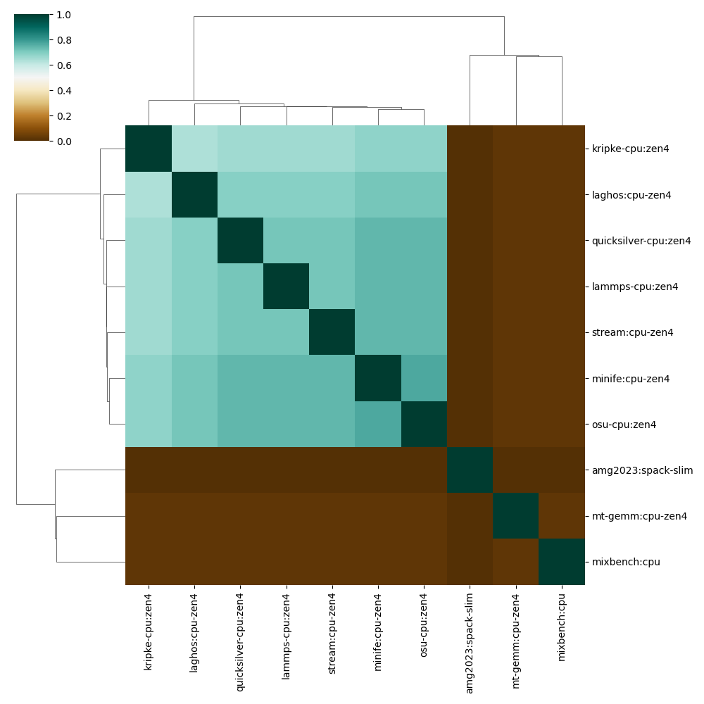
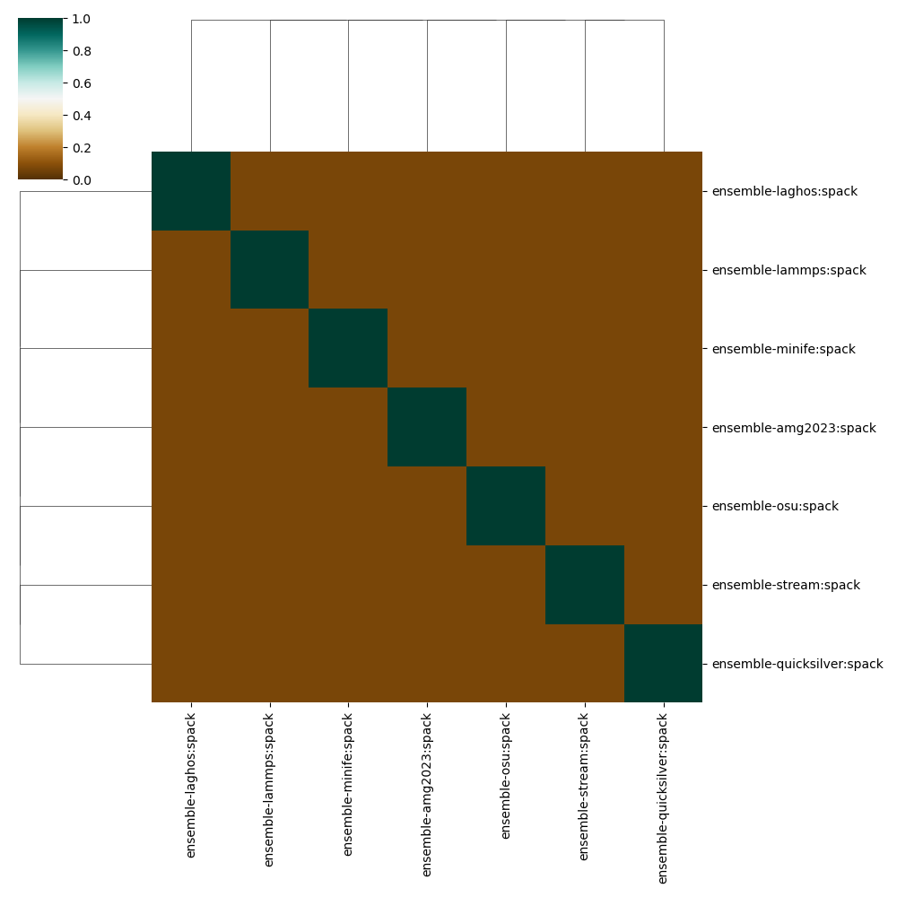
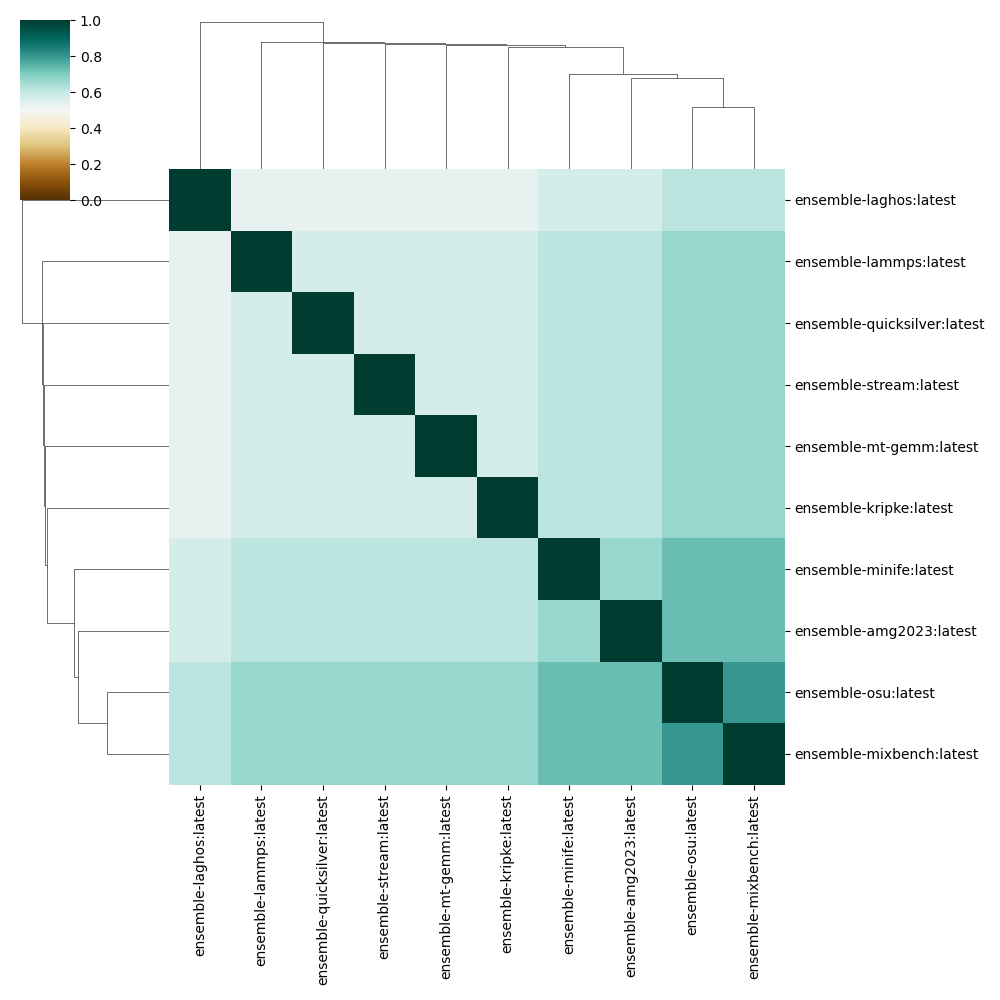

# Similar Containers

Here we want to understand (from an experimental and data-driven standpoint) why it's important to have similar containers. We are going to use two sets of containers:

- [performance study](https://github.com/converged-computing/performance-study/tree/main/docker)
- [ensemble containers](https://github.com/converged-computing/ensemble-containers)

The first set are an "in the wild" set that were created for the performance study. While they made a best effort for similarity, in practice because of rebuilds and imperfect planning they came out slightly different. The second set (ensemble containers) are designed as exactly the same, but explicitly to share as many layers as possible, and in the same order.

## Analysis

```bash
python scripts/container-similarity.py
```

We can first ask a simple question about similarity (and cost).  The larger degree to which containers are similar, the fewer layers are needed to be repulled (which takes time on the cluster). Here are stats (printed when running the [scripts/container-similarity.py](scripts/container-similarity.py):

```bash
Stats for container set performance-study
How many layers?
  (258, 8)
How many unique URIs not including tags?
  10
How many unique URIs including tags?
  10
How many unique layer digests?
  115

Similarity for performance-study-digests
mean: 0.4026779480749065
std 0.3839554443889033

Stats for container set containers
How many layers?
  (120, 8)
How many unique URIs not including tags?
  10
How many unique URIs including tags?
  10
How many unique layer digests?
  33
Similarity for containers-digests
mean: 0.6590169830169829
std 0.1276237000226257

Stats for container set spack
How many layers?
  (56, 8)
How many unique URIs not including tags?
  7
How many unique URIs including tags?
  7
How many unique layer digests?
  50

Similarity for spack-digests
mean: 0.2
std 0.3265986323710905
```

To demonstrate the influence of container building strategy on resulting container layer similarity, we aimed to compare overall layer digest similarity between ~10 applications that were built in multiple ways. When a build was not possible for an approach, we skipped it. The applications are described in Table 1. The application container sets included:

1. A set of performance study containers where some care was taken to ensure similarity of layers.
2. A set of the same applications built intentionally to have the same shared base layers.
3. A set of spack containers that build into an environment in the container.

Each of the above demonstrates a different building strategy:

1. A reasonable effort to create redundancy
2. A best effort to create redundancy
3. Little effort to create redundancy.

While number of layers and size is important, for this part of the experiment we are concerned with redundancy, and more specifically, the extent to which the build strategy produces unique layers that require a new pull from the registry. We are interested to see, for each approach, the degree to which digests are shared, which we use the Jacaard coefficient to represent, which is the set intersection (shared layers) over union (set of total possible shared layers). A Jacaard coefficient of 1 indicates is most similar, and 0 most dissimilar. The reason to have similar layers comes down to the time and associated costs of pulling containers. For a scaled experiment with multiple applications doing these pulls, it would be strategic to minimize this pulling time.

From the above we easily see that the ensemble containers (second set) have fewer overall layers would require 33/118 (~28%) unique layer pulls. Since we are certain that these containers were built with redundancy of layers in mind, we can state that this 28% represents the application logic specific to each container. For the performance study where some care was taken for redundancy, 115/258 (~45%) of layers would require isolated pulls. Finally, for the spack build strategy that creates a large layer that consists of a custom spack view, 50/56 (89%)
of layers would require unique pulls, a strategy that does not allow for large amount of redundancy. We can see this result reflected in the Jacaard similarity cluster maps.

### Performance Study Containers

> some effort for similarity, but imperfect



### Spack Containers

> creates a large, unique layer



### Ensemble Containers

> built to be maximally similar



A more controlled experiment that better controls for layer sizes and counts, and describes influence on pulling time, is needed and will be worked on next.
